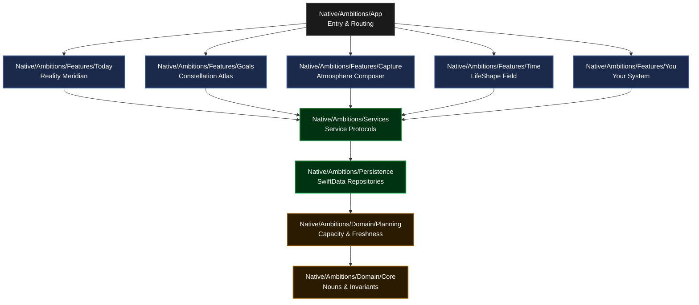

# Ambitions

<p align="center">
  
  
  
  
</p>

***

> [!IMPORTANT]
> **Active Authority Index Notice**: Repository authority starts in [docs/truth/README.md](docs/truth/README.md). If this README conflicts with `docs/truth/*`, the active truth files win. This file serves as architectural orientation and engineering guidelines.

Ambitions is a premium, native iOS **personal life operating system and external brain**. Designed to organize intent, ground long-term goals in daily constraints, and adapt elegantly to changing life realities, Ambitions rejects standard task lists, calendar clones, and cloud-first telemetry in favor of an elegant, local-first product experience.

---

## 🗺️ Architectural Topology

Ambitions uses XcodeGen-driven native modules and package boundaries to separate app routing, feature views, business rules, services, and persistence concerns.



---

## 📂 Repository Directory Structure

For any FAANG engineer starting in this repository, here is the clean map of the core zones:

*   **[`Native/Ambitions/App/`](Native/Ambitions/App)**: App entry, application container dependencies, unified shell composition, and deep-link/Widget intake routing.
*   **[`Native/Ambitions/Domain/`](Native/Ambitions/Domain)**: Pure business models, capacity limits, freshness brokers, non-shaming closure invariants, and planning horizon calculations.
*   **[`Native/Ambitions/Services/`](Native/Ambitions/Services)**: Core coordination service boundaries, protocol contracts, and mock/stub registries.
*   **[`Native/Ambitions/Persistence/`](Native/Ambitions/Persistence)**: On-device SQLite/SwiftData repository configurations.
*   **[`Native/Ambitions/Features/`](Native/Ambitions/Features)**: Feature layouts organized into five domain portals:
    *   **[`Today/`](Native/Ambitions/Features/Today)**: Focus and execution.
    *   **[`Goals/`](Native/Ambitions/Features/Goals)**: Directed outcomes.
    *   **[`Capture/`](Native/Ambitions/Features/Capture)**: Quiet incoming intake.
    *   **[`Time/`](Native/Ambitions/Features/Time)**: Capacity orientation.
    *   **[`You/`](Native/Ambitions/Features/You)**: Permission and trust center.
*   **[`Sources/AmbitionsDesignSystem/`](Sources/AmbitionsDesignSystem)**: Local Swift package for shared design tokens and interface widgets.
*   **[`AppUI/Sources/AmbitionsWidgetUI/`](AppUI/Sources/AmbitionsWidgetUI)**: Encapsulated widget view primitives sharing design metrics.
*   **[`scripts/`](scripts)**: Local automation scripts for build, validation, and repo checks.

---

## 🛠️ Local Build & Dev Setup

Ambitions uses **XcodeGen** to avoid messy, merge-conflicted Xcode project files. The project is dynamically synthesized from `project.yml`.

### 1. Prerequisite Checklist
*   macOS 14.0+ (for local Xcode builds)
*   Xcode 15.4+ or Xcode 16.0+ (configured for Swift 6 compiler toolchain)
*   Homebrew installed `xcodegen`

### 2. Synthesize Xcode Project
Generate the `.xcodeproj` shell container locally prior to opening Xcode:
```bash
xcodegen generate
```

### 3. Build & Run Tests via CLI
To perform localized verification and validate compiler boundaries:

*   **Build Project**:
    ```bash
    ./scripts/build-local.sh
    ```
*   **Run Unit and Integration Suite**:
    ```bash
    ./scripts/test-local.sh
    ```

---

## 🛡️ Core Moat & Design Guidelines

Ambitions enforces a series of strict structural invariants designed to ensure world-class iOS quality and reject features that commoditize the experience:

1.  **Tab Restraint**: Exactly five canonical tabs: `Today / Goals / Capture / Time / You`. Banned: *Plan*, *Inbox*, *Profile*, or any sixth navigation tab.
2.  **No Silent Automation**: No silent reads/writes to calendar, no secret cloud-sync channels, and no background profiling. Any action that changes scheduling requires an explicit receipt.
3.  **Local-First Privacy**: Storing user context, goal threads, and capture logs strictly on-device. The system must operate completely free of server-side data profiling or cloud AI API dependencies.
4.  **Calm & Non-Shaming**: Overdue elements are closed or pivoted gracefully. Gamified anxiety triggers (such as daily streak clocks or productivity comparison leaderboards) are explicitly forbidden.

---

## 🔍 Codebase Health Scans

Engineers should use the localized checks under `scripts/` before proposing changes to the codebase. These helpers support local review of key areas:
*   `accessibility-cognitive-load-scan.sh`: Checks touch-target constraints and Dynamic Type behavior.
*   `cqs-architecture-boundary-scan.sh`: Reviews target boundaries between Services and Features.
*   `codex-forbidden-claim-scan.sh`: Flags validation claims that are not backed by current local proof.

---

## 🌐 Portals & Archives

To navigate the historical, operational, and system layers of the Ambitions repository:
*   [Frontend Portal](frontend/README.md): Active and historical UI canon.
*   [Backend Portal](backend/README.md): Legacy cloud or database adapters.
*   [Codex OS Portal](codex-os/README.md): AI/Codex developer workflow control plane.
*   [Product Canon Portal](product-canon/README.md): Core design and canon artifacts.
*   [Validation Portal](validation/README.md): Local simulator and accessibility checklist runs.
*   [Historical Archive](history/README.md): Retained programs and batch-train records.
