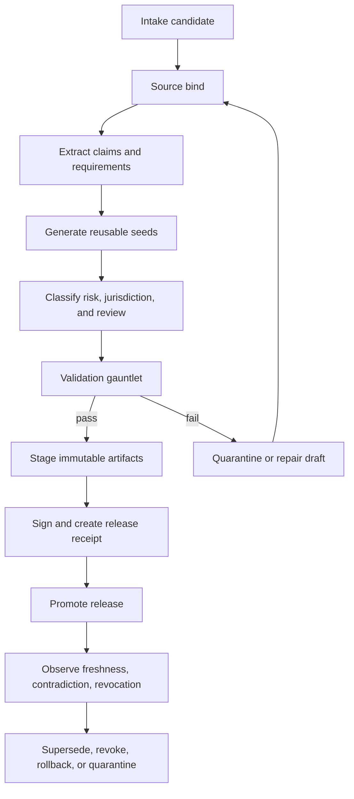

# Source Atlas Pack / Seed Foundry Pipeline

Status: Green for AMB-676 / PLOS-050 pipeline documentation scope; Yellow for tooling implementation, pack publication, runtime eligibility proof, live R2 promotion, privacy/legal approval, release readiness, device proof, accessibility proof, and measured performance proof.
Updated: 2026-06-12 America/New_York
Owning issue: AMB-676 / PLOS-050
Parent issue: AMB-613 / PLOS-M05

## Boundary

This artifact defines the end-to-end Source Atlas Pack / Seed Foundry pipeline from source intake to validated releasable packs and reusable seeds.

It does not implement foundry tooling, source importers, scanners, signing, release promotion, runtime pack loading, pack publication, Cloudflare/R2 operations, credential creation, live R2 writes, or runtime eligibility changes.

The foundry handles public-reference Source Atlas material and non-user-specific reusable seed templates only. It must never place private user goals, captures, schedules, proof, receipts, profile data, files, OCR output, health/location data, private imports, diagnostics, support bundles, user identifiers, or inferred private life context into public packs, seeds, manifests, R2 objects, validation reports, or release receipts.

## Pipeline Stages

| Stage | Purpose | Entry requirements | Exit artifact | Red stop |
|---|---|---|---|---|
| 1. Intake candidate | Capture a candidate public source or reusable seed idea. | Source URL/local reference, owner, domain, redistribution posture, and intended pack/seed class. | Intake record. | Private/user-derived material or unclear rights. |
| 2. Source bind | Bind candidate material to exact source identifiers and hashes. | Source container, source timestamp, license/redistribution note, provenance, authority tier. | Source-bound draft. | Missing provenance, mutable source with no snapshot/hash, or no redistribution posture. |
| 3. Extract claims and requirements | Extract source-backed claims, requirements, constraints, and applicability envelopes. | Source-bound draft. | Claim/requirement candidate set with source references. | Unsourced official claim or extracted private data. |
| 4. Generate reusable seeds | Convert approved source-backed structure into reusable seed families, not finished user Steps. | Candidate set, seed family, reuse envelope, risk notes. | Seed draft set. | Hardcoded finished Steps, exact-user schedules, or private user context. |
| 5. Classify risk, jurisdiction, and review | Assign risk class, jurisdiction, reviewer owner, freshness window, and review state. | Source-bound claims, requirements, and seeds. | Review-needed or reviewed candidate pack. | High-risk material without reviewer owner or professional-boundary handling. |
| 6. Validate gauntlet | Run structural and policy checks before staging. | Candidate pack/seed set. | Validation report and issue list. | Private-data leak, unsupported schema, duplicate/contradiction unresolved, missing source binding, missing rollback path, or missing release receipt plan. |
| 7. Stage immutable artifacts | Prepare exact immutable pack/seed paths and staged manifests. | Validation report passes; no Red issues. | Staged pack/seed payloads, staged manifest, hashes. | Mutable alias as payload source or unsigned/unhashed staged material. |
| 8. Sign and receipt | Bind exact staged artifacts to signature/checksum policy and release receipt. | Staged hashes, validator output, reviewer state, rollback target. | Signed manifest/checksum record and release receipt. | Missing exact hashes, signer state, release receipt, revocation path, or rollback target. |
| 9. Promote release | Promote only validated, signed, receipted artifacts to released state. | Release receipt and reversible promotion plan. | Released manifest/index pointer and release note. | Production promotion without reversible rollback or active-issue authorization for live R2 action. |
| 10. Observe, supersede, revoke, quarantine | Maintain freshness, contradiction, revocation, supersession, and quarantine state. | Released or staged artifact plus monitoring/review input. | Supersession, revocation, rollback, or quarantine receipt. | Silent overwrite, hidden deletion, or stale/revoked material presented as current. |

## Flow

## Required Validation Gauntlet

Before any pack or seed can be staged or released, the foundry must produce validation evidence for:

- schema and version compatibility
- exact source binding and immutable source hashes
- duplicate claim and duplicate seed detection
- contradiction scan
- freshness and stale-threshold classification
- revocation and rollback readiness
- risk and jurisdiction classification
- private-data leak scan
- reusable seed coverage and no-hardcoded-finished-Step enforcement
- Step Quality preflight readiness for future PLOS-M09
- release receipt coverage for exact artifact ids and hashes

Validator output is structural proof only. It does not prove legal approval, privacy approval, App Review readiness, runtime behavior, or release readiness.

## State Model

Pipeline states:

- `intake_candidate`: source or seed idea recorded, not source-bound.
- `source_bound_draft`: exact source/provenance/hash captured.
- `review_needed`: claims, requirements, or seeds need reviewer/risk/jurisdiction review.
- `validated`: local validation gauntlet passed with no Red issues.
- `staged`: immutable staged artifact paths and hashes exist.
- `released`: signed manifest/checksum state plus release receipt exists.
- `superseded`: newer released artifact replaces current pointer without overwriting old bytes.
- `revoked`: artifact is blocked by revocation state and cannot drive runtime.
- `quarantined`: artifact failed validation, verification, contradiction, privacy, or safety gates.

Default runtime eligibility is `not_eligible`. A foundry artifact can become runtime-eligible only when future active issues prove source authority, release receipt, freshness, revocation, rollback, compatibility, risk/jurisdiction review, and runtime consumption gates. AMB-676 does not change runtime eligibility.

## Handoffs

| Handoff | Receives | Produces | Consumer |
|---|---|---|---|
| Source import to claim extraction | Source-bound draft and provenance | Candidate claims and requirements | AMB-680 / PLOS-054 |
| Claim extraction to contradiction/freshness | Candidate claim set | Duplicate, contradiction, and stale-state findings | AMB-681 / PLOS-055 |
| Risk classification | Claims, requirements, source type, jurisdiction | Risk and jurisdiction labels | AMB-682 / PLOS-056 |
| Seed generation | Source-backed claim/requirement structure | Reusable seed families | AMB-677 / PLOS-051 and AMB-683 / PLOS-057 |
| Release receipt | Staged artifacts, validators, hashes, reviewer state | Release receipt and rollback note | AMB-684 / PLOS-058 |
| No-hardcoded-Step enforcement | Seeds and pack paths | Hardcoded-Step violation report | AMB-685 / PLOS-059 |
| R2 distribution | Released public artifacts and signed manifests | Public-reference distribution state | Future active R2-authorized issue only |

## Existing Source Anchors

AMB-676 inspected existing Source Atlas anchors and extends them as policy:

- `Native/Ambitions/Domain/SourceAtlasPackModels.swift` defines pack kinds, source kinds, claim states, freshness states, risk classes, validation issues, pack manifest, claims, requirements, starter items, runtime boundary, and validator.
- `Native/Ambitions/Domain/SourceAtlasPackFactoryModels.swift` defines the lite decoder/factory and validation wrapper.
- `Native/Ambitions/Domain/SourceAtlasStoreModels.swift` defines hash verification, payload source states, quarantine reasons, offline fallback conditions, and pack load selection.
- `artifacts/source-atlas-factory/SAF_PACK_RELEASE_LEDGER.md` defines required pack release fields.
- M03/M04 reports define signing, immutable paths, manifests, freshness/revocation, rollback, fetch/cache/quarantine, freshness cadence, and user-facing download boundaries.

These are source/control-plane anchors, not proof that production foundry tooling, pack publication, R2 promotion, or runtime consumption exists.

## Scaling Hotspots

Future implementation should bound:

- duplicate and contradiction scans over large claim sets
- source hash recomputation and source snapshot retention
- validation report size
- high-risk review queues
- staged artifact fan-out
- release receipt lookup
- rollback and revocation propagation

No measured performance, storage, network, or battery proof is claimed by AMB-676.

## Failure Handling

Failures route to explicit states:

- source missing or mutable without hash: return to source bind
- private-data leak: quarantine and block staging
- duplicate or contradiction unresolved: review-needed or quarantine
- high-risk without reviewer owner: review-needed
- schema or compatibility failure: repair draft or quarantine
- missing release receipt, revocation, rollback, or signer state: block release
- staged or released artifact later fails: revoke, supersede, rollback, or quarantine with receipt

No failed artifact can become runtime-eligible by freshness, popularity, convenience, or manual bucket placement alone.

## Non-Claims

This artifact does not implement foundry tooling, source import, claim extraction, duplicate detection, contradiction scanning, risk classification, seed generation, signing, release receipts, pack publication, Cloudflare/R2 setup, credential creation, live R2 writes, runtime fetch/cache/quarantine, runtime eligibility, privacy/legal approval, release readiness, device proof, accessibility proof, or measured performance proof.
