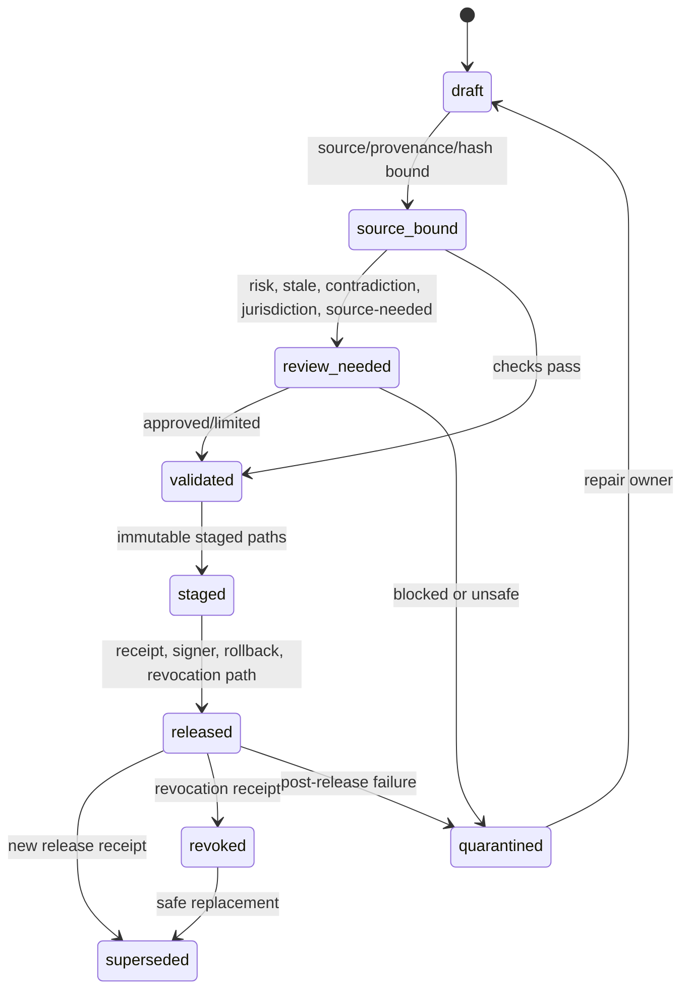

# Source Atlas Pack State / Review Workflow

Status: Green for AMB-678 / PLOS-052 state and review workflow documentation scope; Yellow for workflow tooling implementation, schema migration, release tooling, pack publication, runtime eligibility proof, live R2 promotion, privacy/legal approval, release readiness, device proof, accessibility proof, and measured performance proof.
Updated: 2026-06-12 America/New_York
Owning issue: AMB-678 / PLOS-052
Parent issue: AMB-613 / PLOS-M05

## Boundary

This artifact defines Source Atlas pack states, state transitions, review gates, quarantine, supersede, revoke, and rollback behavior.

It does not implement workflow tooling, change Swift models, migrate schema, publish packs, provision Cloudflare/R2, create credentials, perform live R2 writes, change runtime eligibility, or implement runtime pack consumption.

Pack state is a release-control model. It must not be confused with production runtime proof, privacy/legal approval, App Review approval, performance proof, accessibility proof, or owner approval.

## State Model

| State | Meaning | Entry gate | Exit gate | Runtime eligibility |
|---|---|---|---|---|
| `draft` | Candidate pack content exists but is not source-complete or release-reviewed. | Intake record, owner, intended pack kind. | Source binding complete or abandoned. | `not_eligible` |
| `source_bound` | Pack has exact source/provenance/hash/license posture. | Source identifiers, source timestamps, provenance, redistribution posture. | Claim/requirement extraction and duplicate pass. | `not_eligible` |
| `review_needed` | Pack needs source, risk, jurisdiction, freshness, contradiction, or reviewer decision. | Any required review or unknown/high-risk state. | Reviewer approves, blocks, or requests repair. | `not_eligible` |
| `validated` | Structural validators and policy checks passed for current draft. | Schema, source binding, duplicate, contradiction, freshness, risk, jurisdiction, private-data leak, seed coverage, hardcoded-Step, and rollback checks. | Staged immutable artifact preparation. | `not_eligible` |
| `staged` | Immutable staged payloads and manifests exist with hashes. | Validation pass, exact staged paths, hash/checksum evidence. | Sign/release receipt creation or repair/quarantine. | `not_eligible` |
| `released` | Signed/receipted release exists and can be considered by future runtime gates. | Release receipt, signer/checksum state, rollback target, revocation path, review state. | Supersede, revoke, rollback, or quarantine. | `candidate` only until future runtime eligibility gates prove use. |
| `superseded` | A newer released pack replaces the current pointer without overwriting old bytes. | New release receipt and supersession reason. | Archive reference, rollback target, or revoke if unsafe. | `not_current` |
| `revoked` | Pack is blocked by safety/source/security/review state. | Revocation receipt, reason, affected ids, effective date. | Superseded by safe replacement or remains blocked. | `not_eligible` |
| `quarantined` | Pack failed verification, validation, source, privacy, contradiction, safety, or compatibility checks. | Quarantine receipt with reason and affected payload. | Repair to draft/source_bound or permanent block. | `not_eligible` |

## Transition Rules

| From | To | Required evidence | Red stop |
|---|---|---|---|
| `draft` | `source_bound` | source ids, provenance, hash, redistribution posture | private/user-derived material or missing source authority |
| `source_bound` | `review_needed` | review trigger: high risk, unknown jurisdiction, stale source, contradiction, source-needed, or reviewer request | silent review bypass |
| `source_bound` | `validated` | all extraction and validation checks pass with no review-needed state | validator pass without source binding |
| `review_needed` | `validated` | reviewer approval, risk/jurisdiction decision, freshness decision, contradiction resolution | high-risk or blocked review treated as pass |
| `review_needed` | `quarantined` | blocked review, unresolved contradiction, private-data leak, unsafe source, or unsupported rights | keeping unsafe pack in release lane |
| `validated` | `staged` | immutable staged paths, staged manifest, exact hashes | mutable alias used as payload identity |
| `staged` | `released` | release receipt, signer/hash state, rollback target, revocation path | production promotion without active issue authorization or receipt |
| `released` | `superseded` | new release receipt, supersession reason, old/new ids | overwrite or delete old released bytes |
| `released` | `revoked` | revocation receipt, severity, owner, affected paths | stale/revoked pack presented as current |
| `released` | `quarantined` | post-release validation/verification/privacy/source/safety failure | hidden deletion or silent fallback |
| `revoked` | `superseded` | safe replacement release receipt and rollback note | revoked pack used as fallback |
| `quarantined` | `draft` | repair owner and source of repair | re-release without new validation |

## Review Workflow

Review is required when any of these are true:

- source state is unknown, source-needed, stale, contradicted, revoked, unsupported, or source changed
- freshness is stale, stale critical, disputed, revoked, unknown, or needs review
- risk class requires strict review
- jurisdiction is unknown, high-risk, age-sensitive, legal/civic, health/medical, financial, crisis/safety, certification, or education eligibility
- claim extraction creates duplicate or contradictory claims
- private-data leak scan flags user goals, captures, schedules, proof, receipts, profile, files, OCR, health/location, diagnostics, identifiers, or inferred private context
- pack contains universal scheduled Steps or hardcoded finished user Steps
- release receipt, rollback target, signer state, or revocation path is missing

Review outputs:

- `approved`: pack can proceed to validation or staging if all other gates pass.
- `repair_requested`: pack returns to draft/source_bound with owner and reason.
- `blocked`: pack routes to quarantine or revoked state.
- `jurisdiction_limited`: pack can continue only inside explicit applicability envelope.
- `stale_or_source_needed`: pack cannot drive current runtime behavior.

## Existing Source Anchors

AMB-678 inspected these anchors:

- `Native/Ambitions/Domain/SourceAtlasPackModels.swift` defines claim states, freshness states, requirement source/freshness/risk/review states, validation issues, and `SourceAtlasPackValidator`.
- `Native/Ambitions/Domain/SourceAtlasStoreModels.swift` defines payload source states, quarantine reasons, offline fallback conditions, load result, hash verification, invalid pack quarantine, revoked/contradicted quarantine, and source-state projection.
- `artifacts/source-atlas-factory/SOURCE_ATLAS_PACK_SEED_FOUNDRY_PIPELINE.md` defines source-bound, review-needed, validated, staged, released, superseded, revoked, and quarantined pipeline states.
- `artifacts/source-atlas-factory/SOURCE_ATLAS_REUSABLE_SEED_TAXONOMY.md` defines default `not_eligible` runtime state and hardcoded-finished-Step controls for seeds.
- `artifacts/source-atlas-factory/SAF_PACK_RELEASE_LEDGER.md` defines required release fields for source binding, freshness, revocation, risk, jurisdiction, review, signature/hash, runtime eligibility, release receipt, rollback, and non-claims.

These anchors are source/control-plane evidence, not proof that production workflow tooling, pack publication, R2 promotion, or runtime consumption exists.

## Mermaid State Sketch

## Failure Handling

- Unsupported schema, corrupt payload, hash mismatch, invalid pack, contradiction, revocation, or missing payload routes to quarantine or source-needed fallback.
- Revoked packs cannot be used as last-known-good fallback.
- Supersession preserves old immutable bytes and changes pointers/manifests only through release receipts.
- Quarantine and revocation require owner-visible receipts before parent closeout can claim Green.
- Unknown review state is not a pass state.

## Scaling Hotspots

Future implementation should bound:

- review queue size across large pack families
- duplicate and contradiction state recalculation
- quarantine receipt growth
- release/supersession manifest fan-out
- rollback lookup cost
- stale and source-needed revalidation cadence

No measured performance, storage, network, or battery proof is claimed by AMB-678.

## Non-Claims

This artifact does not implement workflow tooling, schema changes, validators, scanners, release tooling, pack publication, Cloudflare/R2 setup, credential creation, live R2 writes, runtime fetch/cache/quarantine, runtime eligibility, runtime pack consumption, privacy/legal approval, release readiness, device proof, accessibility proof, or measured performance proof.
