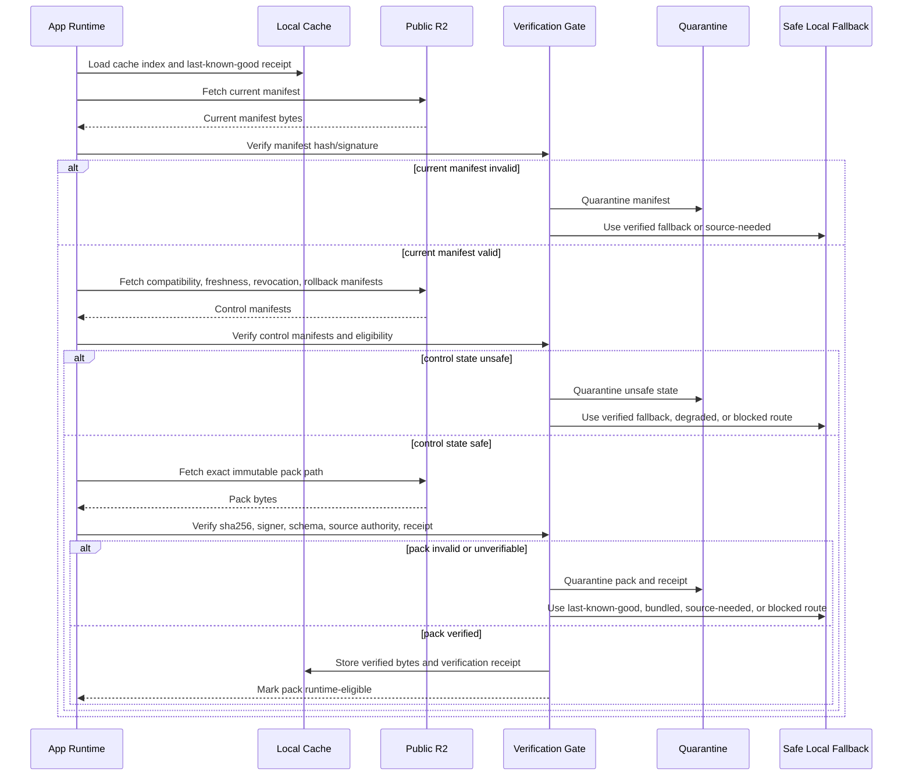

# R2 App Fetch Verify Cache Quarantine Plan

Status: Green for AMB-673 / PLOS-045 fetch/verify/cache/quarantine planning scope; Yellow for full network implementation, runtime fetch implementation, live R2 account proof, bucket provisioning, network validation, release tooling, privacy/legal approval, release readiness, device proof, accessibility proof, and performance proof.
Updated: 2026-06-12 America/New_York
Owning issue: AMB-673 / PLOS-045
Parent issue: AMB-612 / PLOS-M04

## Boundary

This artifact defines the future app flow for remote public Source Atlas pack fetch, verification, caching, quarantine, safe fallback, startup cost, and refresh cost.

It does not implement network code, runtime fetch, signature verification, cache storage, quarantine storage, release tooling, pack publication, Cloudflare/R2 setup, credential creation, or live R2 writes.

Fetched material is public-reference-only. The app must never send private user data, user identifiers, device identifiers, raw private goal text, private source-needed requests, diagnostics, support bundles, secrets, account ids, or write-token material to R2.

## Flow Contract

Safety outranks freshness. A fresher remote pack is not usable until it passes integrity, compatibility, freshness, revocation, rollback, source authority, privacy-boundary, and release-receipt gates.

Future runtime flow:

1. Load verified local cache index and last-known-good receipt.
2. Fetch compact current manifest when allowed by startup/refresh policy.
3. Verify manifest hash/signature or pinned checksum state.
4. Fetch compatibility, freshness, revocation, and rollback manifests named by the current manifest.
5. Verify each control manifest before trust.
6. Reject or quarantine unsupported, stale, revoked, mismatched, missing, private-data-containing, or unsigned control state.
7. Fetch exact immutable pack path only after control manifests pass.
8. Verify pack sha256, signature/checksum state, release receipt, schema, compatibility, freshness, revocation, rollback, and source authority.
9. Cache only verified bytes plus verification receipt.
10. Mark runtime-eligible only after all gates pass.
11. Route failures to quarantine and safe fallback.

## Sequence Diagram

## Quarantine Rules

Quarantine is mandatory when any of these occur:

- network fetch returns malformed, transformed, partial, or unsupported data
- hash, signature, signer, schema, compatibility, freshness, revocation, rollback, release receipt, or source authority check fails
- manifest or pack includes private user data, identifiers, diagnostics, support bundles, secrets, account ids, or write-token material
- current manifest points to a mutable/alias path or a path that does not match the immutable object grammar
- pack is stale beyond allowed behavior, hard-expired, contradicted, revoked, or missing required freshness/revocation state
- rollback target is unverified, stale, revoked, incompatible, or missing release receipt

Quarantined artifacts are not runtime-eligible. Future implementation must record enough local receipt detail to explain why the artifact was rejected without storing private R2-bound data.

## Cache Policy

The cache stores only verified public Source Atlas bytes and local verification receipts. It must not store private user requests, private source-needed context, diagnostics, secrets, or write tokens.

Cache states:

- `verified_current`: all gates pass and freshness/revocation allow use
- `verified_last_known_good`: prior verified pack still allowed by freshness/revocation/offline grace
- `degraded`: pack is not current but can support non-authoritative fallback
- `source_needed`: source or review is required before current use
- `quarantined`: artifact failed a safety gate and is not usable
- `blocked`: no safe remote or local fallback is available

## Failure Handling

Remote path failure routes:

- manifest fetch fails: use verified last-known-good if allowed; otherwise bundled/source-needed/blocked
- control manifest fails: quarantine control state and use verified fallback only
- pack fetch fails: keep current verified cache if allowed; otherwise source-needed/degraded/blocked
- pack verification fails: quarantine pack and do not use bytes
- revocation match: block/quarantine regardless of cache state
- hard expiry: block unless verified rollback target passes all gates
- unknown state: fail closed to source-needed/review-needed

## Startup And Refresh Cost

Startup should not block local-first app launch on remote fetch. Future runtime should prefer cached verified state first, then refresh control manifests on a bounded cadence.

Cost posture:

- compact control manifests are short-TTL refresh candidates
- immutable packs are fetched only after control manifests pass
- pack fetch is exact-path and hash-bound
- high-risk packs require stricter refresh/expiry behavior
- background refresh remains future-owned and unimplemented by this artifact

No measured startup, network, battery, memory, or latency proof is claimed by this spec.

## Non-Claims

This artifact does not implement network fetching, runtime fetch/cache/quarantine, signature verification, manifest parsing, release tooling, pack publication, Cloudflare/R2 setup, credential creation, live R2 writes, network validation, production-readiness proof, privacy/legal approval, release readiness, device proof, accessibility proof, or performance proof.
