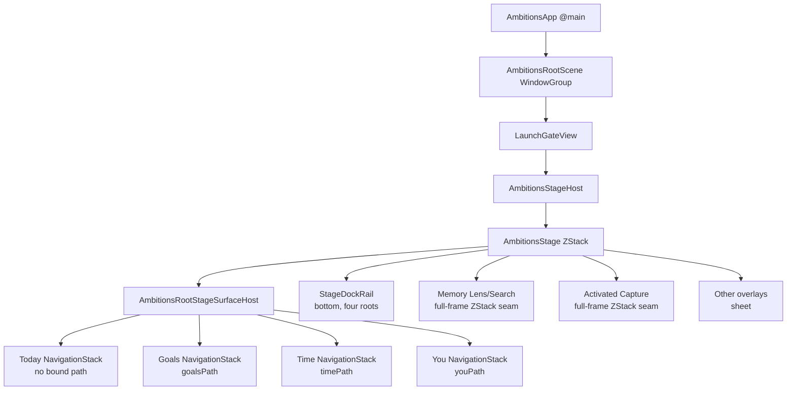

<!-- markdownlint-disable MD013 MD060 -->

# RP-01 — Shell, Navigation, and Restoration

## Executive verdict

The repository supports the constitutional four-root topology, typed root-local navigation for Goals, Time, and You, in-session root switching, and temporary top-level Search and Capture presentations. It does **not** support the selected Crowned Edge Dock as drawn. Current normative canon requires bottom navigation at rest and prohibits putting Capture or Search in an additional dock position; current source implements that contract as a bottom, four-root rail. The right-edge Hidden/Peek/Expanded dock is therefore `CONTRADICTED`, not merely absent.

The repository also does not establish the selected exact-context-return promise. Shell state is in-memory, Today has no stored path, no scene-restoration mechanism was found, and scroll, editing, field-focus, keyboard, and expression restoration are not represented in the shell state. Logical focus plans exist, but no runtime accessibility-focus binding was found. These gaps make the visual direction dependent on architecture, UX Blueprint, runtime, and reconstruction decisions. No revised visual direction is selected here.

## Scope and authority

This packet audits `AVF-SHELL-S07-R00`, `AVF-CAPTURE-S07-R00`, `AVF-SEARCH-D07-R00`, and `AVF-A11Y-S07-R00` against the repository at `29872755f705f6bd8e276aeac86dcf376ac5f0d8` on `main`.

Authority order used:

1. Current source, manifests, and generated artifacts.
2. Current Constitution and `APP-SHELL` / `APP-NAVIGATION` canon.
3. Current tests and verification records.
4. Provisional visual records, used only as protected intent and assumptions to test.

The attached visual records are marked `provisional`. No rendered-UI inspection was performed, because this is a repository-grounded architecture audit and not a visual-quality audit.

## Current navigation architecture

This is a source-derived architecture map, not runtime proof. Sources: `AmbitionsRootScene.swift:8-24`, `AmbitionsStage.swift:22-70,110-209`, and `AmbitionsRootStageSurfaceHost.swift:11-194`.

## Current-state findings

### Application, scene, and shell assembly

- `AmbitionsApp` has one `@main` SwiftUI app entry and `AmbitionsRootScene` owns one `WindowGroup`. The scene processes URLs and active-phase reconciliation. `SUPPORTED` as source wiring; device execution was not proven in this audit. Evidence: E-RP01-001.
- `AppContainerFactory.makeLive` constructs persistent repositories, services, the app session, and one `StageStore`; `AmbitionsStageHost` injects the resulting container into one `AmbitionsStage`. `SUPPORTED`. Evidence: E-RP01-002.
- The application manifest explicitly sets `UIApplicationSupportsMultipleScenes` to false. Multi-window shell restoration is `CONTRADICTED` for the current target, not an unimplemented promise. Evidence: E-RP01-003.

### Root navigation and path ownership

| Root | Current host | Stored path | Root switching | Current capability | Evidence |
|---|---|---|---|---|---|
| Today | `NavigationStack` | None | `selectedSurface` | `PARTIALLY_SUPPORTED` | E-RP01-004 |
| Goals | `NavigationStack(path:)` | `StageState.goalsPath` | `StageStore` | `PARTIALLY_SUPPORTED` | E-RP01-004, E-RP01-005 |
| Time | `NavigationStack(path:)` | `StageState.timePath` | `StageStore` | `PARTIALLY_SUPPORTED` | E-RP01-004, E-RP01-005 |
| You | `NavigationStack(path:)` | `StageState.youPath` | `StageStore` | `PARTIALLY_SUPPORTED` | E-RP01-004, E-RP01-005 |

`AmbitionsRootStageSurfaceHost` switches a `Group` over the selected root; it is not a native `TabView`. Goals, Time, and You have typed arrays bound to their `NavigationStack`s; Today does not. This establishes partial independent-path machinery, but not full parity.

There is also a structural conflict inside current source: `StagePathStore.routeDepth` reports drilldown whenever **any** of the three stored arrays is non-empty. Because inactive-root paths are preserved, switching away from a drilled-down root can leave the newly selected root visually at its root while the global chrome remains in drilldown posture and hides the dock. This is an evidence-based architecture inconsistency, not a claim that the behavior was reproduced on a device. Status: `CONTRADICTED`. Evidence: E-RP01-005 and E-RP01-006.

### Root and path ownership matrix

| Concern | Current owner | Canonical owner | Finding |
|---|---|---|---|
| Selected root | `StageState.selectedSurface` / `StageStore` | Stage navigation | `SUPPORTED` in-session |
| Goals path | `StageState.goalsPath` | Stage navigation | `PARTIALLY_SUPPORTED`; no persistence |
| Time path | `StageState.timePath` | Stage navigation | `PARTIALLY_SUPPORTED`; no persistence |
| You path | `StageState.youPath` | Stage navigation | `PARTIALLY_SUPPORTED`; no persistence |
| Today path | Native stack internal state only | Stage navigation | `ABSENT` as explicit shell state |
| Presentation | `StageState.activeOverlay`, SwiftUI sheet/ZStack seams | Stage shell | `PARTIALLY_SUPPORTED` |
| Return target | Underlying selected root/path plus overlay entry fields | Stage navigation | `PARTIALLY_SUPPORTED`; no durable tuple |
| Focus target | `StageFocusCoordinator` logical plan | Stage navigation | `PLANNED_NOT_IMPLEMENTED` at runtime focus-binding level |
| Relaunch restoration | Preferred initial root only | Stage navigation | `ABSENT` for route restoration |

Sources: E-RP01-004 through E-RP01-008.

### Crown ownership matrix

| Context | Current owner/evidence | Capability | Reconciliation finding |
|---|---|---|---|
| Root title | `AppShellHeaderRail` / `ContextCrown` inside `AppShellScaffold` | `PARTIALLY_SUPPORTED` | Custom crown-like chrome exists, but canon says avoid a heavy context crown and source hides the native navigation bar. |
| Root actions | `AppShellContextualToolbarCatalog` and header buttons | `SUPPORTED` as source | Capture is a root-chrome action, contrary to the visual requirement that Search/Capture live in the dock and never in the crown. |
| Focused object title | Destination-owned `AppShellScaffold` on selected routes; other details own their own view | `PARTIALLY_SUPPORTED` | No single focused-object title contract spans every route. |
| Editing title/action state | Editing surfaces and overlays | `UNKNOWN` | No shell record models an editing-title posture or conflict arbitration. |
| Conflict/recovery context | Contextual content and overlay owners | `PARTIALLY_SUPPORTED` | No evidence that the crown becomes the exclusive conflict/recovery owner. |
| Accessibility-size title | Compact symbols/labels and constrained title blocks | `PARTIALLY_SUPPORTED` | Spoken labels exist; visible semantic-title continuity at the largest sizes is not proven. |

Sources: E-RP01-009, E-RP01-010. Disposition: `TARGETED_VISUAL_REFINEMENT_REQUIRED`, `ARCHITECTURE_DECISION_REQUIRED`, and `UX_BLUEPRINT_DECISION_REQUIRED`.

## Dock-hosting option analysis

These are technical options, not recommendations or approvals.

| Option | Repository fit | Constraints and unresolved authority | Status/disposition |
|---|---|---|---|
| Keep the existing bottom Stage layer | Already implemented by `AmbitionsStage` + `StageDockRail`; aligns with current canon | Cannot realize the selected right-edge seam or Hidden/Peek/Expanded posture | `SUPPORTED` current architecture; selected edge behavior `CONTRADICTED` |
| Add a right-edge layer in `AmbitionsStage` | The top-level ZStack can spatially host one | Requires new posture state, hit-testing, safe-area, keyboard, scroll, gesture, focus, RTL, and accessibility-equivalent owners; conflicts with normative bottom-navigation and no-extra-dock rules | `ARCHITECTURE_DECISION_REQUIRED`, `UX_BLUEPRINT_DECISION_REQUIRED`, `NEW_VISUAL_BRANCH_MAY_BE_REQUIRED` |
| Replace root switching with native `TabView` customization | Native tab semantics could own root selection | No `TabView` exists; selected vertical material seam and embedded Search/Capture are not established by the native control contract | `PLANNED_NOT_IMPLEMENTED`, `IMPLEMENTATION_DETAIL_DEFERRED` |

The current canon is decisive for present compatibility: `APP-SHELL` requires bottom navigation at rest, exactly four root controls, and integrated context-appropriate Search/Capture access without an additional dock position. The visual record's right-edge dock containing six controls is structurally contradicted. Evidence: E-RP01-011.

## Gesture and accessibility risk table

| Risk | Repository evidence | Status | Required disposition |
|---|---|---|---|
| Back-edge collision | `AppShellView` installs a custom leading-edge drag layer; it mirrors to the right in RTL | `PARTIALLY_SUPPORTED` current return, edge-dock collision unverified | `ARCHITECTURE_DECISION_REQUIRED` |
| Native back semantics | Native navigation bars are hidden and source supplies a custom Back button/drag | `CONTRADICTED` with the unqualified native-default claim | `TARGETED_VISUAL_REFINEMENT_REQUIRED` |
| Scroll/edge-dock gestures | No right-edge dock gesture owner or arbitration found | `ABSENT` | `RUNTIME_CAPABILITY_REQUIRED` |
| Keyboard-present dock posture | Current shell computes bottom clearance; no Hidden/Peek/Expanded keyboard transition exists | `ABSENT` | `RUNTIME_CAPABILITY_REQUIRED` |
| Reach and handedness | Current bottom rail is reachable; no left-side equivalent or handedness setting for an edge dock exists | `ABSENT` for selected behavior | `UX_BLUEPRINT_DECISION_REQUIRED` |
| RTL | Back swipe mirrors; no edge-dock mirroring contract exists | `PARTIALLY_SUPPORTED` overall, `ABSENT` for selected dock | `UX_BLUEPRINT_DECISION_REQUIRED` |
| VoiceOver | Current root buttons expose labels, values, hints, and selected traits | `SUPPORTED` for the current dock source | `VISUAL_DIRECTION_SURVIVES` only at semantic requirement level |
| Voice Control / Switch Control / Full Keyboard Access | Current dock uses `Button`; direct assistive-device proof is absent | `UNKNOWN` | `RECONSTRUCTION_PLAN_ACTION_REQUIRED` |
| Minimum target | Current rail uses 44/50-point heights | `SUPPORTED` for current source | `VISUAL_DIRECTION_SURVIVES` |
| Equivalent Peek/Expanded postures | No alternate labeled/opaque/lower-reach posture model exists | `ABSENT` | `RUNTIME_CAPABILITY_REQUIRED`, `UX_BLUEPRINT_DECISION_REQUIRED` |

Sources: E-RP01-012, E-RP01-013 and RP-08 evidence.

## Search and Capture hosting analysis

| Capability | Search | Capture | Finding |
|---|---|---|---|
| Non-root identity | Canon and source model Memory Lens as overlay | Canon and source model Capture as overlay/composer | `SUPPORTED` |
| Top-level host | `AmbitionsStage.shellSearchSeam` | `AmbitionsStage.shellActivatedCaptureComposerSeam` | `SUPPORTED` as source |
| Full-screen temporary presentation | Full-frame ZStack and canvas background | Full-frame ZStack seam, horizontally padded | `PARTIALLY_SUPPORTED`; neither uses the navigation canon's explicit full-screen presentation owner |
| Root-independent state host | `StageState.activeOverlay` | `StageState.activeOverlay` | `SUPPORTED` in-session |
| Invocation access | Toolbar catalog exposes Memory Lens in selected context; external routing exists | Root chrome exposes Capture; Cmd-K and external routing exist | `PARTIALLY_SUPPORTED`; neither is owned by the current dock |
| Context preserved on dismissal | Underlying root/path remains while overlay is active | Same, except `openCaptureComposer` resets Time path in current source | Search `PARTIALLY_SUPPORTED`; Capture `CONTRADICTED` for exact return from Time |
| Relaunch restoration | No durable overlay/query state | No durable shell expression state | `ABSENT` |
| External-entry origin | Last external route/source and overlay entry source exist in memory | Same | `PARTIALLY_SUPPORTED`; not durable |

Sources: E-RP01-007, E-RP01-014, E-RP01-015.

## Restoration capability matrix

| Context element | In-session | Relaunch/interruption | Capability status | Evidence/uncertainty |
|---|---|---|---|---|
| Root | Stored in `StageState` | App session can choose a preferred initial root, but current selected root is not scene-restored | `PARTIALLY_SUPPORTED` | E-RP01-005, E-RP01-016 |
| Navigation depth | Goals/Time/You arrays | No durable encoding or scene storage | `PARTIALLY_SUPPORTED` in-session; `ABSENT` relaunch | E-RP01-004, E-RP01-017 |
| Focused object | Encoded by typed path where route target contains identity | Not restored | `PARTIALLY_SUPPORTED` | E-RP01-004, E-RP01-017 |
| Selection | Not represented generically | Not restored | `ABSENT` | E-RP01-005 |
| Scroll position | No shell anchor/state found | Not restored | `ABSENT` | E-RP01-017 |
| Editing state | Not represented in `StageState` | Not restored | `ABSENT` | E-RP01-005 |
| Field focus | Logical focus plan only | Not restored | `PLANNED_NOT_IMPLEMENTED` | E-RP01-008 |
| Keyboard state | No shell representation | Not restored; OS state cannot be guaranteed from current contract | `ABSENT` | E-RP01-005 |
| Search query | Owned inside current overlay/view lifetime | No durable shell record | `PARTIALLY_SUPPORTED` in-session; `ABSENT` relaunch | E-RP01-014, E-RP01-017 |
| Capture expression | Owned by Capture view/runtime, not shell restoration | No shell restoration record | `UNKNOWN` in-session durability; `ABSENT` shell relaunch restoration | E-RP01-005, E-RP01-014 |
| Pending operation | Runtime/domain concern, not represented by shell restoration | No navigation-restoration link found | `UNKNOWN` | Scope boundary; RP-07 owns operational persistence |
| External-entry origin | In-memory `lastExternalRoute` and source | Not durable | `PARTIALLY_SUPPORTED` | E-RP01-005 |

The canon requires validated restoration of root, depth, selection, and focus as product meaning permits. Current source does not satisfy that contract. Presence of normative requirements is `PLANNED_NOT_IMPLEMENTED`, not implementation support. Evidence: E-RP01-018.

## Capability and visual-assumption matrix

| Visual assumption | Status | Finding disposition | Affected directions |
|---|---|---|---|
| Exactly four persistent roots | `SUPPORTED` | `VISUAL_DIRECTION_SURVIVES` | `AVF-SHELL-S07-R00`, `AVF-A11Y-S07-R00` |
| Search and Capture are non-root global systems | `SUPPORTED` | `VISUAL_DIRECTION_SURVIVES` | `AVF-SHELL-S07-R00`, `AVF-CAPTURE-S07-R00`, `AVF-SEARCH-D07-R00` |
| Right-edge Material Seam is the sole dock | `CONTRADICTED` | `NEW_VISUAL_BRANCH_MAY_BE_REQUIRED`, `ARCHITECTURE_DECISION_REQUIRED` | `AVF-SHELL-S07-R00` |
| Dock contains Today, Goals, Time, You, Search, Capture | `CONTRADICTED` | `UX_BLUEPRINT_DECISION_REQUIRED` | `AVF-SHELL-S07-R00`, `AVF-CAPTURE-S07-R00`, `AVF-SEARCH-D07-R00` |
| Hidden, Peek, Expanded dock state machine | `ABSENT` | `RUNTIME_CAPABILITY_REQUIRED` | `AVF-SHELL-S07-R00`, `AVF-A11Y-S07-R00` |
| Semantic crown owns context but not Search/Capture | `PARTIALLY_SUPPORTED` and `CONTRADICTED` by subclaim | `TARGETED_VISUAL_REFINEMENT_REQUIRED` | `AVF-SHELL-S07-R00`, `AVF-CAPTURE-S07-R00`, `AVF-SEARCH-D07-R00` |
| Search and Capture are full-screen temporary iPhone modes | `PARTIALLY_SUPPORTED` | `TARGETED_VISUAL_REFINEMENT_REQUIRED`, `IMPLEMENTATION_DETAIL_DEFERRED` | `AVF-CAPTURE-S07-R00`, `AVF-SEARCH-D07-R00` |
| Exact context returns after dismissal | `PARTIALLY_SUPPORTED` in-session | `RUNTIME_CAPABILITY_REQUIRED` | `AVF-SHELL-S07-R00`, `AVF-CAPTURE-S07-R00`, `AVF-SEARCH-D07-R00` |
| Exact context returns after relaunch/interruption | `ABSENT` | `RUNTIME_CAPABILITY_REQUIRED`, `RECONSTRUCTION_PLAN_ACTION_REQUIRED` | `AVF-SHELL-S07-R00`, `AVF-CAPTURE-S07-R00`, `AVF-SEARCH-D07-R00` |
| Edge dock has labeled/opaque/RTL/keyboard/accessibility equivalents | `ABSENT` | `UX_BLUEPRINT_DECISION_REQUIRED`, `RUNTIME_CAPABILITY_REQUIRED` | `AVF-SHELL-S07-R00`, `AVF-A11Y-S07-R00` |
| Native Apple navigation behavior is the substrate | `PARTIALLY_SUPPORTED` | `TARGETED_VISUAL_REFINEMENT_REQUIRED` | `AVF-SHELL-S07-R00`, `AVF-A11Y-S07-R00` |

## Critical contradictions

1. **Dock structure:** normative `APP-SHELL` requires bottom navigation with four root-only controls; the provisional direction requires a right-edge dock with roots plus Search and Capture. `CONTRADICTED`. Evidence: E-RP01-011.
2. **Return guarantee:** canon and visual intent require meaningful restoration, but current shell state is non-durable and omits several requested context dimensions. `CONTRADICTED` as a current capability claim. Evidence: E-RP01-005, E-RP01-017, E-RP01-018.
3. **Independent paths versus global depth:** inactive-root paths are preserved but global route depth aggregates all paths. `CONTRADICTED` internal architecture. Evidence: E-RP01-006.
4. **Native behavior versus custom navigation chrome:** `NavigationStack` is native, but the native bar is hidden and a custom edge drag owns return. `PARTIALLY_SUPPORTED`; the unqualified visual claim is contradicted. Evidence: E-RP01-012.
5. **Capture exact return:** opening Capture clears the Time path in current `StageStore`. `CONTRADICTED` for exact return from a deep Time context. Evidence: E-RP01-015.

## Required decisions — not decided here

| Authority | Decision required |
|---|---|
| Devan | Whether the locked right-edge dock intent may supersede the current normative bottom-navigation requirement, or remains a visual branch pending canon change. |
| Architecture | One selected-root-aware route-depth model; durable navigation/restoration record; single crown/global-action owner; native-versus-custom navigation boundary. |
| UX Blueprint | Right/left/RTL dock behavior; Hidden/Peek/Expanded semantics; keyboard, reach, scroll, and assistive equivalents; exact meaning of “same place.” |
| Runtime | Durable root/path/selection/focus/expression restoration and stale-target validation; actual focus application; failure recovery. |
| Reconstruction planning | Sequence removal or migration of duplicate/custom shell owners only after authority decisions; add proof gates before visual implementation. |
| Accessibility/platform planning | Direct device coverage for root semantics, focus return, RTL, keyboard, Voice Control, Switch Control, and largest Dynamic Type. |
| Figma later | Reflect reconciled architecture without selecting it here. |
| SwiftUI later | Implement only after architecture and UX ownership decisions; no implementation is authorized by this packet. |

## Unsupported assumptions

- A right-edge dock can replace the current bottom root rail without a canon/architecture decision.
- Search and Capture currently belong inside the dock.
- Hidden, Peek, and Expanded dock postures exist.
- A left-handed/lower-reach/opaque/labeled equivalent exists.
- Every root has an independent restorable navigation path.
- Exact scroll, editing, field focus, keyboard, query, expression, pending-operation, and external-origin context is restored.
- Logical focus planning is equivalent to runtime accessibility-focus restoration.
- The current custom back gesture is proven equivalent to native back behavior across RTL and assistive technologies.

All are `UNSUPPORTED_VISUAL_BEHAVIOR_REMOVE` from any current-capability claim or must remain explicitly provisional pending the decisions above. This does not remove them from protected intent.

## Reconstruction implications

- `RECONSTRUCTION_PLAN_ACTION_REQUIRED`: reconcile current canon and selected edge-dock intent before any shell implementation.
- `RUNTIME_CAPABILITY_REQUIRED`: define a selected-root-aware, persistable navigation record and validated restoration pipeline.
- `ARCHITECTURE_DECISION_REQUIRED`: decide whether native navigation chrome or custom Stage chrome owns back, title, focus, and safe-area behavior.
- `UX_BLUEPRINT_DECISION_REQUIRED`: define accessible posture equivalence and degraded states for the dock and crown.
- Proof must include direct, current device evidence for dismissal return, interruption/relaunch, invalid targets, keyboard-present states, RTL, Dynamic Type, VoiceOver traversal/focus, Voice Control, Switch Control, and Full Keyboard Access.
- Legacy or duplicate shell chrome must not be deleted until the single-owner decision is made.

## Evidence appendix

### E-RP01-001 — App and scene entry

- **Claim:** The app has one SwiftUI scene entry with URL and active-lifecycle handling.
- **Capability status:** `SUPPORTED`
- **Source:** `Native/Ambitions/App/AmbitionsApp.swift:3-14`; `Native/Ambitions/App/AmbitionsRootScene.swift:3-32`
- **Symbol/section:** `AmbitionsApp`, `AmbitionsRootScene.body`
- **Authority/currentness:** Current production source.
- **Verification:** Source inspection with `nl -ba` and `rg`.
- **Result:** One `WindowGroup`; URL and lifecycle entry are wired.
- **Confidence:** High.
- **Remaining uncertainty:** No device launch executed in this audit.
- **Affected directions:** `AVF-SHELL-S07-R00`, `AVF-CAPTURE-S07-R00`, `AVF-SEARCH-D07-R00`.

### E-RP01-002 — Assembly and dependency injection

- **Claim:** One live container and Stage store assemble the current shell.
- **Capability status:** `SUPPORTED`
- **Source:** `Native/Ambitions/App/AppContainerFactory.swift:44-124,187-220`; `Native/Ambitions/App/AmbitionsStageHost.swift:4-20`
- **Symbol/section:** `AppContainerFactory.makeLive`, `AmbitionsStageHost`
- **Authority/currentness:** Current production source.
- **Verification/result:** Source inspection found persistent repositories/services and one injected stage.
- **Confidence:** High.
- **Remaining uncertainty:** Runtime construction was not exercised.
- **Affected directions:** `AVF-SHELL-S07-R00`.

### E-RP01-003 — Scene multiplicity

- **Claim:** Multiple scenes/windows are disabled.
- **Capability status:** `CONTRADICTED`
- **Source:** `Native/Ambitions/Support/Info.plist:38-64`
- **Manifest key:** `UIApplicationSupportsMultipleScenes = false`
- **Authority/currentness:** Current app manifest.
- **Verification:** `plutil -lint Native/Ambitions/Support/Info.plist`
- **Result:** Plist valid; manifest disables multiple scenes.
- **Confidence:** High.
- **Remaining uncertainty:** None at manifest level.
- **Affected directions:** `AVF-SHELL-S07-R00`, `AVF-A11Y-S07-R00`.

### E-RP01-004 — Four root hosts and typed paths

- **Claim:** Four roots exist; three use bound typed paths and Today does not.
- **Capability status:** `PARTIALLY_SUPPORTED`
- **Source:** `Native/Ambitions/App/AmbitionsRootStageSurfaceHost.swift:11-194`
- **Symbol:** `AmbitionsRootStageSurfaceHost`
- **Authority/currentness:** Current production source.
- **Verification/result:** Source inspection found Group switching and four `NavigationStack`s.
- **Confidence:** High.
- **Remaining uncertainty:** In-device behavior not executed.
- **Affected directions:** `AVF-SHELL-S07-R00`.

### E-RP01-005 — Shell state record

- **Claim:** Shell state stores selected root, three paths, overlay, external entry, history, and a continuity receipt only in memory.
- **Capability status:** `PARTIALLY_SUPPORTED`
- **Source:** `Native/Ambitions/Stage/StageState.swift:3-32`; `Native/Ambitions/Stage/StageStore.swift:18-49,134-219,237-340`
- **Symbol:** `StageState`, `StageStore`
- **Authority/currentness:** Current production source.
- **Verification/result:** State is neither `Codable` nor backed by `SceneStorage`; omitted restoration fields are not members.
- **Confidence:** High.
- **Remaining uncertainty:** Domain-owned drafts may persist independently; they do not establish shell restoration.
- **Affected directions:** `AVF-SHELL-S07-R00`, `AVF-CAPTURE-S07-R00`, `AVF-SEARCH-D07-R00`.

### E-RP01-006 — Global path-depth conflict

- **Claim:** Chrome depth aggregates inactive-root paths.
- **Capability status:** `CONTRADICTED`
- **Source:** `Native/Ambitions/Stage/StagePathStore.swift:4-10,67-78`; `Native/Ambitions/Stage/DockBehaviorPolicy.swift:4-20`
- **Symbol:** `StagePathStore.routeDepth`, `DockBehaviorPolicy.showsRootDock`
- **Authority/currentness:** Current production source.
- **Verification/result:** A non-empty path in any root yields `.drilldown`; drilldown hides root dock.
- **Confidence:** High as static inference.
- **Remaining uncertainty:** Not reproduced in simulator due pre-execution boot failure.
- **Affected directions:** `AVF-SHELL-S07-R00`.

### E-RP01-007 — Presentation state

- **Claim:** Search, activated Capture, and sheet overlays have one top-level Stage owner.
- **Capability status:** `PARTIALLY_SUPPORTED`
- **Source:** `Native/Ambitions/Stage/AmbitionsStage.swift:22-70,125-185`; `Native/Ambitions/Stage/StagePathStore.swift:13-28`
- **Symbol:** `AmbitionsStage`, `StagePathStore.overlayPresentation`
- **Authority/currentness:** Current production source.
- **Verification/result:** Search/Capture render as full-frame ZStack seams; other overlays use `.sheet`.
- **Confidence:** High.
- **Remaining uncertainty:** Direct dismissal/focus behavior unexecuted.
- **Affected directions:** `AVF-SHELL-S07-R00`, `AVF-CAPTURE-S07-R00`, `AVF-SEARCH-D07-R00`.

### E-RP01-008 — Focus plans

- **Claim:** The repository computes logical return-focus plans but does not establish applied accessibility focus.
- **Capability status:** `PLANNED_NOT_IMPLEMENTED`
- **Source:** `Native/Ambitions/Stage/StageFocusCoordinator.swift:3-81`; `Native/Ambitions/Stage/StageOverlay.swift:11-24`
- **Symbol:** `StageFocusCoordinator`, `StageOverlay`
- **Authority/currentness:** Current production policy/model source.
- **Verification:** `rg -n '@AccessibilityFocusState|accessibilityFocused' Native/Ambitions`
- **Result:** No runtime focus binding found.
- **Confidence:** High.
- **Remaining uncertainty:** UIKit-level focus work outside searched source was not found.
- **Affected directions:** `AVF-SHELL-S07-R00`, `AVF-A11Y-S07-R00`.

### E-RP01-009 — Crown/header source

- **Claim:** Current root chrome is a custom header/crown that hides native navigation chrome.
- **Capability status:** `PARTIALLY_SUPPORTED`
- **Source:** `Native/Ambitions/Stage/Chrome/AppShellHeaderRail.swift:16-220`; `Native/Ambitions/App/AppShellView.swift:49-85`
- **Symbol:** `AppShellHeaderRail`, `AppShellScaffold`
- **Authority/currentness:** Current production source.
- **Verification/result:** Custom header rail exists; `.toolbar(.hidden, for: .navigationBar)` hides native bar.
- **Confidence:** High.
- **Remaining uncertainty:** Rendered hierarchy not audited.
- **Affected directions:** `AVF-SHELL-S07-R00`, `AVF-A11Y-S07-R00`.

### E-RP01-010 — Root global actions

- **Claim:** Capture is currently a root-chrome action, not a dock control.
- **Capability status:** `CONTRADICTED` with provisional dock ownership
- **Source:** `Native/Ambitions/App/AppShellContextualToolbarCatalog.swift:61-70,109-132`; `Native/Ambitions/App/AmbitionsRootStageSurfaceHost.swift:244-257`
- **Symbol:** `buttons(for:)`, `shellUtilityButtons`
- **Authority/currentness:** Current production source.
- **Verification/result:** Root toolbar catalogs include Capture; a Capture keyboard shortcut is attached at the header action.
- **Confidence:** High.
- **Remaining uncertainty:** Search availability differs by context.
- **Affected directions:** `AVF-SHELL-S07-R00`, `AVF-CAPTURE-S07-R00`, `AVF-SEARCH-D07-R00`.

### E-RP01-011 — Canonical dock contract

- **Claim:** Current canon requires bottom, four-root-only navigation and contextual global actions outside an extra dock position.
- **Capability status:** `CONTRADICTED` with the selected edge dock
- **Source:** `docs/canon/specifications/app/shell.md:831-865`
- **Section:** `SPEC-APP-SHELL-DEPTH-002`, `SPEC-APP-SHELL-GLOBAL-ACTIONS-001`
- **Authority/currentness:** Current normative canon.
- **Verification:** `python3 scripts/ambitions-canon.py check`
- **Result:** Canon check passed: 66 documents, 466 requirements, 47 UX screens, 39 visual contracts, 16 links, 18 JSON files.
- **Confidence:** High.
- **Remaining uncertainty:** Only Devan/canonical governance can authorize a changed requirement.
- **Affected directions:** `AVF-SHELL-S07-R00`, `AVF-CAPTURE-S07-R00`, `AVF-SEARCH-D07-R00`.

### E-RP01-012 — Custom return behavior

- **Claim:** Native stacks are used, but current chrome and edge return are custom.
- **Capability status:** `PARTIALLY_SUPPORTED`
- **Source:** `Native/Ambitions/App/AppShellView.swift:49-85,134-177`; `Native/Ambitions/Stage/SurfaceGestureMap.swift:54-70`
- **Symbol:** `AppShellScaffold.backSwipeLayer`, `SurfaceGestureMap.isEdgeBackSwipe`
- **Authority/currentness:** Current production source.
- **Verification/result:** Custom drag recognizes a mirrored leading edge and calls `onBack`; visible Back button is the non-gesture equivalent.
- **Confidence:** High.
- **Remaining uncertainty:** Native equivalence and assistive interaction not directly proven.
- **Affected directions:** `AVF-SHELL-S07-R00`, `AVF-A11Y-S07-R00`.

### E-RP01-013 — Current dock semantics

- **Claim:** The current bottom dock contains four accessible root buttons with 44/50-point sizing.
- **Capability status:** `SUPPORTED` as source
- **Source:** `Native/Ambitions/Stage/Chrome/StageDockRail.swift:4-66`; `Native/Ambitions/Stage/AmbitionsStage.swift:187-209`
- **Symbol:** `StageDockRail`, `shellVisibleDock`
- **Authority/currentness:** Current production source.
- **Verification/result:** HStack root controls expose label/value/hint/selected trait; Stage centers it at bottom.
- **Confidence:** High.
- **Remaining uncertainty:** Device accessibility traversal unverified.
- **Affected directions:** `AVF-SHELL-S07-R00`, `AVF-A11Y-S07-R00`.

### E-RP01-014 — Search/Capture seams

- **Claim:** Search and activated Capture have full-frame top-level seams, but no durable context record.
- **Capability status:** `PARTIALLY_SUPPORTED`
- **Source:** `Native/Ambitions/Stage/AmbitionsStage.swift:145-185`; `Native/Ambitions/Stage/StageState.swift:3-32`
- **Symbol:** `shellSearchSeam`, `shellActivatedCaptureComposerSeam`
- **Authority/currentness:** Current production source.
- **Verification/result:** Both frames fill the Stage; only `activeOverlay` carries shell presentation state.
- **Confidence:** High.
- **Remaining uncertainty:** Capture draft persistence belongs to RP-05/RP-07.
- **Affected directions:** `AVF-CAPTURE-S07-R00`, `AVF-SEARCH-D07-R00`.

### E-RP01-015 — Capture alters Time depth

- **Claim:** Opening Capture clears Time navigation depth.
- **Capability status:** `CONTRADICTED`
- **Source:** `Native/Ambitions/Stage/StageStore.swift:212-219`
- **Symbol:** `StageStore.openCaptureComposer`
- **Authority/currentness:** Current production source.
- **Verification/result:** Function resets `timePath` before setting overlay.
- **Confidence:** High.
- **Remaining uncertainty:** Whether every Capture entry uses this function was not runtime-proven.
- **Affected directions:** `AVF-SHELL-S07-R00`, `AVF-CAPTURE-S07-R00`.

### E-RP01-016 — Initial-root preference

- **Claim:** A preferred root can determine initial root but does not constitute scene restoration.
- **Capability status:** `PARTIALLY_SUPPORTED`
- **Source:** `Native/Ambitions/App/AppSession.swift:21-42`; `Native/Ambitions/Core/Persistence/AppPreferencesStore.swift`
- **Symbol:** `AppSession.initialTab`, `AppPreferencesStore`
- **Authority/currentness:** Current production source.
- **Verification/result:** Initial root comes from preference/session; no current route stack is serialized.
- **Confidence:** Medium-high.
- **Remaining uncertainty:** Preference updates from every root switch were not found.
- **Affected directions:** `AVF-SHELL-S07-R00`.

### E-RP01-017 — No scene-restoration mechanism

- **Claim:** No SwiftUI scene-restoration storage or activity implementation was found.
- **Capability status:** `ABSENT`
- **Source:** `Native/Ambitions`, `Native/AmbitionsTests`
- **Symbol/search:** `@SceneStorage`, `stateRestorationActivity`, `NSUserActivity`
- **Authority/currentness:** Current source search.
- **Verification:** `rg -n '@SceneStorage|stateRestorationActivity|NSUserActivity' Native/Ambitions Native/AmbitionsTests`
- **Result:** No hits.
- **Confidence:** High within searched scope.
- **Remaining uncertainty:** OS-private behavior is not a product restoration contract.
- **Affected directions:** `AVF-SHELL-S07-R00`, `AVF-CAPTURE-S07-R00`, `AVF-SEARCH-D07-R00`.

### E-RP01-018 — Normative restoration contract

- **Claim:** Canon requires validated restoration of prior root, depth, selection, and focus as product meaning permits.
- **Capability status:** `PLANNED_NOT_IMPLEMENTED`
- **Source:** `docs/canon/specifications/app/navigation.md:60-97,113-136`
- **Section:** `APP-NAVIGATION-RESTORATION-001`, `APP-NAVIGATION-STATE-001`
- **Authority/currentness:** Current normative canon.
- **Verification:** Canon query and full canon check.
- **Result:** Requirement is current; source implementation is incomplete.
- **Confidence:** High.
- **Remaining uncertainty:** Exact permissible restoration limits still require UX/runtime definition.
- **Affected directions:** `AVF-SHELL-S07-R00`, `AVF-CAPTURE-S07-R00`, `AVF-SEARCH-D07-R00`, `AVF-A11Y-S07-R00`.

## Verification and proof ceiling

Commands used include `git branch --show-current`, `git rev-parse HEAD`, `git status --short`, `git diff --check`, `python3 scripts/ambitions-canon.py check`, `plutil -lint`, targeted `rg`, and numbered source inspection. Canon and plist validation passed; the working tree was clean before these documentation writes.

A targeted XCTest batch attempted by the audit coordinator failed before any tests executed because the simulator could not boot: `FAILURE_CLASS=simulator_boot_failure`, `EXECUTED_TESTS=0`. Existing test names and assertions are inventory evidence only. This packet makes no passing-runtime, simulator, visual, or device claim.
