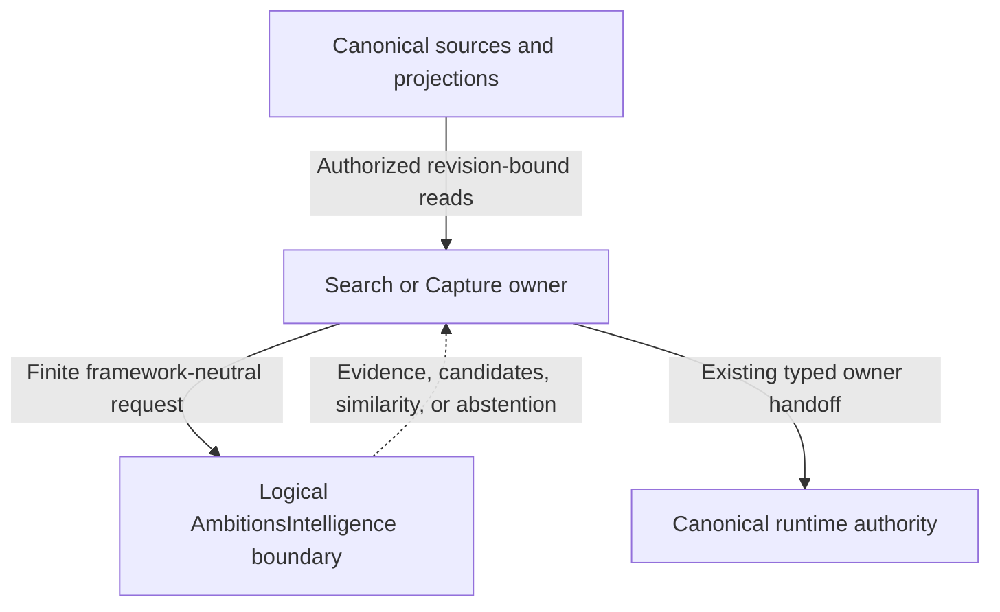

+++
initiative = "ambitions-private-semantic-intelligence"
document_type = "design"
status = "approved"
upstream = "scope.md"
+++

## Ambitions Private Semantic Intelligence — Initial Provider-Neutral Design

> **Phase boundary:** Devan approved Research, Scope, and this initial Design on
> 2026-08-13. This approved provider-neutral Design defines the
> logical computation boundary, Search/Capture integration boundaries,
> isolation and safety contracts, evaluation architecture, and evidence gates.
> It does not select an external production model, production semantic index,
> asset-delivery mechanism, final physical module boundary, tokenizer,
> quantization, actor topology, or numerical release budget. It authorizes no
> evaluation implementation, model conversion, package/tool creation,
> production code, canon change, deployment, or release. Its approval authorizes
> evaluation-only implementation grooming; evaluation execution remains
> separately unauthorized by this artifact.

**Repository evidence baseline:** Research inspected product and source at
`0518378bd9b8f11ce7b50f1a290520ebdb947f90`. The three subsequent commits
through `ce47058a3db7ed89dff9eb70a6acd65df6917ffc` changed only this initiative's
Research and Scope lifecycle artifacts. Narrow Design verification therefore
found no intervening product/source implementation change.

## Design summary

V1 is a progressive semantic refinement of the existing global Search and
Capture capabilities. Today, Goals, Time, and You remain the four roots;
Capture and Search remain global capabilities. The Design adds no root, global
capability, AI destination, chat, model picker, generative feature, or new
canonical authority.

The durable architecture is one logical `AmbitionsIntelligence` computation
boundary with framework-neutral semantics. It accepts finite, privacy-qualified,
revision-bound inputs and returns finite evidence: candidate references,
similarities, proposal signals, confidence evidence, provider state, or
abstention. It exposes no command, Event, Projection, Receipt, History, raw
store, network, or owner-mutation capability. Search and Capture remain the
only owners of user-visible meaning and action.

This initial Design does not choose whether the boundary will eventually live
inside `LocalRuntimeOS` or in an extracted Swift package. It also does not
design a production persistent semantic index because the production Search
owner/generation has not yet been consolidated and provider/index/device
evidence does not yet exist. Those choices belong to the amended Design after
the bounded evaluation tranche.

The first post-approval implementation tranche, if separately groomed, is
evaluation-only. It must live outside the shipping application's dependency and
resource graph, exercise the closed matrix against immutable fixtures, and
produce typed evidence for the existing intelligence-evaluation owner. It is
disposable and incapable of canonical mutation. Nothing in that tranche may be
promoted wholesale into production or establish Search, Capture, persistence,
runtime, delivery, or package ownership.

## User flows

### 1. Search: deterministic result, then one semantic refinement

1. The user opens the existing full-screen global Search surface and enters a
   query.
2. Search immediately executes its current deterministic local path. Exact and
   strong-prefix results, privacy filtering, object identity, source revision,
   action eligibility, stable ordering, and owner routes remain available
   without waiting for intelligence.
3. For supported English input, Search may issue one bounded, cancellable,
   revision-bound semantic request after the deterministic result is usable. A
   new query revision cancels the prior request.
4. The logical intelligence boundary returns candidate references and evidence,
   or abstains. It returns no display model and no action authority.
5. Once consolidation is complete, production Search re-resolves every
   candidate through the eventual owner-approved production Search path and
   generation, removes ineligible, stale, deleted, tombstoned, wrong-owner,
   wrong-family, or privacy-suppressed candidates, and applies deterministic
   fusion. A valid exact result cannot be hidden or displaced solely by a model
   score.
6. If the qualified result set adds value and still matches the active query,
   Search publishes at most one stable refinement. The active result and
   VoiceOver focus do not jump. Bounded labels such as “Related wording,” “Same
   Goal,” or “Possible duplicate” explain why an item appeared.
7. Opening, inspecting, or acting on a result uses the existing Search-to-owner
   route and current revision validation. Semantic evidence never authorizes the
   action.

If the provider is disabled, absent, unsupported, unqualified, interrupted, or
failed, this flow ends after step 2 without an error-shaped empty state.

### 2. Search: related and possible-duplicate discovery

1. The user invokes a related or duplicate job from an existing Search context,
   or Search determines that the current approved result presentation supports
   the bounded job.
2. Search supplies a finite set of Search-authorized source/candidate documents
   or candidate references to the logical boundary; the boundary cannot widen
   eligible object families.
3. The boundary returns similarity evidence or abstains.
4. Search revalidates identity, privacy, deletion, revision, and family before
   showing a bounded related/duplicate group. The group remains explanatory,
   not a merge, deletion, or canonical deduplication action.

### 3. Capture: evidence inside the existing proposal flow

1. The user enters text in the existing full-screen Capture composer. Durable
   intake and the current deterministic classifier/parser run first.
2. Capture may ask the logical intelligence boundary for English semantic
   evidence for Step / Goal / Needs a Place, possible duplicates, possible Goal
   associations, or ambiguity. Waiting/dependency, optional/someday, and date
   evidence may supplement but never replace explicit deterministic rules and
   parsers.
3. The boundary returns finite evidence with source revision bindings and
   coverage/abstention state. It does not return a `CaptureRouteDecision`, write
   the correction ledger, or create a runtime Event.
4. Capture combines deterministic classification, semantic evidence, candidate
   margin, rule agreement, language/provider coverage, and current candidate
   validity into its own proposal state.
5. Clear, qualified evidence may support a bounded suggestion such as a
   possible Goal or duplicate. Weak, conflicting, stale, unsupported, or
   out-of-language evidence produces abstention and the existing clarification
   or Needs a Place path.
6. The user can accept, change, reject, choose none, or keep the original input.
   Capture owns correction, confirmation, promotion, handoff, and every accepted
   consequence. No proposal is auto-accepted.

### 4. Unsupported language or mixed-language uncertainty

1. Search or Capture performs bounded language-support qualification without
   sending content off device.
2. If the semantic quality contract does not cover the input, no English-only
   model result is silently treated as qualified.
3. The current deterministic behavior completes. User-facing text makes no
   multilingual semantic-quality claim; a provider-unavailable banner is not
   shown merely because deterministic behavior is valid.

### 5. External enhancement control, if an external model later qualifies

This flow is reserved for the amended Design; the initial Design does not
select an external model or delivery mechanism.

1. The user can disable external-model enhancement without disabling Search or
   Capture.
2. The product immediately uses deterministic behavior and any separately
   qualified Apple-local fallback.
3. The user can purge user-derived semantic data exclusive to the external
   provider without changing canonical objects.
4. If delivery is separate/on-demand, the UI must disclose measured benefit and
   actual size and support defer, cancel, retry, and removal. If delivery is
   bundled, no fictitious model-byte removal is shown; immutable app-bundle
   bytes remain installed.

The amended Design must first decide whether these controls fit an existing
approved You/settings/storage surface. A genuinely new child remains a
separately governed material-frontend branch.

### 6. Evaluation-only evidence flow after Design approval

1. After this Design is separately approved, evaluation-only grooming may
   define a non-shipping host, immutable suite manifest, fixtures, provider
   adapters, and physical-device measurement path.
2. The runner resolves exactly the closed matrix: deterministic Search/Capture,
   `NLEmbedding`, Arctic Embed XS, BGE Small EN v1.5, and all-MiniLM-L6-v2.
   mxbai xsmall is admitted only when every Scope low-incremental-cost condition
   is recorded as met. Core Spotlight runs as a separately labelled Apple-native
   arm.
3. Each arm receives the same immutable Search/Capture fixture partitions,
   safety canaries, task definition, fusion/calibration experiment identity,
   and device/runtime reporting contract where applicable. The tranche uses
   fixture/test authority and disposable candidate stores only; it neither
   depends on nor selects a production Search path or generation.
4. Candidate-specific conversion and tokenization exist only in the evaluation
   host. Reference-numeric checks must pass before results are considered valid.
5. The runner records quality, safety, conversion, runtime, scale, failure,
   storage, provenance, and license evidence. Private production stores are not
   mounted, read, copied, or exported.
6. Results are emitted through the existing intelligence-quality/safety
   evaluation identity and hard-failure semantics. The report must allow “no
   external model.” It grants no release or implementation authority.
7. After evidence review, this Design is amended. Only the amended Design may
   select external model or no model, production semantic-index mechanism,
   final physical boundary, delivery/runtime decisions, and measured release
   criteria. Devan must re-approve it before production grooming.

## States and recovery

### Product-visible semantic states

| State | Search behavior | Capture behavior | Recovery |
|---|---|---|---|
| `deterministicOnly` | Immediate current results | Current rule/parser proposal | Always valid; no semantic error UI required |
| `qualifying` | Deterministic results remain interactive | Draft and deterministic proposal remain interactive | Cancel on revision, dismissal, or pressure |
| `refining` | One bounded refinement may follow | Bounded evidence may update proposal before acceptance | Retain deterministic state; never block |
| `refined` | Qualified candidates fused once | Qualified suggestion/ambiguity visible | Owner revalidates on every selection |
| `abstained` | Keep deterministic result set | Clarify or Needs a Place | Explain uncertainty only when useful |
| `unsupportedLanguage` | Deterministic behavior only | Deterministic behavior only | No semantic-quality claim |
| `disabled` | Deterministic/qualified Apple-local behavior | Same | Re-enable only by user choice where a control exists |
| `unavailable` | Deterministic behavior only | Deterministic behavior only | Retry only on a later bounded request |
| `failedOrQuarantined` | Deterministic or prior qualified fallback | Same | Quarantine bad generation; no retry loop |
| `pressureSuppressed` | Deterministic behavior only | Deterministic behavior only | Reconsider on a later request after pressure clears |

The product does not expose raw provider states, model names, numeric confidence,
tokenization, compilation, or inference terminology in normal Search/Capture UI.

### Request validity and stale-result containment

Every request is bound to a consumer, task kind, request/query or draft revision,
authorized source generation, privacy-purpose decision, language-support result,
provider/evaluation identity, limits, and cancellation context. Every returned
candidate is bound to the source identity/revision used to compute it.

A result is publishable only when all bindings still match. Query edit,
Capture edit, navigation/dismissal, source revision, tombstone, privacy or owner
change, provider-generation change, cancellation, app deactivation, or consumer
deallocation invalidates the result. Invalid evidence is discarded; it never
updates UI or canonical state.

### Provider and asset failure

- Missing/never-installed, interrupted acquisition, incompatible, corrupt,
  revoked, reclaimed, unavailable OS model, converter mismatch, or load/runtime
  failure all resolve to a typed unavailable/quarantined outcome.
- No failure can block app launch or deterministic Search/Capture.
- No indefinite retry, continuous health polling, or automatic download is
  allowed. Any later separate acquisition follows intelligence-change-management.
- Activation is generation-atomic: readers see one complete qualified semantic
  generation or none. A partial rebuild is never readable.
- Rollback activates a compatible non-revoked prior generation or disables the
  enhancement. It never alters canonical state.

### Lifecycle and resource recovery

- A new query/draft revision or surface dismissal cancels optional foreground
  work and prevents stale publication.
- Low Power Mode pauses discretionary bulk work and may suppress foreground
  refinement. Serious/critical thermal pressure, memory warning, protected-data
  unavailability, background expiration, or app deactivation cancels or unloads
  optional work.
- Background indexing, if a later amended Design selects it, is opportunistic,
  checkpointed, and derived-only. It cannot be required for correctness or
  continue after its authorized source/generation changes.
- Storage pressure may purge rebuildable derived intelligence and external
  caches under the later delivery contract. Canonical objects remain intact.

### Derived-data lifecycle

Deletion, tombstone, source revision, privacy reclassification, owner/purpose
change, model/preprocessing change, or generation incompatibility immediately
makes prior derived evidence ineligible through an authoritative eligibility
check. Physical purge may follow asynchronously, but no old entry can influence
Search or Capture meanwhile. Rebuild reads only current authorized canonical
sources. Replay can rebuild derived data; it cannot resurrect a prohibited
entry.

The production storage schema, backup exclusion, file-protection mechanics, and
migration path remain amended-Design decisions because no production index is
selected. Whatever mechanism is selected must use same-or-stronger protection
than source data, avoid stale backup copies for rebuildable data, and expose one
valid generation or none across crash, migration, rebuild, and rollback.

## Frontend experience specification

- Surface impact: existing + conditional new-child
  Search and Capture are
  the only primary affected product surfaces. Search gains deterministic-first
  semantic refinement, bounded result reasons, and related/duplicate groups.
  Capture gains bounded suggestion, ambiguity, duplicate, and Goal-association
  states inside the current proposal/correction flow. If an external model later
  qualifies, amended Design first fits controls into an existing approved
  You/settings/storage surface where possible. A genuinely new child is
  conditional future material frontend work and is not selected by this initial
  Design.
- IA/navigation: none
  Today, Goals, Time, and You remain roots. Capture and
  Search remain global full-screen, non-root capabilities. No route, root,
  shell hierarchy, entry point, or ownership changes in this initial Design.
  Any future settings child stays under the existing You/settings/storage
  hierarchy.
- Assets/iconography: system-only
  Reuse existing components and Apple
  system symbols. No provider/model brand, mascot, custom AI asset, sparkle
  motif, or Hugging Face branding is permitted.
- Visual language: unchanged
  Use the current object-led Search, full-screen
  Capture, native clarification/choice, settings, Trust, and degraded-state
  language. Do not add chat bubbles, prompt chrome, confidence meters, inference
  dashboards, activity feeds, or a separate intelligence aesthetic.
- Motion: unchanged
  This classification concerns animation and
  transitions, not a product destination. Deterministic results appear without
  waiting. One semantic refinement may update in place without reshuffling the
  focused row, repeated animation, or spatial instability. Reduce Motion uses
  no essential transition.
- Copy/localization: Use product language such as “Related wording,” “Same
  Goal,” “Possible duplicate,” “Which did you mean?”, “None of these,” and
  “Enhanced local understanding.” Copy must not expose model/framework names,
  numeric confidence, hidden certainty, or promotional AI claims. Semantic
  quality is English-only; visible strings remain localization-ready and
  unsupported input receives no false promise.
- **Visible Search states.** Fixture deterministic-first, a single qualified
  refinement, related wording, same Goal, possible duplicate, no added semantic
  value, unavailable provider with silent deterministic completion, stale
  result suppression, and owner-revalidated action handoff. Empty-query content
  remains calm and does not become recommendations.
- **Visible Capture states.** Fixture deterministic proposal, qualified bounded
  suggestion, competing suggestions, duplicate, Goal association, clarification,
  none-of-these, rejection/change, unsupported language, provider unavailable,
  stale evidence discarded after edit, and confirmation. Original input and an
  obvious nonsemantic path remain available.
- Accessibility: Preserve native reading order, semantic grouping, focus,
  largest Dynamic Type/reflow, VoiceOver, Switch Control, hardware keyboard,
  non-color state, and reduced effects. Search makes at most one concise
  refinement announcement when useful and does not announce each rank change.
  Capture alternatives and none-of-these are labelled controls; no meaning
  depends on probability, animation, position, haptics, or color.
- Visual proof: Existing-surface Search/Capture refinement is bounded
  existing-surface work. Its visual gate is **not-required** beyond the approved
  Design contract, but implementation Verification must include native fixtures,
  screenshots, interaction, accessibility, and representative-device proof for
  every named state. If amended Design selects a genuinely new child
  settings/storage surface, that branch becomes material frontend work, must use
  `ambitions-unified-frontend-program`, may use subordinate
  `ambitions-native-visual-foundry` for its native fixture/proof, and requires
  explicit owner visual approval before its frontend task becomes executable.
- Visual gate: not-required
  This applies only to the bounded work inside
  the approved existing Search and Capture surfaces. A later amended Design
  selecting a genuine new child must reclassify that branch and use its required
  owner visual gate.

## Architecture and data

### Authority topology

The downward intelligence edge is read/compute/return only. There is no edge
from the logical boundary to command execution, Events, Projections, Receipts,
History, raw canonical stores, or network egress.

### Framework-neutral computation contracts

The initial Design fixes semantic roles, not concrete Swift declarations or
files. Later grooming may name exact types only within these contracts:

1. **Request context** — task kind, consumer/request revision, source-generation
   identity, privacy-purpose decision, language-support result, result/work
   limits, cancellation context, and provider-policy constraints.
2. **Qualified documents/candidates** — opaque canonical references plus the
   minimum text fields authorized for the task, source owner/privacy/revision,
   object-family eligibility, and deterministic provenance. No arbitrary store
   client crosses the boundary.
3. **Semantic work** — bounded embedding/similarity/candidate or prototype
   comparison work that observes cancellation and has no mutation method.
4. **Evidence result** — finite candidate references, evidence kinds, normalized
   comparison values only where defined by the selected evaluation identity,
   source bindings, provider/generation identity, limitations, or abstention.
   Raw scores are not product confidence and are not UI.
5. **Health/availability result** — typed local availability, qualification,
   incompatibility, quarantine, cancellation, or pressure suppression. It
   grants no owner or release authority.

Search- and Capture-specific adapters translate owner-owned domain data into
these framework-neutral roles and translate evidence back into owner-owned
policy. The logical boundary must not import presentation, Search action,
Capture placement, runtime command, Receipt, History, or external networking
interfaces.

### Search integration boundary

Search owns document eligibility, query interpretation used by product policy,
candidate hydration, exact/prefix preservation, deterministic fusion, grouping,
stable tie-breaking, presentation, inspection, action preparation, and current
revision validation. Intelligence may retrieve or score candidate references;
it cannot determine canonical eligibility or return an actionable result.

The live repository still contains the global `DefaultMemoryLensService` /
`LocalSearchIndex`, SQLite `FTSIndex` plus deterministic `SemanticLocalIndex`,
and a newer generation-bound `RuntimeCanonicalSearch` path. Therefore:

- this initial Design defines no production persistent semantic index;
- the evaluation host may use disposable stores but cannot constrain migration;
- before amended Design selects a persistent mechanism, an owner-approved
  consolidation must establish one production Search owner, canonical document
  contract, generation identity, privacy/filter policy, rebuild lifecycle,
  hydration/action seam, and migration/cutover path; and
- semantic retrieval is a child computation of that owner, never a fourth
  Search authority.

Deterministic fusion must preserve qualified exact/strong-prefix results,
apply the active privacy/family/local-only filters again after semantic return,
deduplicate by canonical identity, suppress stale results, and publish a stable
bounded set. The exact fusion formula remains evaluation/amended-Design work.

### Capture integration boundary

Capture durable intake, `CaptureClassifier`, date parsing, route resolution,
placement review, correction ledger, confirmation, promotion, and canonical
handoff retain ownership. Intelligence runs only after safe intake and cannot
construct or persist `CaptureRouteDecision`, append correction records, mint
runtime traces/events, or update a Capture.

The Capture adapter may request route-prototype, duplicate, Goal-association,
and ambiguity evidence. Capture combines it with deterministic rule output and
current eligible Goals/objects. Correction data may be used only as explicit,
locally read evaluation fixtures under separate consent/governance; v1 does not
train, fine-tune, profile, or silently learn from corrections.

### Provider boundary

Production provider selection is deliberately absent. The logical provider
role must be substitutable by deterministic test doubles, `NLEmbedding`, a
future Core ML adapter, or a future availability-gated Core AI adapter without
changing Search/Capture authority. `NLEmbedding` is the required zero-additional-
asset evaluation arm and eligible fallback only where its exact language/OS
revision is available and qualified.

iOS 27/Core AI cannot define the durable abstraction, raise the iOS 26 minimum,
or become a v1 dependency. The private generative runtime remains the sole
owner of generative model sessions and tasks; semantic v1 does not call it.

### Initial physical boundary

No new production package or target is designed. Repository module policy
currently authorizes zero future targets. Framework-neutral semantics are
documented independently of placement so the amended Design can choose:

- a logical boundary inside existing `LocalRuntimeOS`; or
- an extracted package only after dependency closure, Search migration/runtime
  ownership, generative-owner reconciliation, build/test routing, module policy,
  measured provider needs, and explicit owner approval.

Evaluation code, if later groomed, belongs under
`Tools/AmbitionsIntelligenceEvaluation/` or the repository's approved equivalent
outside every shipping target. Its location creates no precedent for production
package extraction. Evaluation resources, weights, tokenizers, stores, and
benchmark hosts must be unreachable from the shipping app dependency and
resource graphs.

### Evaluation architecture

The evaluation tranche is a finite experiment, not a prototype product. Its
groomed architecture must include these logical parts:

- an immutable suite manifest binding task, fixture release, closed arm list,
  provider/checkpoint/conversion/runtime identity, preprocessing and fusion
  experiment, OS/device/build, and expected evidence dimensions;
- privacy-safe synthetic/canonical Search and Capture fixtures with declared
  locale, clock, time zone, seed, privacy class, origin, scale, source revisions,
  hard negatives, deletion/staleness cases, and expected owner behavior;
- adapters for the five required arms, optional conditional mxbai, and separate
  Core Spotlight arm;
- an isolated test-only Core Spotlight domain/index for only the synthetic or
  canonical fixtures explicitly assigned to that arm, using test-only
  identifiers and deterministic fixture provenance, with no production object
  identifiers, private user content, production Search persistence, shipping-app
  use, or product-authority implication, plus explicit cleanup at normal
  closeout and failure recovery;
- deliberate Core Spotlight boundary cases that distinguish fixtures ineligible
  for donation under the tested policy from otherwise permissible synthetic
  candidates returned for Ambitions post-retrieval privacy, identity, revision,
  deletion, and staleness validation;
- conversion-reference checks that quarantine numerically invalid candidate
  adapters before comparative metrics are accepted;
- a Search harness that separates retrieval, candidate hydration/validation,
  deterministic fusion, and actions, with mutation/action canaries;
- a Capture harness that separates deterministic rules, semantic evidence,
  product calibration/abstention experiments, and owner confirmation, with
  mutation canaries;
- a device/runtime harness recording cold/warm phase timings, throughput,
  cancellation, memory, storage/high-water marks, compute placement, energy,
  thermal, Low Power Mode, lifecycle, background expiration, failure, and
  offline behavior; and
- a report adapter into the existing intelligence-quality/safety evaluation
  identity, dimensional evidence, hard-failure, limitation, and invalidation
  contracts.

The Search quality partitions must cover exact/prefix preservation, lexical and
zero-token-overlap paraphrases, related-but-irrelevant hard negatives,
duplicates, Goal relevance, stability, Recall@K, MRR, and NDCG where useful.
Capture partitions must cover per-class precision/recall, Goal association,
duplicates, ambiguity, calibration, abstention, selective accuracy, correction,
and unsafe-assumption rate. Safety partitions are zero-tolerance for private,
deleted, tombstoned, stale, wrong-owner/family, action-authority, canonical-
mutation, private-egress, and deterministic-availability violations.

Scale runs use the Scope-defined 1K, 10K, and supported 100K synthetic cases.
Exact scanning is measured first. A disposable minimal ANN comparison is
permitted only when exact scan is insufficient at the supported scale and
cannot select or become the production index.

Physical-device evidence uses Release builds on at least the oldest supported
iOS 26 class (iPhone 11; add a low-memory SE-class device when practical), a
middle non-Pro class such as iPhone 14/15, and a current Pro/Apple-Intelligence-
capable class. This is the evaluation matrix, not a numeric release budget.
Research latency, RSS, storage, cancellation, energy, and thermal values may
appear only as explicitly labelled experimental comparison points with no
Design or release authority.

### Evaluation isolation contract

Before evaluation-only implementation can run, dependency/static inspection
must prove:

- no shipping app, extension, production package, production test-host route,
  bundle resource, archive copy phase, runtime composition root, or production
  source imports or reaches evaluation code/assets;
- the host receives only fixtures or separately governed consented test
  material and has no adapter to app repositories, Event stores, projections,
  receipts, correction stores, command clients, or network inference;
- mutation canaries fail any attempt to create/update canonical state;
- no evaluated artifact uses mutable revisions, `trust_remote_code`, pickle,
  runtime Hub loading, an account/token, or unreviewed executable downloads;
- reports redact content and never upload private queries, Capture text,
  vectors, candidates, scores, diagnostics, or fixtures; and
- tranche closeout deletes/disposes code and assets, archives only explicitly
  non-production evidence, or selectively reimplements approved pieces after
  amended Design. Wholesale promotion is prohibited.

### Provenance and adjacent-owner handoffs

Every evaluated artifact binds immutable source revision and hashes, exact
files/tokenizer, preprocessing, prompt/truncation/pooling/normalization,
dimension, converter/toolchain, precision/compression, compiled hash,
license/NOTICE, compatibility, security scan, evaluation identity, and
revocation state.

`intelligence-change-management` owns any future acquisition, verification,
staging, atomic promotion, rollback, revocation, and purge. The evaluation
tranche can produce model-specific evidence/manifests but cannot create a
release coordinator. `intelligence-quality-safety-evaluation` owns durable run
identity, evidence dimensions, hard failures, limitations, invalidation, and
read-only reports. This initiative supplies semantic fixtures, methods, and
claims. The private generative runtime and grounded-generative initiatives keep
all generative task/proposal ownership.

### Persistence, migrations, concurrency, and replay

- **Initial production persistence:** none is selected or authorized. No
  production semantic store or migration is designed before Search
  consolidation and measured evidence.
- **Evaluation persistence:** disposable and non-production, with immutable run
  identity and atomic result/artifact writes through the evaluation owner.
  Interruption yields a partial/invalid run, never product state.
- **Concurrency:** work must be `Sendable`, bounded, and cancellable under Swift
  strict concurrency. A concrete actor topology is intentionally deferred;
  whatever topology is chosen must serialize activation/generation changes,
  prevent stale publication, and avoid main-actor inference or disk I/O.
- **Replay:** canonical replay never depends on semantic evidence. A future
  semantic store is rebuildable from current authorized projections and exact
  provider/preprocessing identity. Replay cannot repeat acquisition, publish a
  partial generation, or resurrect deleted/reclassified entries.
- **Migration:** amended Design must define supported store/index upgrade,
  rebuild, rollback, corruption, backup/exclusion, and low-storage behavior for
  the selected mechanism. Incompatible derived data is discarded/quarantined
  and rebuilt; canonical data is never migrated by intelligence.

### Candidate canon handoff after amended Design

No canon edit occurs in the evaluation tranche. After evidence and before
production implementation, amended Design must identify exact changes to the
owning Search, Capture, privacy/data-classification, persistence/replay,
performance/energy, testing/fixtures, validation/release, and—only if needed—
You/settings specifications. No navigation root/global-capability change,
private-egress exception, new canonical object, Receipt/History owner, or iOS
minimum-target change is expected. If any becomes necessary, work returns to
Scope.

## Privacy and accessibility

### Privacy and security

- Search queries, Capture text, source fields, embeddings/vectors, indexes,
  candidate identities joined to private objects, similarity/rank/confidence or
  abstention evidence, corrections, caches, and content-bearing diagnostics are
  private derived user data. Numeric form is not anonymization.
- The source owner and privacy policy decide which minimum fields may enter a
  request. Unknown class, owner, purpose, language support, destination, or
  policy revision fails closed to deterministic behavior.
- Normal intelligence performs no private network request. No Hugging Face,
  OpenAI, PCC, hosted inference, vector service, analytics, crash upload,
  telemetry, support bundle, or model-improvement path may receive private
  content or derived data.
- Public artifact acquisition, if later approved, uses only public immutable
  identity/metadata and cannot be partitioned or parameterized by private
  content, stable user identity, query, selection, or behavior.
- Local logs/signposts may record opaque task/request/provider/generation IDs,
  bounded phase durations, counts, availability and reason codes, privacy class
  category, and redacted health. They must not record source text, titles,
  queries, embeddings, candidate IDs tied to content, corrections, prompts, or
  raw scores.
- Derived stores use source privacy, owner, purpose, retention/deletion, and
  same-or-stronger Data Protection. Screenshots, widgets, Spotlight, clipboard,
  backup/export, crash material, and diagnostic bundles need explicit denial or
  minimization tests.
- Evaluation uses synthetic/canonical fixtures by default. Any consented test
  material needs a separate named consent, retention, deletion, device/export,
  and review contract; it cannot become a training corpus.

### Accessibility behavior

Search preserves the deterministic result order and active focus while optional
work runs. A useful refinement makes at most one concise announcement; the
focused item does not move, disappear, or become unactionable because a model
rank changed. Labels convey result identity, owner/state, reason, and action
without requiring spatial grouping or color.

Capture preserves original text, deterministic proposal, edit/correction path,
and focus. Ambiguity presents labelled choices, “None of these,” and a clear
continue/reject path. VoiceOver and Switch Control can inspect and choose every
alternative, and Dynamic Type can reflow without hiding confirmation or
consequence. No numeric confidence is spoken.

Unavailable, disabled, offline, purged, or pressure-suppressed semantics do not
remove controls or produce an inaccessible empty state. Any later external-
enhancement settings/delivery flow must expose benefit, storage/download effect,
state, progress, cancel/retry/remove where applicable, disable, purge, and
fallback with native semantics and non-color status.

## Requirement traceability

| Scope requirement | Design decision and verification seam |
|---|---|
| `REQ-001` | Deterministic-first Search/Capture flows; semantic states always fall back without launch/action dependency |
| `REQ-002` | Framework-neutral read/compute/return contracts; explicit absence of command, Event, Projection, Receipt, History, store, and egress capabilities |
| `REQ-003` | Search candidate jobs for paraphrase, zero-overlap, related, duplicate, and Goal relevance; Search rehydrates eligible identities |
| `REQ-004` | Deterministic fusion preserves exact/prefix, privacy, revision, tombstone, family, action, and stable fallback authority |
| `REQ-005` | No production persistent semantic index until one Search owner/generation and migration are owner-approved |
| `REQ-006` | Capture adapter returns route/duplicate/Goal/ambiguity evidence only; deterministic classifier/parser remain authoritative |
| `REQ-007` | Capture retains intake, proposal, correction, confirmation, promotion, runtime trace/Event, and owner handoff |
| `REQ-008` | Product calibration combines held-out evidence and rule/candidate validity; weak/conflicting/stale/out-of-language cases abstain |
| `REQ-009` | English-only qualification flow and deterministic behavior for unsupported/mixed language; multilingual arms excluded |
| `REQ-010` | `NLEmbedding` is a distinct zero-asset evaluation arm and eligible qualified fallback keyed to language/OS revision |
| `REQ-011` | Evaluation architecture fixes the five required arms and conditional low-cost mxbai rule; no survey expansion |
| `REQ-012` | Core Spotlight is separately labelled and must pass identical correctness/lifecycle checks through Search hydration |
| `REQ-013` | Evaluation architecture, fixtures, metrics, device protocol, scale/ANN condition, provenance and eleven-question report boundary |
| `REQ-014` | Evaluation-only tranche follows separate Design approval and grooming; non-shipping, disposable, mutation-incapable, no ownership/package precedent |
| `REQ-015` | Initial Design defers provider/index/physical/delivery/runtime selection; amended Design evidence bundle and Devan re-approval precede production grooming |
| `REQ-016` | Airplane-mode/no-account operation; local adapters only; missing assets/provider failure preserve deterministic behavior |
| `REQ-017` | Delivery-neutral disable/purge flow; conditional separate-download versus bundled controls deferred to amended Design |
| `REQ-018` | Explicit no-private-egress boundary for product, evaluation, logs, diagnostics, analytics, and hosted services |
| `REQ-019` | Source-inherited privacy/purpose/revision bindings, immediate ineligibility, purge/rebuild, and no replay resurrection |
| `REQ-020` | Immutable artifact manifest, isolated allowlisted conversion, no remote code/pickle/runtime Hub, quarantine/fallback |
| `REQ-021` | Revision-bound cancellation, no per-keystroke inference, LPM/thermal/memory/background suppression, incremental derived work only |
| `REQ-022` | No numeric Design gate; Research values labelled experimental comparison points only; amended Design adopts measured criteria |
| `REQ-023` | Atomic semantic generations, staged activation, compatible rollback/disable, and byte-independent canonical state |
| `REQ-024` | Existing Search/Capture surfaces only, one stable refinement, bounded product copy, no AI/chat/model surface |
| `REQ-025` | VoiceOver/focus/announcement, Dynamic Type, Switch Control, non-color, reduced-effects, clarification, and conditional controls |
| `REQ-026` | Explicit handoffs to generative runtime, evaluation, change-management, and grounded-proposal owners without duplication |
| `REQ-027` | iOS 26 preserved; Natural Language/Core ML baseline; future Core AI is availability-gated and abstraction-neutral |

## Verification design

This section defines the evidence the evaluation-only tranche and amended
Design must receive. It does not authorize implementation or adopt release
thresholds.

### Lifecycle and graph proof

- Product-doc checker proves Research, Scope, and Design approved, one canonical
  initiative directory, and exactly the three implementation grooming artifacts.
- Dependency/resource/archive inspection proves evaluation code and assets are
  unreachable from the shipping app, extension, production packages, bundle,
  composition root, and archive.
- Static ownership checks prove the logical boundary exposes no canonical write,
  Search action, Capture placement, Receipt/History, raw store, or network API.
- Module-policy review proves evaluation placement creates no production target
  or package-extraction authorization.

### Deterministic and owner-authority proof

- Existing Search and Capture suites remain green and are run as the baseline,
  not replaced by model tests.
- Contract tests use mutation canaries to prove no semantic arm can append an
  Event, write a Projection, create a Receipt, update a Capture/Goal/Step, write
  the correction ledger, or validate/execute a Search action.
- Search cases prove exact/prefix preservation, deterministic first publication,
  canonical hydration, privacy/family/local-only filters, stale/deleted/
  tombstoned suppression, stable focus, action revalidation, and no fourth
  Search owner.
- Capture cases prove durable intake first, deterministic rule/date precedence,
  original-input preservation, abstention/clarification, none-of-these,
  correction, confirmation, and no automatic Goal/date/dependency/priority or
  placement consequence.

### Quality and calibration proof

- All five required arms share identical immutable partitions and reporting;
  conditional mxbai admission has a written cost-condition result. Core
  Spotlight is separate.
- Search reports Recall@K, MRR, NDCG where useful, exact/prefix preservation,
  paraphrase and zero-overlap retrieval, related hard negatives, duplicates,
  Goal relevance, stability, and slice-level regressions.
- Capture reports per-class precision/recall, Goal association, duplicates,
  ambiguity, calibration, abstention, selective accuracy, correction, unsafe
  assumptions, and useful coverage.
- Holdout partitions used for winner reasoning are isolated from tuning/fusion
  experiments. Every comparison binds exact model/provider/preprocessing,
  corpus, calibration, fusion, and code/build identity.
- The final report states a winner or “no external model,” limitations, hard
  failures, user-value lift, and burden; public leaderboard position is not a
  selection result.

### Conversion, provenance, and supply-chain proof

- Reference-numeric tests cover tokenizer IDs/masks, truncation/prompting,
  pooling, normalization, embedding dimension, representative vectors,
  compressed variants, and unacceptable drift.
- Immutable checkpoint/files/hashes, converter/toolchain, compiled hash,
  license/NOTICE, commercial-use review, security scan, compatibility and
  revocation are recorded for every arm.
- Tests reject mutable revisions, missing/mismatched hashes, unknown files,
  remote code, pickle, unreviewed executable downloads, runtime Hub requests,
  account/token requirements, incompatible artifacts, and revoked generations.

### Privacy, deletion, and offline proof

- Seeded canaries prove source/query/Capture text, embeddings, candidate IDs,
  raw scores, corrections, fixtures, and content-bearing diagnostics appear in
  no network request, logs, crash material, analytics, shared report, screenshot,
  clipboard, widget, or implicit export. The evaluation host has no access to
  live production stores, and private production Ambitions content never reaches
  Core Spotlight for this evaluation.
- Core Spotlight tests prove that no unauthorized or policy-ineligible fixture
  is donated; explicitly authorized synthetic/canonical fixtures use only the
  isolated test domain and test identifiers, never persist as production Search
  state, are unreachable by the shipping app, and are removed during normal
  teardown and failure recovery.
- When the test is specifically measuring post-retrieval suppression for an
  otherwise permissible synthetic Spotlight candidate, Search must still apply
  Ambitions canonical privacy, identity, revision, deletion, and staleness
  validation before the candidate can appear or support an action.
- Airplane mode and no-account/no-token runs cover every arm after applicable
  public assets exist and every fallback state before/without them.
- Delete, tombstone, revision, privacy reclassification, owner/purpose change,
  restore, replay, model/preprocessing generation change, partial rebuild,
  corruption, revocation, purge, and rollback prove immediate ineligibility and
  eventual terminal removal without canonical effect.
- Evaluation fixture and consent audits prove no real private production data is
  imported or retained without a separate explicit contract.

### Runtime, performance, energy, and device proof

- Release-build measurements run on the oldest supported iOS 26 class, middle
  non-Pro class, and current Pro/Apple-Intelligence-capable class, with a low-
  memory SE-class run when practical.
- For 1K, 10K, and supported 100K scales, report phase-separated cold/warm model
  availability/verification/compile/load, tokenization, inference, retrieval or
  scan, fusion, hydration, rendering, initial/indexing throughput, incremental
  work, cancellation, peak/high-water memory, active/rebuild storage, compute
  placement, energy, and thermal state.
- Cross airplane mode, asset present/missing/corrupt/incompatible/reclaimed,
  Low Power Mode, nominal/fair/serious/critical thermal states where safely
  inducible, foreground/background, protected-data availability, memory
  pressure, background expiration, query/draft revision, dismissal, app
  deactivation, crash, and relaunch.
- No blind sleeps, retry-until-pass, invented battery percentage, simulator-only
  memory/energy claim, or unlabeled Research hypothesis satisfies evidence.
  Measured baseline/candidate distributions inform amended-Design budgets.

### UI and accessibility proof

- Native fixtures and screenshots cover every visible Search/Capture state named
  in the frontend specification at smallest/largest supported widths and largest
  Dynamic Type.
- VoiceOver verifies reading/focus order, stable active result, at-most-one useful
  refinement announcement, labelled reasons, ambiguity choices, none-of-these,
  consequences, confirmation, and return focus.
- Switch Control, hardware keyboard, non-color state, Reduce Motion, interruption,
  offline, disabled, unavailable, failure, purge, and conditional delivery
  controls are exercised where applicable.
- A future genuine new settings/storage child cannot enter grooming without the
  unified-frontend-program workflow, native visual proof, and explicit owner
  visual approval.

### Evidence handoff and Design amendment gate

The evidence bundle must answer all eleven `REQ-013` questions and contain the
complete `REQ-015` identities and measurements. Hard failures in privacy,
deletion/staleness, identity/action safety, canonical authority, deterministic
availability, provenance/license, or shipping-graph isolation disqualify the
affected arm regardless of average quality.

The amended Design must explicitly choose and justify:

1. external production model or no external model;
2. production Search owner/generation and semantic-index mechanism;
3. final physical boundary;
4. exact provider/preprocessing/fusion/calibration identity;
5. persistence, deletion, rebuild, migration, backup and rollback behavior;
6. bundle versus Apple-hosted/managed delivery if an external model qualifies;
7. measured latency, memory, storage, cancellation, energy, thermal, Low Power
   Mode, and device-coverage release criteria; and
8. exact canon/build/test/frontend impacts.

Production implementation grooming is blocked until Devan re-approves that
amended Design.

## Open decisions

No unresolved product decision is introduced by this Design. The following are
intentional evidence or repository dependencies, not permission for grooming to
invent behavior:

| Gated decision | Required input | Resolution point |
|---|---|---|
| External model or no external model | Complete closed-matrix quality, safety, runtime, size, license and burden evidence | Amended Design + Devan re-approval |
| Production Search owner/generation | Owner-approved consolidation of Memory Lens, FTS/deterministic semantic path, and canonical-generation migration | Before any persistent production semantic index is designed |
| Production index and exact scan/ANN | Search ownership plus 1K/10K/100K quality/runtime/storage evidence | Amended Design |
| Final logical/physical placement | Dependency closure, module policy, Search/runtime/generative ownership, build/test routing, measured provider needs | Amended Design + explicit module/owner approval |
| Provider/tokenizer/conversion/precision/compute details | Reference fidelity and device evidence | Amended Design |
| Delivery and control placement | Archive/installed/high-water size, failure/update/rollback and UX evidence | Amended Design; new child triggers frontend governance |
| Numeric release budgets/device qualification | Physical-device baseline and candidate distributions | Amended Design; Research numbers remain nonauthoritative |
| Production persistence/migration/backup protection | Selected Search/index/provider/generation mechanism | Amended Design |
| Core Spotlight production role | Separately labelled quality/correctness/lifecycle evidence and Search ownership fit | Amended Design or rejection |
| iOS 27/Core AI evolution | Stable API/platform evidence and separately approved product need | Future availability-gated Design; not semantic v1 |

If evidence requires multilingual quality, generative behavior, private egress,
opaque learning, a new product owner, a new root/global capability, weaker
deterministic/privacy behavior, or another v1 capability, the initiative must
return to Scope rather than amend Design around the product change.

## Design self-review

**Verdict: PASS — Devan approved this initial provider-neutral Design on
2026-08-13; evaluation-only implementation grooming is authorized.**

- Approved Research and approved Scope are the sole upstream authorities; the
  verified repository delta since the Research baseline contains lifecycle
  artifacts only.
- All 27 Scope requirements map to an explicit Design decision and verification
  seam.
- User flows cover deterministic-first Search, related/duplicate discovery,
  Capture evidence, unsupported language, conditional external control, and the
  lifecycle-conforming evaluation path.
- Visible, failure, pressure, stale-result, provider/asset, derived-data,
  rollout, rollback, and recovery states preserve deterministic and canonical
  authority.
- Search and Capture remain product owners; the computation boundary has no
  mutation, action, Receipt/History, raw-store, or egress capability.
- The Design creates neither a fourth Search authority nor a second Capture
  authority and blocks persistent semantic-index selection until Search
  ownership is consolidated.
- Provider, production index, package extraction, tokenizer, quantization,
  delivery, actor topology, storage schema, and numerical budgets remain
  deliberately evidence-gated.
- Evaluation is defined as a closed, disposable, non-production tranche outside
  the shipping dependency/resource graph, executable only after separate Design
  approval and evaluation-only grooming.
- Frontend classifications exactly match approved Scope: surface impact is
  `existing + conditional new-child`; current Search/Capture work remains
  bounded existing-surface work with a `not-required` visual gate, while an
  amended Design selecting a genuine new child must use the unified-frontend
  workflow and explicit owner visual approval. IA, assets, visual language,
  effects, copy, and accessibility classifications remain unchanged.
- Privacy, deletion/reclassification, offline, provenance, concurrency, replay,
  resource, device, rollout/rollback, and adjacent-owner boundaries are explicit
  enough for evaluation-only grooming without inventing product behavior.

This approved initial Design authorizes evaluation-only implementation grooming
only. It does not authorize evaluation code, model conversion, package/tool
creation, production implementation, canon changes, deployment, or release.
