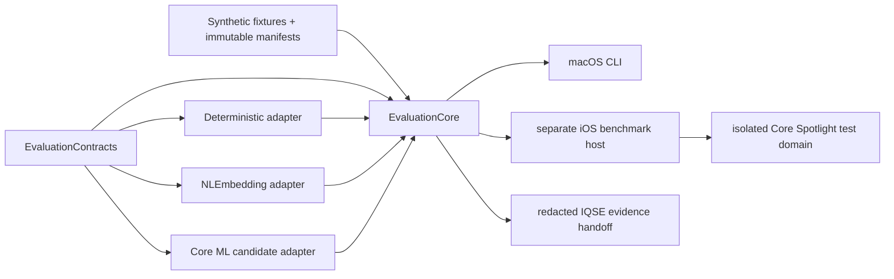

# Evaluation-Only Implementation Plan

> **For agentic workers:** Execute only after Devan separately hands this groomed
> package to Codex. Use `superpowers:test-driven-development` for each task and
> `superpowers:verification-before-completion` before closing it. This plan does
> not authorize execution, conversion, package/tool creation, production work,
> canon edits, deployment, or release.

## Outcome and authority boundary

Build one disposable, non-production evaluation tranche that answers the eleven
finite questions in `REQ-013` and produces the evidence required by the approved
initial Design for its later amendment. The tranche compares the approved closed
semantic matrix using synthetic/canonical fixtures, validates external conversion
fidelity, measures real iPhone cost, and reports either a qualifying arm or an
explicit no-external-model result.

The tranche is not Ambitions product implementation. It cannot create a Search
owner, Capture owner, canonical object, runtime authority, production semantic
index, asset-delivery system, production package precedent, or user-facing AI
surface. It does not modify `Native/Ambitions/`, `Packages/`, root `project.yml`,
shipping schemes, app/extension composition, canon, or release resources.

The closed arms are:

1. current deterministic Search/Capture baseline;
2. Apple `NLEmbedding`;
3. Snowflake Arctic Embed XS;
4. BGE Small EN v1.5;
5. all-MiniLM-L6-v2;
6. conditional `mxbai-embed-xsmall-v1` only after the admission gate below; and
7. a separately labelled Core Spotlight semantic-search arm.

No multilingual or generative arm and no additional model is admissible.

## Exact repository layout

All implementation created by this tranche is rooted here:

```text
tools/ambitions-intelligence-evaluation/
├── Package.swift
├── README.md
├── Sources/
│   ├── AmbitionsIntelligenceEvaluationContracts/
│   │   ├── EvaluationIdentity.swift
│   │   ├── EvaluationModels.swift
│   │   ├── EvaluationProvider.swift
│   │   └── EvaluationResults.swift
│   ├── AmbitionsIntelligenceEvaluationCore/
│   │   ├── CaptureEvaluationHarness.swift
│   │   ├── ExactVectorScanner.swift
│   │   ├── Metrics.swift
│   │   ├── MutationCanaries.swift
│   │   ├── PrivacyCanaries.swift
│   │   ├── QualityRunner.swift
│   │   ├── ReportWriter.swift
│   │   ├── ScaleCorpusGenerator.swift
│   │   ├── SearchEvaluationHarness.swift
│   │   └── SuiteLoader.swift
│   ├── AmbitionsIntelligenceEvaluationDeterministic/
│   │   ├── DeterministicCaptureAdapter.swift
│   │   └── DeterministicSearchAdapter.swift
│   ├── AmbitionsIntelligenceEvaluationNaturalLanguage/
│   │   └── NLEmbeddingAdapter.swift
│   ├── AmbitionsIntelligenceEvaluationCoreML/
│   │   ├── CoreMLCandidateAdapter.swift
│   │   └── ValidatedTokenizer.swift
│   └── AmbitionsIntelligenceEvaluationCLI/
│       └── main.swift
├── Tests/
│   ├── AmbitionsIntelligenceEvaluationContractsTests/
│   ├── AmbitionsIntelligenceEvaluationCoreTests/
│   ├── AmbitionsIntelligenceEvaluationDeterministicTests/
│   ├── AmbitionsIntelligenceEvaluationNaturalLanguageTests/
│   └── AmbitionsIntelligenceEvaluationCoreMLTests/
├── BenchmarkHost/
│   ├── project.yml
│   ├── Sources/
│   │   ├── BenchmarkApp.swift
│   │   ├── BenchmarkCoordinator.swift
│   │   ├── BenchmarkScenario.swift
│   │   ├── BenchmarkSignposts.swift
│   │   ├── CoreSpotlightEvaluationArm.swift
│   │   └── ResourcePressureController.swift
│   └── Tests/
│       ├── BenchmarkCoordinatorTests.swift
│       └── CoreSpotlightIsolationTests.swift
├── Conversion/
│   ├── README.md
│   ├── requirements.lock
│   ├── convert_candidate.py
│   ├── export_reference_vectors.py
│   ├── validate_candidate.py
│   └── tests/
│       ├── test_conversion_policy.py
│       └── test_reference_validation.py
├── Fixtures/v1/
│   ├── manifest.json
│   ├── search-corpus.jsonl
│   ├── search-judgments.jsonl
│   ├── capture-corpus.jsonl
│   ├── capture-judgments.jsonl
│   ├── deterministic-search-oracle.jsonl
│   ├── deterministic-capture-oracle.jsonl
│   ├── mutation-canaries.json
│   ├── privacy-canaries.json
│   ├── spotlight-policy.json
│   └── reference-texts.jsonl
├── Manifests/
│   ├── suite-v1.json
│   ├── offline-failure-matrix-v1.json
│   ├── physical-device-matrix-v1.json
│   ├── providers/
│   │   ├── deterministic.json
│   │   ├── nlembedding.json
│   │   ├── arctic-xs.json
│   │   ├── bge-small-en-v1.5.json
│   │   ├── minilm-l6-v2.json
│   │   └── mxbai-xsmall-conditional.json
│   ├── licenses/
│   └── security/
├── Schemas/
│   ├── fixture-manifest-v1.schema.json
│   ├── provider-manifest-v1.schema.json
│   ├── run-manifest-v1.schema.json
│   └── evaluation-report-v1.schema.json
├── Scripts/
│   ├── check_isolation.py
│   ├── check_provenance.py
│   ├── cleanup.py
│   ├── collect_archive_sizes.py
│   ├── inspect_run.py
│   ├── synthesize_report.py
│   └── tests/
│       ├── test_synthesize_report.py
│       └── test_cleanup.py
└── .gitignore
```

Generated assets and evidence are never committed. During execution they live
only beneath ignored `Artifacts/`, `Runs/`, and `Reports/` directories inside
this tool root. `cleanup.py` removes model/tokenizer inputs, converted and
compiled assets, vector stores, Spotlight test-domain records, temporary build
products, and incomplete runs. The reviewed redacted evidence bundle is copied
to
`docs/qa/evidence/ambitions-private-semantic-intelligence-evaluation-v1/`
only at tranche closeout; that path is evidence, not a runtime input.

## Non-shipping dependency graph



`Package.swift` produces no library consumed outside its own root. The CLI is a
macOS executable for deterministic fixtures, quality, reference checks, scale,
and report synthesis. The standalone XcodeGen `BenchmarkHost/project.yml`
depends by local path on the evaluation package and builds only a separately
identified non-shipping app and tests. Root `project.yml`, `Ambitions.xcodeproj`,
shipping targets, extensions, packages, schemes, build phases, resources, and
archives have no reverse edge to this root.

The package target graph is exact: Contracts has no internal dependency; Core,
Deterministic, NaturalLanguage, and CoreML each depend on Contracts; Core also
depends on the three provider targets for orchestration; the CLI depends on Core;
and one `AmbitionsIntelligenceEvaluationKit` library product exposes those
evaluation targets only to the standalone benchmark host. The host defines only
`AmbitionsIntelligenceEvaluationBenchmarkHost` and
`AmbitionsIntelligenceEvaluationBenchmarkHostTests` plus the same-named scheme.

The package may import only Foundation, Accelerate where measurement proves it
useful, NaturalLanguage in its adapter, and CoreML in its candidate adapter. The
iOS host additionally imports os/signpost and CoreSpotlight. No runtime Hub,
HTTP, production database, canonical command, Event/Projection/Receipt,
Capture-correction, or shipping presentation dependency is allowed.

`Package.swift` uses Swift tools 6.2, Swift 6 language mode, strict concurrency,
macOS 15, and iOS 26. The standalone host uses Swift 6.0, strict concurrency,
and an iOS 26 deployment target, matching current repository build policy without
raising the shipping app minimum.

## Evaluation contracts and immutable identity

`AmbitionsIntelligenceEvaluationContracts` defines evaluation-only, `Sendable`,
framework-neutral value contracts:

- `EvaluationSuiteIdentity`: schema version, fixture-release digest, closed-arm
  digest, task/policy revisions, source commit, and evidence dimensions;
- `EvaluationRunIdentity`: suite identity plus provider/preprocessing,
  conversion/precision, OS/device/build, scale, seed, calibration/fusion, and
  start identity;
- `EvaluationDocument` and `EvaluationQuery`: opaque synthetic IDs, authorized
  minimal text, family, privacy eligibility, source revision, tombstone/deletion,
  Goal relation, relevance judgments, and expected deterministic consequences;
- `EmbeddingRequest`/`EmbeddingResult`: bounded text role, provider identity,
  vector dimension, normalized numeric values, limitations, cancellation, and
  abstention—never a canonical object or product confidence;
- `CandidateReference` and `SemanticEvidence`: fixture identity, score/evidence
  kind, source binding, provider generation, limitation, and abstention;
- `EvaluationProvider`: availability, qualification, batch embedding, and local
  health only; no mutation, persistence, network, Search action, or Capture route
  methods; and
- dimensional results compatible with the approved intelligence-quality/safety
  owner: applicability, coverage, evidence, hard failures, limitations,
  invalidation identity, and no universal score or release verdict.

All JSON is canonicalized before SHA-256 identity. A run is valid only when its
suite, fixtures, provider manifest, binaries/assets, device/OS/build, exact code
commit, seed, scale, experiment settings, and output digest are complete. Partial
or interrupted output is marked invalid and never merged with another run.

## Fixtures and test authority

`Fixtures/v1/manifest.json` binds every fixture file by digest and declares
English locale, deterministic clock/time zone, generator version, partition,
data origin, privacy class, object family, source revision, expected owner
behavior, and tuning versus holdout membership. Inputs are synthetic or canonical
test material only—never copied from a live Ambitions store or correction ledger.

Search cases include exact titles, prefixes, lexical matches, zero-token-overlap
paraphrases, related-but-not-relevant hard negatives, duplicates, Goal relations,
ambiguous short queries, unsupported/mixed language, privacy-ineligible objects,
wrong families/owners, deleted/tombstoned/stale revisions, action-token cases,
and stable tie cases. Capture cases include Step/Goal/Needs-a-Place prototypes,
waiting/dependency, optional/someday, explicit and ambiguous dates, duplicates,
Goal association/no-association, conflicts, unsupported language, correction,
and unsafe-assumption canaries.

The fixture corpus is the only Search/Capture authority in the tranche. The
evaluation harness does not import production types. Baseline behavior is a
fixture-side transcription of the current deterministic algorithms plus golden
outputs captured from focused current Search/Capture tests; it is labelled with
the inspected source file hashes and must be refreshed or invalidated if those
owners change before execution.

## Provider adapters and conversion

### Deterministic baseline

The deterministic Search adapter reproduces current token normalization,
exact/prefix/body ranking, stem-overlap `SemanticLocalIndex`, privacy/family/
local-only filters, deduplication, stable tie-breaking, and action revalidation
against fixture authority. The Capture adapter reproduces the current
`CaptureClassifier` rules and raw/needs-triage abstention without persisting a
route or correction. Focused production tests remain the behavioral oracle; the
adapter does not become a reusable product library.

### Apple `NLEmbedding`

The NaturalLanguage adapter records requested and resolved language, API/OS
revision identity available from the platform, dimension, availability, and
limitations. It uses local sentence vectors only, normalizes according to the
declared experiment, and abstains when English support is unavailable. It has no
asset acquisition or production fallback role.

### External Core ML candidates

Conversion is an offline build-time evaluation operation, never runtime code.
`requirements.lock` pins exact converter, tokenizer, tensor, and test tooling.
Each provider manifest must pin publisher/checkpoint/revision, every input hash,
allowlisted file, tokenizer/vocabulary, prompts, truncation, pooling,
normalization, output dimension, converter/toolchain, precision/compression,
converted/compiled hash, license/NOTICE, scan result, and revocation status.

The converter accepts only reviewed `safetensors`/JSON/text inputs. It rejects
mutable revisions, remote code, pickle, unknown executable files, symlinks that
escape the staging root, and unpinned downloads. Public assets may be acquired
in a separately controlled staging step; all evaluation and device runs then
work from immutable local files with no account or token.

Each external candidate has its own conversion task. Reference validation
compares tokenizer IDs/masks, truncation and prompt behavior, pooling,
normalization, dimension, representative vectors, similarity order, and every
tested precision/compression variant against the pinned publisher/reference
implementation. The manifest declares tolerances derived from the numerical
comparison method; a variant outside tolerance is quarantined and cannot enter
quality or device synthesis. This validates an evaluation arm only and selects
no production tokenizer, precision, or asset.

### Conditional mxbai admission

Before acquiring or converting mxbai, the admission report must prove it reuses
the same conversion/runtime path, fixtures, devices, licensing/security process,
schemas, milestones, and reporting without a new framework, architecture branch,
corpus, milestone, or material integration effort. A false or unproven condition
records `excluded_by_scope` and ends the task; no compensating work is allowed.

## Search, Capture, quality, and scale harnesses

The Search harness performs retrieval, canonical-fixture hydration, privacy/
family/local-only/revision/tombstone validation, deterministic fusion experiments,
and action revalidation as separately measured phases. Providers may return only
fixture IDs and evidence. Metrics include Recall@1/3/5/10, MRR, NDCG where useful,
exact/prefix top-result preservation, zero-overlap recall, hard-negative error,
duplicate precision/recall, Goal relevance, result stability, and every hard
safety failure.

The Capture harness compares deterministic rules with semantic route-prototype,
duplicate, Goal-association, and ambiguity evidence. It evaluates per-class
precision/recall/F1, association Recall@K/MRR and no-association precision,
duplicate precision/recall, calibration, risk-coverage, abstention, selective
accuracy, correction, useful coverage, and unsafe-assumption rate. Semantic
evidence can never override a hard deterministic rule or auto-accept a route.

Calibration and fusion experiments are explicitly named run variants. Tuning
partitions cannot influence holdout judgments. Public leaderboard scores do not
enter the decision calculation.

Scale runs generate deterministic 1K, 10K, and supported 100K synthetic corpora
from the fixture grammar while preserving privacy/deletion/staleness slices.
`ExactVectorScanner` is the only initial vector mechanism and stores evaluation
vectors in a disposable row-major binary file keyed by fixture ID. That file
format is non-production and nonprecedential. It reports vector bytes, metadata,
active/staged/high-water storage, build/incremental throughput, scan latency,
memory, cancellation, and correctness.

ANN work is absent from the initial implementation. It may be added as a small
evaluation-only subdirectory only after the reviewed exact-scan report shows
insufficiency at a supported scale under the amended-Design evidence needs. The
trigger record must name the failing scale/device/distribution and question;
otherwise the ANN task is skipped. No ANN result selects a production index.

## Core Spotlight isolation

The iOS host creates a unique test domain and searchable-index name derived from
the run identity. Only fixtures explicitly marked `spotlightDonationAllowed`
are converted to `CSSearchableItem` values with test-only identifiers. The arm
has no production object identifiers, private user content, production Search
store, app group, shipping bundle ID, or product-authority implication.

Tests distinguish:

- fixtures prohibited from donation, which must never enter Spotlight;
- allowed synthetic candidates, which may return but must pass fixture-side
  privacy, identity, family, revision, deletion, tombstone, and staleness
  validation before scoring or action tests; and
- teardown/recovery, which deletes the run domain on success, cancellation,
  timeout, failed assertion, next launch, and explicit cleanup.

Core Spotlight results remain separately labelled and cannot silently join the
embedding-provider ranking table or become a production architecture.

## Mutation, privacy, offline, and failure canaries

The contracts omit mutation and network capabilities. In addition, injected
canaries fail the run if any arm attempts or claims to append Events, mutate
Projections, create Receipts, change Capture/Goals/Steps, write correction state,
authorize/execute Search actions, access a live production path, or create a
product owner. Baseline action validation is pure fixture policy only.

Privacy canaries monitor URL loading, network task creation, file paths, logs,
reports, screenshots, clipboard, widgets, Spotlight donation, and diagnostic
fields. Content, vectors, raw scores, candidate IDs tied to content, or fixture
text cannot enter shared reports or egress. Reports contain fixture/run digests,
aggregate metrics, redacted failures, and content-free performance dimensions.

The failure matrix injects provider unavailable, never-acquired/absent asset,
interrupted staging, missing/corrupt/incompatible/revoked asset, cancellation,
memory warning/pressure, Low Power Mode, thermal pressure, foreground/background,
protected-data unavailability, background expiration, crash/relaunch, partial
run, disk pressure, and Spotlight cleanup recovery. Deterministic fixtures must
remain runnable, partial results invalid, and canonical state impossible to
affect.

## Physical-device benchmark host and instrumentation

The standalone iOS host has no product UI. Test scenarios are selected through
launch arguments and an immutable local run manifest; XCTest observes run state,
redacted report export, and cleanup. It is never linked to the shipping app.
Release-configuration measurement covers:

- oldest supported iOS 26 class: iPhone 11; add a low-memory SE-class run when
  practical;
- middle non-Pro class: iPhone 14 or 15; and
- current Pro/Apple-Intelligence-capable class.

`BenchmarkSignposts` assigns stable `OSSignposter` intervals to verification,
compile/load, tokenization, inference, index build, incremental update, exact
scan, fusion, hydration, cancellation, and cleanup. The coordinator records cold
and warm distributions, throughput, peak/high-water memory, disk/archive/model/
tokenizer/compiled-cache/vector sizes, compute placement evidence available from
Instruments, process/thermal state, Low Power Mode, background expiration, and
app lifecycle. Energy and thermal conclusions come from physical-device
Instruments/Power Profiler runs after cooldown, with randomized arm order where
practical—not from simulator or invented battery percentages.

Research latency, RSS, storage, cancellation, energy, and thermal numbers may be
displayed only in a report field named `researchExperimentalComparisonPoints`,
with the statement that they have no Scope, Design, product, or release authority.

## Output, existing evaluation owner, and evidence handoff

Every run writes atomically:

- `run-manifest.json` with all immutable identities;
- `case-results.jsonl` for redacted per-case outcomes keyed by fixture digest;
- `metrics.json` with dimensional aggregates and distributions;
- `hard-failures.json` and `limitations.json`;
- `runtime-measurements.json` plus signpost/Instruments attachment digests;
- `provenance.json`, license/NOTICE inventory, security findings, and hashes;
- `storage-and-archive.json` separating source, converted, compiled, index,
  staged, rollback, archive, and installed-size evidence; and
- `evaluation-report.json` and `evaluation-report.md`.

The report schema maps semantic claims into the existing approved
`intelligence-quality-safety-evaluation` owner: stable evaluation/run identity,
separate evidence dimensions and coverage, hard failures, limitations,
invalidation bindings, and no aggregate release score. Because that adjacent
initiative is documentation authority but has no implemented source seam in the
current repository, this tranche emits `iqse-handoff.json`; it does not create a
second durable evaluation owner or production Trust UI. If that implementation
lands before this tranche executes, Codex may write a narrow adapter only after
confirming its live interface, without changing this tranche's ownership.

The final evidence packet answers every `REQ-013` question and permits four
unbiased conclusions: external model wins; `NLEmbedding` is sufficient;
deterministic-only is preferable; or no external candidate qualifies. Hard
privacy, authority, identity/action, deletion/staleness, provenance/license,
deterministic-availability, or shipping-isolation failure disqualifies the arm.

## Persistence, migration, rollout, and disposal

- Production persistence: N/A—prohibited by approved Design.
- Production migration: N/A—no production store exists.
- Evaluation persistence: ignored run directories with immutable identity,
  atomic files, explicit invalid partial state, and disposable vector assets.
- Production rollout/rollback: N/A—amended Design decides these after evidence.
- Evaluation recovery: restart never resumes as valid unless all completed phase
  digests match; otherwise the run is invalidated and restarted from fixtures.
- Closeout: remove all test Spotlight domains, model/tokenizer/compiled assets,
  vector stores, temporary projects/build output, and incomplete runs. Retain
  only the redacted evidence packet and immutable public provenance/license
  records needed for Design amendment.

Evaluation code is deleted or remains clearly quarantined as non-production
tooling after closeout; no file is promoted wholesale. Any production reuse
requires amended Design, Devan's re-approval, and new production grooming.

## Frontend and accessibility applicability

Product frontend implementation and product accessibility proof are N/A for
this tranche because it is forbidden to modify the approved Search/Capture
surfaces or create the conditional new child. The automation-only benchmark host
is test infrastructure, not an Ambitions surface. Existing-surface semantic UX,
VoiceOver, Dynamic Type, focus, motion, and conditional settings controls remain
for amended Design and production grooming after evidence. No task may use this
N/A to weaken the approved eventual product accessibility requirements.

## Implementation order

1. Establish tool isolation, schemas, immutable contracts, and structural tests.
2. Build canonical synthetic fixtures, oracle refresh checks, and canaries.
3. Implement deterministic and `NLEmbedding` baselines.
4. Implement the shared offline conversion/reference-validation lane, then
   validate Arctic, BGE, and MiniLM independently; decide conditional mxbai.
5. Implement Search, Capture, quality, exact-scale, Spotlight, offline/failure,
   and privacy/authority harnesses.
6. Add the separate iOS host, signposts, real-device runtime, energy, thermal,
   and Low Power Mode protocols.
7. Synthesize the eleven-question evidence packet, perform cleanup, and hand the
   results to amended Design. Do not begin production grooming.

## Plan self-review

**PASS.** The plan is limited to the approved evaluation tranche; uses an
independent non-shipping root; closes the matrix; resolves disposable execution
details without selecting production architecture; maps evidence to all eleven
`REQ-013` questions; preserves Research numbers as nonauthoritative comparison
points; and supports a legitimate no-external-model result.
