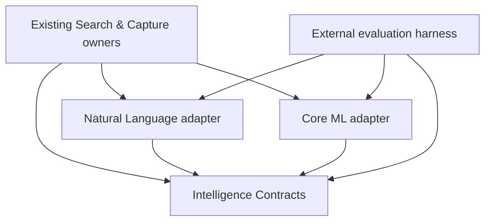

+++
initiative = "ambitions-private-semantic-intelligence"
document_type = "research"
status = "approved"
upstream = ""
+++

# Ambitions Private Semantic Intelligence — Research

**Evidence snapshot:** 2026-08-13  
**Repository:** [`agentdevan/ambitions`](https://github.com/agentdevan/ambitions)  
**Repository revision inspected:** [`0518378bd9b8f11ce7b50f1a290520ebdb947f90`](https://github.com/agentdevan/ambitions/tree/0518378bd9b8f11ce7b50f1a290520ebdb947f90) (`main`)  
**Lifecycle state:** Approved Research; approved Scope; Design draft  
**Canonical path:** `docs/product-development/ambitions-private-semantic-intelligence/research.md`

> This document is Research only. It does not create a package, change production source, select a production model irrevocably, or authorize implementation. Measurements labeled **estimate** are planning calculations to be replaced by release-build measurements on physical devices. Performance thresholds are Research-phase experimental hypotheses only; they have no product, Scope, Design, implementation, or release authority unless a later approved phase explicitly adopts or revises them using measured baseline and candidate data.

## Executive conclusion

Ambitions should establish a reusable, first-class, nonauthoritative native intelligence **computation boundary**. That is a logical product/engineering boundary, not a decision that it must immediately be a separately extracted Swift package. The first production implementation could remain inside existing `LocalRuntimeOS` ownership behind framework-neutral contracts, or later be extracted into a new package if Scope/Design and owner approval establish that this is the cleaner dependency-closed form. Current repository module policy has no authorized future targets, and the approved generative-runtime design currently locates that owner inside `LocalRuntimeOS`.

The justified initial product strategy is a benchmark-gated progression from **B — Apple-only semantic enhancement** to a narrow form of **C — compact Core ML semantic intelligence**:

1. Preserve the current deterministic Search and Capture paths as always-available behavior and canonical safety machinery.
2. Add a small provider contract around nonauthoritative text embeddings and semantic scores.
3. Use Apple `NLEmbedding` as the zero-additional-asset baseline and fallback on the current iOS 26 deployment target.
4. Benchmark Snowflake Arctic Embed XS as the leading compact external candidate, with BGE Small EN v1.5 and all-MiniLM-L6-v2 as required challengers/controls. Do not ship any external model unless it clears later-approved Ambitions-specific quality, exact-match, privacy, latency, memory, energy, and size criteria by a meaningful margin.
5. If it clears those gates, distribute it as a signed, pinned, optional local asset rather than making model availability a prerequisite for Search, Capture, or app installation. The expected model pack is tens of megabytes, not hundreds; the base app remains useful before and without the pack.
6. Do not ship a custom local generative LLM in v1. Most initial value comes from retrieval, association, duplicate detection, ambiguity, and abstaining proposals. The Apple system Foundation Model may later provide bounded, availability-gated generation on eligible devices; custom Core AI or MLX language models remain future work.

If later module extraction is approved, the smallest plausible package target set is:

- `AmbitionsIntelligenceContracts`
- `AmbitionsIntelligenceNaturalLanguage`
- `AmbitionsIntelligenceCoreML` only if an external model earns production inclusion after measured evidence and later approval

Do not add an `AmbitionsIntelligenceCore` target to the initial extracted form. Reconsider it only if later code evidence shows that shared vector normalization, model identity, or provider-selection code cannot remain in Contracts or the current Search/Capture owners and forms a genuinely cohesive dependency-closed owner. The proposed `AmbitionsIntelligenceDeterministic` would duplicate existing ownership and should not be created. `AmbitionsIntelligenceCoreAI27` is version-coupled and premature; if needed later, use `AmbitionsIntelligenceCoreAI` behind availability checks. Evaluation belongs under a non-production `Tools/` or equivalent harness and must never be linked by the shipping app.

This recommendation can deliver meaningful offline semantic Search and Capture assistance at zero per-use inference cost while keeping canonical state deterministic. Scope can approve the capability and a bounded non-production evaluation boundary without selecting an external production model; measured spike evidence should inform the later Design decision.

## Idea and user problem

Ambitions already provides local deterministic intelligence: immediate Search, typed Capture proposals, validation, confirmation, durable events, projections, receipts, history, corrections, replay, and privacy filtering. Its weakness is not absence of an AI destination. It is that semantically equivalent language can fail to meet lexical rules:

- “renew passport” may not retrieve “replace travel document before Lisbon”;
- a Capture about “waiting for Maya to send the draft” can be understood differently from a literal substring rule;
- a new thought may duplicate or relate to an existing Goal without sharing words;
- a user may express the same commitment, dependency, or someday intent in language the current rules do not enumerate.

The user problem is therefore: **make Ambitions understand paraphrase, relationship, duplication, and ambiguity better without weakening local-first privacy, deterministic authority, immediate native interaction, or safe fallback.**

The subsystem is not a chatbot, autonomous planner, replacement runtime, or new root destination. Intelligence should be experienced as better results and better proposals inside the existing product surfaces.

## Current truth

### Authority map

The repository contains four kinds of evidence. They are not interchangeable.

| Evidence class | Authority in this Research | Examples | How it is used |
|---|---|---|---|
| Canonical product law | Highest product authority | Constitution; generated canon start; Search, Capture, privacy, persistence, navigation specifications | Non-negotiable invariants unless canon is explicitly changed later |
| Current implementation and tests | Source of truth for behavior that exists now | `project.yml`, Swift packages, runtime/search/capture sources, unit/runtime/UI tests | Establishes actual seams, constraints, and gaps |
| Approved future product-development material | Constraint and coordination evidence, not proof of implementation | intelligence change management; private generative model runtime; intelligence quality/safety evaluation; grounded generative proposals | Avoids creating a conflicting owner or lifecycle |
| Historical/audit material | Context only | Superseded audits, prior navigation descriptions, archived proposals | Never used to override canon or live source |

### Platform and build truth

At the inspected revision:

- [`project.yml`](https://github.com/agentdevan/ambitions/blob/0518378bd9b8f11ce7b50f1a290520ebdb947f90/project.yml) sets the app, extension, and tests to **iOS 26.0**, Swift **6.0**, and `SWIFT_STRICT_CONCURRENCY: complete`. The app is iPhone-only and does not enable Mac Catalyst.
- [`Packages/AmbitionsRuntime/Package.swift`](https://github.com/agentdevan/ambitions/blob/0518378bd9b8f11ce7b50f1a290520ebdb947f90/Packages/AmbitionsRuntime/Package.swift) uses Swift tools 6.2 and declares iOS 26/macOS 15, with `RuntimeCore`, `RuntimeSQLite`, and `RuntimeTestSupport` products.
- The four present package boundaries are `AmbitionsExternalContracts`, `AmbitionsDesignSystem`, `AmbitionsRuntime`, and `AmbitionsPresentation`. There is no current `AmbitionsIntelligence` package and no production Hugging Face, vector-database, hosted-inference, MLX, Core ML model, Core AI, or Foundation Models dependency.
- XcodeGen is authoritative for project configuration. Any later production target or asset integration must be expressed in `project.yml`, not hand-edited in the generated project.
- Existing schemes cover unit, runtime, accessibility, screenshot, and release-candidate paths. The repository has deterministic fixtures and runtime test support but no current physical-device neural benchmark harness.

The research finds no justification to raise the minimum deployment target. Core AI is an iOS 27 beta technology; Core ML, Natural Language, and the deterministic runtime can cover iOS 26.

Current package manifests have no remote app dependency. A separate macOS MCP tool has a remote package dependency but is outside the app graph and is not precedent for adding a production network dependency. Swift package manifests use a Swift 6.2-capable toolchain while Xcode targets use Swift 6.0 language mode; a later package must preserve strict concurrency, isolation and `Sendable` behavior across that distinction.

The repository’s current [`module-candidate-policy.json`](https://github.com/agentdevan/ambitions/blob/0518378bd9b8f11ce7b50f1a290520ebdb947f90/docs/qa/architecture/module-candidate-policy.json) has `authorizedFutureTargets: []`. This is QA/policy evidence rather than constitutional law, but it is the live extraction gate: Research can recommend a logical boundary, not authorize a target. Before `Packages/AmbitionsIntelligence` can exist, later Scope/Design and owner review must establish dependency closure, resolve Search ownership/migration and current runtime boundaries, reconcile generative-runtime ownership, add build/test routing, and approve extraction under repository policy. None of those conditions prevents the logical boundary from initially living inside `LocalRuntimeOS`.

### Product and navigation truth

Current canon and live shell composition define exactly four independent root surfaces: **Today, Goals, Time, and You**. The global shell capabilities are **Capture and Search**. Trust is contextual. Capture and Search are full-screen, non-root surfaces. No other root destination or global shell capability is assumed in this Research. This matters because an intelligence subsystem must not add an AI tab, promote Trust to a dashboard, or reintroduce stale navigation language. See the [generated canon start](https://github.com/agentdevan/ambitions/blob/0518378bd9b8f11ce7b50f1a290520ebdb947f90/docs/canon/generated/CODEX_START_HERE.md), [canon authority guide](https://github.com/agentdevan/ambitions/blob/0518378bd9b8f11ce7b50f1a290520ebdb947f90/docs/canon/README.md), and [navigation specification](https://github.com/agentdevan/ambitions/blob/0518378bd9b8f11ce7b50f1a290520ebdb947f90/docs/canon/specifications/app/navigation.md).

### Canonical runtime law

The runtime law is more important than the choice of model. Canon requires the mutation lifecycle to pass through Intent → Preparation → Validation → Preview → Confirmation → Authority Commit → Projection → Side Effects → Settlement → Receipt → Undo → Recovery. Models, parsers, semantic indexes, planners, views, Search, and Capture cannot bypass the owning authority. Proposed, external, or stale information cannot silently become accepted truth. Events remain immutable and replayable; projections and indexes are disposable derivations.

Consequences for intelligence:

- model output is a proposal or score, never an event or canonical object;
- object IDs, revisions, privacy, tombstones, and action validity come from canonical owners;
- a model cannot mint canonical IDs, call the event store directly, or mutate a projection;
- validation and explicit consequences remain deterministic;
- accepted corrections use the existing Capture correction/receipt/history path;
- derived indexes are versioned, rebuildable, replaceable, and safe to discard.

### Privacy and egress law

The privacy canon classifies every stored, rendered, logged, exported, indexed, cached, synced, or transmitted datum with an owner, allowed destinations, redaction, deletion, consent, and protection behavior. Derived and inferred facts remain part of the private graph. The egress law prohibits private graph content—including captures, goals, notes, attachments, queries, and derived intelligence—from reaching an Ambitions backend, hosted AI, analytics, telemetry, support upload, or server profiler merely to provide intelligence. Only explicit, user-reviewed exports or named integrations under their owning contracts may egress; separately gated platform sync is not general AI egress.

This makes local execution the default architecture, not a preference. It also means a vector is not “safe metadata” simply because it is numeric. Embeddings inherit the source object’s privacy and deletion semantics.

### Search implementation truth

Search has valuable seams, but live composition is in migration and must not be described as one unified pipeline:

- The global user-facing Memory Lens is constructed in [`SystemSurfaceBootstrap.swift`](https://github.com/agentdevan/ambitions/blob/0518378bd9b8f11ce7b50f1a290520ebdb947f90/Native/Ambitions/App/Bootstrap/SystemSurfaceBootstrap.swift) as `DefaultMemoryLensService`. [`MemoryLensService.swift`](https://github.com/agentdevan/ambitions/blob/0518378bd9b8f11ce7b50f1a290520ebdb947f90/Native/Ambitions/Core/LocalRuntimeOS/Search/MemoryLensService.swift) loads legacy repositories and builds a fresh [`LocalSearchIndex.swift`](https://github.com/agentdevan/ambitions/blob/0518378bd9b8f11ce7b50f1a290520ebdb947f90/Native/Ambitions/Core/LocalRuntimeOS/Search/LocalSearchIndex.swift) for substring/ranking search.
- [`PersistenceBootstrap.swift`](https://github.com/agentdevan/ambitions/blob/0518378bd9b8f11ce7b50f1a290520ebdb947f90/Native/Ambitions/App/Bootstrap/PersistenceBootstrap.swift) creates [`FTSIndex.swift`](https://github.com/agentdevan/ambitions/blob/0518378bd9b8f11ce7b50f1a290520ebdb947f90/Native/Ambitions/Core/LocalRuntimeOS/Search/FTSIndex.swift), backed by SQLite FTS5, and passes it into command-side index maintenance. `FTSIndex` retrieves lexical candidates, applies [`ResultRanker.swift`](https://github.com/agentdevan/ambitions/blob/0518378bd9b8f11ce7b50f1a290520ebdb947f90/Native/Ambitions/Core/LocalRuntimeOS/Search/ResultRanker.swift), `SemanticLocalIndex`, and action validation.
- [`SemanticLocalIndex.swift`](https://github.com/agentdevan/ambitions/blob/0518378bd9b8f11ce7b50f1a290520ebdb947f90/Native/Ambitions/Core/LocalRuntimeOS/Search/SemanticLocalIndex.swift) is **not a neural semantic index**. It uses normalization, suffix handling, token overlap, deterministic scoring, and records `externalModelUsed = false`. In the FTS path it only reranks direct FTS candidates; zero-overlap documents cannot be recovered.
- [`RuntimeCanonicalSearch.swift`](https://github.com/agentdevan/ambitions/blob/0518378bd9b8f11ce7b50f1a290520ebdb947f90/Native/Ambitions/Core/LocalRuntimeOS/Search/RuntimeCanonicalSearch.swift) and [`RuntimeCanonicalSearchGenerationStore.swift`](https://github.com/agentdevan/ambitions/blob/0518378bd9b8f11ce7b50f1a290520ebdb947f90/Native/Ambitions/Core/LocalRuntimeOS/Search/RuntimeCanonicalSearchGenerationStore.swift) implement newer generation-bound documents, filters, source/privacy digests, cursors, certificates and action tokens with substantial tests. No construction site was found in the inspected app bootstrap/container, so this is implemented/tested migration infrastructure, not proven production composition.
- [`SearchRebuildPipeline.swift`](https://github.com/agentdevan/ambitions/blob/0518378bd9b8f11ce7b50f1a290520ebdb947f90/Native/Ambitions/Core/LocalRuntimeOS/Search/SearchRebuildPipeline.swift) materializes runtime events into projections and rebuilds FTS with a typed receipt.

The most important present limitation is therefore twofold. First, the existing “semantic” reranker has no semantic recall beyond lexical candidates. Second, adding a standalone vector index without first selecting the owning Search generation would create a fourth Search path. A real semantic provider must score/retrieve through the approved Search owner and merge from all privacy-eligible documents; it cannot become a new object or action authority.

Search canon already requires immediate deterministic Find results while typing, local nonauthoritative indexes, bounded explanation, privacy filtering, action validation, derived-index rebuild safety, cancellation, and an old-valid-generation fallback. It also describes one coherent private Find/Ask/Act/Inspect layer. Scope/Design must reconcile today’s Memory Lens, FTS, and canonical-generation migration before choosing persistent semantic storage.

### Capture implementation truth

Capture likewise already has appropriate enhancement seams:

- [`CaptureClassifier.swift`](https://github.com/agentdevan/ambitions/blob/0518378bd9b8f11ce7b50f1a290520ebdb947f90/Native/Ambitions/Core/LocalRuntimeOS/CaptureRouting/CaptureClassifier.swift) uses local deterministic substring/rule logic for commitment, waiting, optional/someday, deliverable, simple deadline phrases, and route seeds.
- [`CaptureDurableIntakePipeline.swift`](https://github.com/agentdevan/ambitions/blob/0518378bd9b8f11ce7b50f1a290520ebdb947f90/Native/Ambitions/Core/LocalRuntimeOS/CaptureRouting/CaptureDurableIntakePipeline.swift) journals input and stages/quarantines attachments before interpretation.
- [`CaptureRouteResolver.swift`](https://github.com/agentdevan/ambitions/blob/0518378bd9b8f11ce7b50f1a290520ebdb947f90/Native/Ambitions/Core/LocalRuntimeOS/CaptureRouting/CaptureRouteResolver.swift) refuses classification until intake is safe and records a local route decision with trace/checksum.
- [`CaptureCorrectionLedger.swift`](https://github.com/agentdevan/ambitions/blob/0518378bd9b8f11ce7b50f1a290520ebdb947f90/Native/Ambitions/Core/LocalRuntimeOS/CaptureRouting/CaptureCorrectionLedger.swift) durably records previous/corrected classification, reason, privacy, trace and checksum.
- [`CapturePlacementReviewState.swift`](https://github.com/agentdevan/ambitions/blob/0518378bd9b8f11ce7b50f1a290520ebdb947f90/Native/Ambitions/Composer/Capture/CapturePlacementReviewState.swift) owns review-first presentation, explicit consequence/privacy/confirmation and user corrections. Goal promotion remains explicit.

The rule classifier is fast, inspectable, and useful for explicit wording, but it has no learned paraphrase understanding or calibrated confidence. Its natural abstention is the raw/needs-triage path. A shared embedding provider can improve Goal association, duplicate detection, class-prototype similarity, and ambiguity margins before Ambitions considers a dedicated classifier or language model. Canon identifies Quick Capture and Capture-to-Goal as the proven baseline; the broader route vocabulary in source is not evidence that every route is product-enabled.

### Existing test and release evidence

[`SearchTests.swift`](https://github.com/agentdevan/ambitions/blob/0518378bd9b8f11ce7b50f1a290520ebdb947f90/Native/AmbitionsTests/LocalRuntimeOS/Search/SearchTests.swift) covers LocalSearch ranking, FTS privacy/provenance/actions, deterministic `SemanticLocalIndex`/no-external-model behavior and rebuild materialization. [`RuntimeCanonicalSearchTests.swift`](https://github.com/agentdevan/ambitions/blob/0518378bd9b8f11ce7b50f1a290520ebdb947f90/Native/AmbitionsTests/LocalRuntimeOS/Search/RuntimeCanonicalSearchTests.swift) covers tokenizer/query bounds, filter/cursor binding, privacy/source digests, generation certificates/action tokens, posting parity, scrub/quarantine and saturation. [`CaptureRoutingTests.swift`](https://github.com/agentdevan/ambitions/blob/0518378bd9b8f11ce7b50f1a290520ebdb947f90/Native/AmbitionsTests/LocalRuntimeOS/CaptureRouting/CaptureRoutingTests.swift) covers journal-before-route, attachments/quarantine, restart durability, promotion/correction trace and direct lookup. [`CapturePlacementReviewStateTests.swift`](https://github.com/agentdevan/ambitions/blob/0518378bd9b8f11ce7b50f1a290520ebdb947f90/Native/AmbitionsTests/Capture/CapturePlacementReviewStateTests.swift) checks user-owned correction, no AI score presentation and no Goal creation without explicit promotion. These are regression assets for a future integration: model tests must surround, not replace, them.

Test plans include Smoke, Runtime, ReleaseCandidate, Accessibility and Screenshots. The [required code-quality workflow](https://github.com/agentdevan/ambitions/blob/0518378bd9b8f11ce7b50f1a290520ebdb947f90/.github/workflows/code-quality.yml) runs canon/static/secrets/drift audits, SwiftLint, `AmbitionsExternalContracts` package tests and a Smoke build-for-testing, but does not currently run every local package hostlessly. [`ambitions-changed-file-test-routes.json`](https://github.com/agentdevan/ambitions/blob/0518378bd9b8f11ce7b50f1a290520ebdb947f90/scripts/ambitions-changed-file-test-routes.json) has only one hostless package route today. A later package requires explicit changed-file routing, graph/audit coverage and package tests. [`ambitions-xcode-benchmark.sh`](https://github.com/agentdevan/ambitions/blob/0518378bd9b8f11ce7b50f1a290520ebdb947f90/scripts/ambitions-xcode-benchmark.sh) is a general benchmark runner, not a present neural/device acceptance system.

The canon [testing standard](https://github.com/agentdevan/ambitions/blob/0518378bd9b8f11ce7b50f1a290520ebdb947f90/docs/canon/standards/testing-and-fixtures.md) requires deterministic privacy-safe fixtures, behavioral assertions and failure injection. The [performance/energy standard](https://github.com/agentdevan/ambitions/blob/0518378bd9b8f11ce7b50f1a290520ebdb947f90/docs/canon/standards/performance-and-energy.md) rejects invented thresholds, and [validation/release](https://github.com/agentdevan/ambitions/blob/0518378bd9b8f11ce7b50f1a290520ebdb947f90/docs/canon/standards/validation-and-release.md) requires build, behavior, UI, accessibility, data, concurrency, privacy, performance, rollout and rollback evidence. No build, test, model conversion or physical-device benchmark was executed in this Research, so current green status and measured budgets remain unknown.

Existing Apple integrations include App Intents/App Shortcuts, EventKit with an outbox, WidgetKit/ActivityKit, UserNotifications and LocalAuthentication. CloudKit client/gate code exists, but current canon keeps production continuity disabled. No live Swift source imports Core ML or Foundation Models, no app package has an ML dependency, and similarly named OCR/natural-language sources are deterministic/fallback models rather than proof of Vision/NaturalLanguage integration.

The approved product-development initiatives for intelligence change management, private generative model runtime, intelligence quality/safety evaluation, and grounded generative proposals are relevant coordination constraints. They call for immutable/pinned model identities, signed and content-addressed assets, staging and atomic promotion, last-known-good rollback, revocation/purge, evaluation compatibility tuples, retrieval-before-generation, structured proposals, and deterministic fallback. They are approved future direction, not evidence that those systems are already implemented or permission for this Research to own generation.

Most importantly, the approved [`private-generative-model-runtime` design](https://github.com/agentdevan/ambitions/blob/0518378bd9b8f11ce7b50f1a290520ebdb947f90/docs/product-development/private-generative-model-runtime/design.md) places `PrivateGenerativeRuntime` under `Native/Ambitions/Core/LocalRuntimeOS/GenerativeRuntime/` with nonauthoritative envelopes, deterministic validators and no command client. A semantic package must not duplicate that generative owner. If later architecture wants to extract shared contracts, it must explicitly revise or reconcile that approved Design. Its discussion of Private Cloud Compute also does not override current canon: any transfer of private graph fields to PCC/hosted AI requires an explicit canon change. This Research recommends no such egress.

### Runtime migration and composition truth

The repository contains extensive canonical Event, State, Projection, Receipt, History, Trust and replay contracts, but the production container is still in a compatibility migration. [`AppContainerFactory.swift`](https://github.com/agentdevan/ambitions/blob/0518378bd9b8f11ce7b50f1a290520ebdb947f90/Native/Ambitions/App/AppContainerFactory.swift) states that currently constructed product services use the legacy repository graph and refuses to construct it after the newer authority is selected, avoiding a second write authority. [`ObjectStateCore.swift`](https://github.com/agentdevan/ambitions/blob/0518378bd9b8f11ce7b50f1a290520ebdb947f90/Native/Ambitions/Core/LocalRuntimeOS/State/ObjectStateCore.swift) marks only App State migrated; other families remain contract-defined with direct-write debt.

For intelligence, that means:

- consume approved read-only projection/inspection clients where available, or privacy-minimized app-side snapshots;
- never read raw stores/repositories merely because package extraction makes canonical types inconvenient;
- never become a migration bridge, write authority, receipt factory or alternate privacy taxonomy;
- keep FTS/SQLite storage, Search generations/action tokens, durable Capture intake/correction/promotion, Events, Projections, Receipts, History, Trust, replay and egress authorization outside the package.

The codebase has multiple compatibility privacy types, including `RuntimePrivacyClass` and Event Ledger classifications. A new boundary must carry an existing authorized classification (or a strictly derived wrapper mapped at the app boundary), not invent a third product taxonomy.

Relevant live evidence is already modeled richly: [`RuntimeSemanticEvent.swift`](https://github.com/agentdevan/ambitions/blob/0518378bd9b8f11ce7b50f1a290520ebdb947f90/Native/Ambitions/Core/LocalRuntimeOS/EventJournal/RuntimeSemanticEvent.swift) defines typed semantic aggregates/transitions; [`RuntimeCanonicalProjectionModels.swift`](https://github.com/agentdevan/ambitions/blob/0518378bd9b8f11ce7b50f1a290520ebdb947f90/Native/Ambitions/Core/LocalRuntimeOS/Projections/RuntimeCanonicalProjectionModels.swift) binds generation authority, certificates, access and cursors; [`RuntimeCommittedReceiptModels.swift`](https://github.com/agentdevan/ambitions/blob/0518378bd9b8f11ce7b50f1a290520ebdb947f90/Native/Ambitions/Core/LocalRuntimeOS/Receipts/RuntimeCommittedReceiptModels.swift) models receipt authority and privacy-sensitive inspection; [`HistoryQueryEngine.swift`](https://github.com/agentdevan/ambitions/blob/0518378bd9b8f11ce7b50f1a290520ebdb947f90/Native/Ambitions/Core/LocalRuntimeOS/Inspection/HistoryQueryEngine.swift) projects receipt/event history; and [`RuntimeTrustLineage.swift`](https://github.com/agentdevan/ambitions/blob/0518378bd9b8f11ce7b50f1a290520ebdb947f90/Native/Ambitions/Core/LocalRuntimeOS/Inspection/RuntimeTrustLineage.swift) binds commands, transactions, events, receipts, proofs, rollback, replay, checksums and object IDs. Intelligence should reference this evidence through authorized read/proposal seams; it should not recreate “AI receipts” or an alternate History.

## Evidence

### Intelligence capability map

Scores are research priorities, not promised scope. A higher score is better. For **storage efficiency**, **compute efficiency**, **privacy fit**, and **implementation simplicity**, 5 means lighter/safer/simpler. Readiness means readiness for an initial production release under current repository and platform constraints.

| Candidate capability | User value | Differentiation | Feasibility | Storage efficiency | Compute efficiency | Privacy fit | Simplicity | Reliability | v1 readiness | Research verdict |
|---|---:|---:|---:|---:|---:|---:|---:|---:|---:|---|
| Hybrid Search: FTS + semantic retrieval | 5 | 5 | 4 | 4 | 4 | 5 | 3 | 4 | 5 | Primary v1 capability |
| Paraphrase retrieval with zero lexical overlap | 5 | 5 | 4 | 4 | 4 | 5 | 3 | 4 | 5 | Primary v1 quality test |
| Exact/prefix-preserving semantic reranking | 4 | 4 | 4 | 4 | 4 | 5 | 3 | 4 | 5 | v1, with deterministic fusion |
| Related-object discovery | 4 | 4 | 4 | 4 | 4 | 5 | 3 | 3 | 4 | v1 only in bounded contextual surfaces |
| Search duplicate/near-duplicate detection | 4 | 4 | 5 | 4 | 4 | 5 | 4 | 4 | 5 | v1; embeddings plus deterministic checks |
| Goal association from Search/Capture text | 5 | 5 | 4 | 4 | 4 | 5 | 3 | 3 | 4 | v1 proposal, never automatic attachment |
| History/Memory semantic retrieval | 4 | 4 | 4 | 3 | 3 | 4 | 3 | 3 | 3 | Start only after owner/privacy fixtures exist |
| Query intent understanding for Find/Act/Inspect | 3 | 3 | 3 | 4 | 4 | 5 | 3 | 3 | 3 | Bounded classifier/prototype experiment; actions remain typed |
| Capture route/class prototype scoring | 4 | 4 | 4 | 4 | 4 | 5 | 3 | 3 | 4 | v1 signal combined with rules and abstention |
| Capture duplicate detection | 5 | 4 | 5 | 4 | 4 | 5 | 4 | 4 | 5 | Primary v1 capability |
| Capture ambiguity/confidence/abstention | 5 | 5 | 4 | 5 | 5 | 5 | 3 | 4 | 5 | Primary v1 safety capability |
| Waiting/optional/someday recognition | 4 | 3 | 4 | 5 | 5 | 5 | 4 | 4 | 5 | Keep rules authoritative; embeddings add evidence |
| Deadline recognition | 5 | 2 | 5 | 5 | 5 | 5 | 4 | 4 | 5 | Deterministic date parsing first; model may flag ambiguity |
| Context, effort, or priority hints | 3 | 3 | 3 | 4 | 4 | 5 | 3 | 2 | 2 | Research later; subjective and easy to over-assume |
| Goal-decomposition proposals | 4 | 4 | 3 | 5 with system model / 1 custom | 2 | 4 | 2 | 2 | 2 | Future bounded generative owner; not semantic v1 |
| Summaries and reflection drafts | 3 | 3 | 3 | 5 with system model / 1 custom | 2 | 4 | 2 | 2 | 2 | Future, user-requested only |
| Evidence/pattern explanations | 4 | 4 | 3 | 5 with system model / 1 custom | 2 | 4 | 2 | 3 | 2 | Prefer deterministic explanation templates first |
| Suggested next-step prose | 3 | 3 | 3 | 5 with system model / 1 custom | 2 | 4 | 2 | 2 | 2 | Future proposal only; never autonomous execution |
| Offline speech-to-text Capture | 4 | 2 | 4 | 5 app / system asset | 3 | 5 | 3 | 4 | 3 | Separate input enhancement; SpeechTranscriber evaluation later |
| OCR for attachment text | 3 | 2 | 5 | 5 | 4 | 5 | 4 | 4 | 3 | Vision is adequate; add only with a concrete attachment workflow |
| Image similarity/duplicate attachment detection | 2 | 2 | 5 | 4 | 4 | 5 | 4 | 4 | 2 | Vision feature prints; not text-semantic v1 |
| General attachment understanding/VLM | 2 | 3 | 2 | 1 | 1 | 3 | 1 | 2 | 1 | Explicitly not v1 |
| Image generation | 1 | 1 | 2 | 1 | 1 | 3 | 1 | 2 | 1 | Outside subsystem/product need |

The flagship first release is therefore not “small LLM everywhere.” It is reliable semantic retrieval and proposal quality where the repository already has deterministic ownership and correction.

### Search: where neural intelligence helps and where it must stop

#### Proposed research architecture

1. **Immediate path:** run the present canonical/FTS path and render deterministic results without waiting for a model.
2. **Debounced refinement:** after a deliberate idle interval, embed the normalized query once. Cancel the prior task when the query changes or the surface disappears.
3. **Independent semantic retrieval:** compare the query against the eligible semantic generation, not merely the FTS result list. For likely personal-scale corpora, exact cosine/dot-product scan using bounded contiguous vectors may be simpler and more auditable than an approximate nearest-neighbor dependency; scale data must decide.
4. **Canonical filtering:** suppress deleted, stale, privacy-ineligible, wrong-owner, unsupported-family, and source-revision-mismatched entries using canonical identity and source metadata.
5. **Deterministic fusion:** merge by canonical object identity. Preserve exact and strong prefix matches, then combine lexical and semantic ranks using a versioned deterministic policy such as reciprocal-rank fusion or bounded weighted rank. Raw cross-model cosine values must never be treated as universal confidence.
6. **Validation and action:** keep `SearchActionValidator`, source cursor, document digest, generation, consequence, and confirmation semantics unchanged. A neural score cannot authorize an action.
7. **Explanation:** use bounded phrases such as “Related wording” or “Matches this Goal,” backed by explicit lexical/semantic/relationship features. Do not expose model names or imply certainty.

The semantic generation should include at least:

- canonical object ID and family;
- source revision/cursor and tombstone state;
- privacy class and owner;
- normalized source digest;
- model identity, tokenizer identity, preprocessing version, vector dimension and numeric format;
- generated-at generation and compatibility tuple.

It remains disposable. Rebuild into a staged generation, validate coverage/dimensions/hashes/privacy counts, then atomically promote. Keep the old valid generation until promotion. A missing, corrupt, revoked, or incompatible semantic generation falls back to deterministic Search without blocking the user.

#### Capabilities to keep deterministic

- exact, prefix, and action-command recognition;
- object identity, owner, revision, deletion/tombstone, privacy suppression;
- maximum query/candidate/work bounds and result-family eligibility;
- typed actions, consequences, confirmation, mutation, receipts, history, undo and replay;
- stable tie-breaking after the defined hybrid policy;
- index promotion, corruption quarantine, rollback, and failure disclosure.

#### Core Spotlight role

[Core Spotlight semantic search](https://developer.apple.com/videos/play/wwdc2024/10131/) is private and on-device on iOS 18+, and Apple recommends preparing semantic search shortly before use because preparation adds time and memory; its Search UI guidance also recommends debouncing and cancelling prior queries. It remains an Apple-native evaluation arm or candidate-source experiment, not a production architecture assumption.

It must earn any production role against the same Ambitions-specific correctness, privacy, deletion, staleness, quality, latency, cancellation, rebuild and lifecycle criteria as other candidates. Its model revision/ranking are OS-controlled, semantic assets may be absent until downloaded, and Ambitions must prove privacy filtering, tombstone removal, source-revision correctness, exact-match preservation, rebuild behavior, and deterministic action validation. If evaluated, Core Spotlight returns candidate identities; Ambitions still hydrates and validates canonical objects. [`CSUserQuery.prepare()` and search guidance](https://developer.apple.com/documentation/corespotlight/building-a-search-interface-for-your-app) should inform lifecycle tests.

### Capture: shared embeddings before a classifier or LLM

The current classifier is strongest when users use explicit words. Preserve those rules for explicit waiting, optional/someday, deadline, and action language. A model should add independent evidence:

- similarity to route/class prototypes constructed from consented/synthetic canonical fixtures;
- similarity to existing Goals for candidate Goal association;
- similarity to recent or open objects for duplicate/near-duplicate warnings;
- margin between the best and second-best route/Goal candidates;
- disagreement between rule and semantic signals;
- language/coverage/model availability.

Those signals yield a typed, nonmutating proposal containing candidates, confidence evidence, abstention reason, source revision, and model identity. The existing draft route UI remains the owner of Step / Goal / Needs a Place clarification. The correction ledger remains the durable record after a user changes the proposal.

V1 should not train or ship a dedicated Capture classifier until the shared embedding bake-off establishes a ceiling. A dedicated classifier adds training data, calibration, versioning, class-imbalance, drift, and model-distribution obligations. It is justified only if embeddings plus deterministic rules fail a predeclared selective-accuracy target. A local LLM is even less justified for initial route classes: it is larger, slower, harder to calibrate, and more likely to generate unsupported structure.

Confidence is not the model’s largest similarity score. It is a calibrated decision based on held-out Ambitions fixtures, including margin, class, language, object availability, and rule agreement. When evidence is weak or contradictory, abstain and show the existing clarification. Never auto-create a Goal, hard deadline, dependency, priority, or destructive action from semantic inference.

### Apple-native baseline and platform split

| Technology | Current iOS 26 app | iOS 27-only or beta | Device/runtime qualification | Recommended role |
|---|---|---|---|---|
| Natural Language / `NLEmbedding` | Available | No | Factory may return `nil`; language/revision coverage varies | Required zero-asset semantic baseline/fallback |
| Core ML | Available | No | Operator placement varies; ANE is permitted, not guaranteed | Production external embedding runtime across current deployment |
| Core ML compression | Available | No | ML Program/palettization gates vary by OS; accuracy must be re-evaluated | Produce FP16/INT8/4–6-bit candidates; select by device evidence |
| Core Spotlight semantic search | Available | No (semantic search iOS 18+) | Semantic assets/preparation may add latency and memory | Evaluation arm; possible candidate source, never canonical authority |
| Foundation Models `SystemLanguageModel` | Available from iOS 26 | New system model behavior in 27 beta | Apple Intelligence eligibility, region/language, enablement, model-ready state | Future optional bounded generation; never required for v1 semantics |
| Core AI | No | iOS 27 beta | Custom on-device models across Apple silicon; specialization/cache required | Future custom-model runtime, not reason to raise minimum target |
| Foundation Models `LanguageModel` protocol | No | iOS 27 beta | Provider-specific; system eligibility applies only to system model | Future common generative abstraction, not embedding contract |
| MLX / MLX Swift | Library possible | Foundation Models bridge is iOS 27 beta | Primarily GPU/unified-memory research flexibility; no automatic ANE promise | Evaluation/research; not default v1 iPhone runtime |
| Vision OCR / image feature prints | Available | Newer requests may be 27 | Request/asset specific | Prefer for bounded OCR or image similarity when product scope exists |
| SpeechAnalyzer / SpeechTranscriber | iOS 26 | No | Locale/hardware/system asset required | Future offline Capture input; separate capability from semantics |
| App Intents | Available | App Schemas are 27 beta | Ordinary intents do not require Apple Intelligence | Continue exposing validated typed actions, never model mutation |
| Background Assets | Available; Apple-hosted managed packs for apps targeting iOS 26+ | APIs continue evolving | Download/storage/network and App Store configuration | Preferred optional model-asset delivery path if external model ships |
| BackgroundTasks | Available | Core AI background restrictions/entitlements evolve in 27 beta | Scheduling is opportunistic; expiration/cancellation mandatory | Checkpointed indexing only; never depend on completion |

[`NLEmbedding`](https://developer.apple.com/documentation/naturallanguage/nlembedding) offers Apple-provided word and sentence embeddings without adding an app asset and without Apple Intelligence hardware. Ambitions must record the available embedding revision with an index generation because the OS may change it. Language factories can fail, and Apple does not promise Ambitions-specific retrieval quality. It is a baseline and fallback, not an assumed winner.

[Core ML](https://developer.apple.com/documentation/coreml) remains the mature current-deployment runtime. `MLComputeUnits.all` lets Core ML choose CPU/GPU/Neural Engine but does not guarantee ANE placement. Actual operation placement must be inspected. Apple’s [coremltools optimization guidance](https://apple.github.io/coremltools/docs-guides/source/opt-overview.html) supports pruning, palettization, and weight/activation quantization, with newer grouped/per-block techniques gated by OS version. Every compressed variant needs a quality and performance rerun; smaller weights do not automatically mean lower end-to-end latency or energy.

[Core AI](https://developer.apple.com/documentation/coreai) is Apple’s new iOS 27 beta neural runtime with `.aimodel`, device specialization, CPU/GPU/ANE execution, modern Swift tensor APIs, profiling, and ahead-of-time compilation. Apple says first specialization can be material for large models and should be moved outside an interactive path; specialized artifacts are tied to device and OS. That supports a future `AmbitionsIntelligenceCoreAI` adapter, but it does not make `CoreAI27` a durable module name or justify abandoning iOS 26 Core ML. See [Meet Core AI](https://developer.apple.com/videos/play/wwdc2026/324/) and the [iOS 27 beta release notes](https://developer.apple.com/documentation/ios-ipados-release-notes/ios-ipados-27-release-notes).

The iOS 26 [`SystemLanguageModel`](https://developer.apple.com/documentation/foundationmodels/systemlanguagemodel) is an on-device Apple Foundation Model whose availability can be `.deviceNotEligible` or `.modelNotReady`. Apple currently lists iPhone 15 Pro models and iPhone 16 or later among eligible phones, with language/region/enablement conditions; code should query availability rather than encode that list. It adds no app-owned model weight and can work offline when ready, but it is not universal and changes with OS updates. Apple positions it for bounded summarization, extraction, classification, and structured generation rather than authoritative knowledge or complex reasoning. [Meet the Foundation Models framework](https://developer.apple.com/videos/play/wwdc2025/286/).

iOS 27’s [`LanguageModel`](https://developer.apple.com/documentation/foundationmodels/languagemodel) protocol can unify system, Core AI, MLX, and third-party generative providers. It is not an embedding abstraction and not another name for Core AI. Ambitions’ semantic provider contracts should remain framework-neutral; a later generative owner may bridge through this protocol.

### Other modalities

- **Speech:** iOS 26 `SpeechTranscriber` can be fully on-device once its system-managed locale asset is installed, without adding that model to the app download. Assets can be unavailable or removed after disuse, so Capture must retain typing and explicit unavailable states. Legacy `SFSpeechRecognizer` is only strictly local when support is checked and `requiresOnDeviceRecognition` is set. Speech is an input modality, not a reason to put a language model in semantic v1. See [SpeechTranscriber](https://developer.apple.com/documentation/speech/speechtranscriber) and [WWDC25 SpeechAnalyzer](https://developer.apple.com/videos/play/wwdc2025/277/).
- **OCR:** Vision’s text recognition is a mature bounded on-device tool. Prefer it to a VLM when the product need is “extract text from this attachment.” OCR output is private derived content and enters Capture or attachment owners as proposed text, not accepted truth. See [Recognizing text in images](https://developer.apple.com/documentation/vision/recognizing-text-in-images).
- **Image similarity:** Vision feature prints support image-to-image similarity/deduplication, not text-to-image retrieval. They are relevant only after the attachment owner defines a product need. [Vision framework](https://developer.apple.com/documentation/vision).
- **VLMs and image generation:** storage, memory, thermal, safety, and product-value evidence is inadequate for v1. They are not required to improve text Search or Capture and are explicitly outside the initial subsystem.

### Hugging Face and open-model landscape

Hugging Face is appropriate in Ambitions’ controlled development supply chain, not in the end-user inference path.

| Potential role | Recommendation | Boundary |
|---|---|---|
| Model discovery | Use | Treat cards and leaderboards as candidate-generation evidence; follow linked papers and reproduce product metrics |
| Source checkpoint and tokenizer | Use selectively | Pin publisher-owned repository to immutable 40-character commit; capture file hashes, pooling, prompt and normalization configuration |
| Swift tokenizer tooling | Consider narrow use | [`swift-transformers`](https://github.com/huggingface/swift-transformers) can build tokenizers from local files; do not import Hub/network functionality merely for tokenization |
| Production inference runtime | Avoid | Run converted assets through Natural Language/Core ML, and later Core AI only if qualified |
| Production network dependency | Prohibit | No account, token, Hub availability, mutable `main`, inference endpoint, or cloud service may be needed for normal use |
| End-user asset distribution | Avoid direct Hub downloads | Prefer app bundle or Apple-hosted Background Assets under first-party signed manifests |

The [Hugging Face Hub download API](https://huggingface.co/docs/huggingface_hub/guides/download) supports immutable revisions. Production ingestion should allowlist architectures and file types, prefer `safetensors`, run conversion in an isolated build environment, produce an SBOM and license/NOTICE bundle, and compare converter outputs against publisher reference numerics. Never enable `trust_remote_code` simply to make a candidate load: Transformers documents that it executes repository-supplied code. See the [Auto Class security guidance](https://huggingface.co/docs/transformers/model_doc/auto) and [Hub pickle scanning limits](https://huggingface.co/docs/hub/security-pickle).

Required model identity fields are checkpoint owner/name/commit, every input SHA-256, tokenizer and vocabulary hashes, pooling, query/document prompts, truncation, normalization, output dimension, converter/toolchain versions, quantization recipe, compiled asset hash, license/NOTICE, evaluation result, and revocation state. An update is a new embedding space and requires a new staged index generation.

### Compact embedding candidates

Source artifact sizes are current Hub metadata at the evidence cutoff. Apple package sizes are estimates until conversion. “W8/W4” means approximately 8-bit/4-bit weight compression and includes planning allowance for packaging but not the semantic index.

| Candidate | Architecture / parameters | Tokenizer, context, pooling | Output | Source artifact | Estimated Apple asset | Language | Published retrieval evidence | License / obligations | Apple feasibility and verdict |
|---|---|---|---:|---:|---:|---|---|---|---|
| Apple `NLEmbedding.sentenceEmbedding` | OS-undisclosed, revisioned | OS-undisclosed; arbitrary sentence API | Runtime-reported | 0 app bytes | 0 app bytes | Language-specific factories | No comparable public MTEB/BEIR score | Apple OS API; no redistributed checkpoint | Highest deployment confidence; model coverage/revision and Ambitions quality unknown. Mandatory baseline/fallback. |
| [`Snowflake/snowflake-arctic-embed-xs`](https://huggingface.co/Snowflake/snowflake-arctic-embed-xs) | Six-layer BERT, 22.565M | WordPiece 30,522; 512 tokens; CLS; retrieval query prefix | 384d | 90.27 MB F32; published INT8 ONNX 22.97 MB | **Estimate:** 25–32 MB W8; 15–22 MB W4 | English | Self-reported legacy MTEB retrieval NDCG@10 50.15 | Apache-2.0; retain license and applicable NOTICE; commercial use stated | Standard BERT graph makes Core ML conversion highly plausible; no exact Apple Core AI recipe. **Leading English bake-off candidate.** |
| [`BAAI/bge-small-en-v1.5`](https://huggingface.co/BAAI/bge-small-en-v1.5) | 12-layer BERT, 33.36M | WordPiece 30,522; 512; CLS; optional retrieval prompt | 384d | 133.47 MB F32 | **Estimate:** 36–45 MB W8; 23–32 MB W4 | English | Self-reported legacy MTEB retrieval 51.68, average 62.17 | MIT; retain copyright/license; commercial use stated | Plausible Core ML but twice Arctic’s encoder depth. Similarity scores cluster high, so thresholds require calibration. **Required quality challenger.** |
| [`sentence-transformers/all-MiniLM-L6-v2`](https://huggingface.co/sentence-transformers/all-MiniLM-L6-v2) | Six-layer MiniLM/BERT, 22.71M | WordPiece; Sentence Transformers defaults to 256 wordpieces; mean pooling | 384d | 90.87 MB F32; ARM64 qint8 ONNX 23.03 MB | **Estimate:** 25–32 MB W8; 15–22 MB W4 | Primarily English | Legacy retrieval 41.95 in Snowflake’s comparison; broad sentence-pair lineage | Apache-2.0; retain license/NOTICE | Mature, straightforward conversion and useful control, but weaker retrieval evidence than Arctic at similar size. |
| [`google/embeddinggemma-300m`](https://huggingface.co/google/embeddinggemma-300m) | Gemma-3-derived bidirectional text encoder, 302.86M | Gemma ~256K vocabulary; 2,048; task prompts/pooling; activations do not support FP16 per card | 768d with MRL 512/256/128 | 1.211 GB F32 + 33.4 MB tokenizer JSON | **Estimate:** 320–380 MB W8; 180–250 MB W4 | 100+ languages | Card reports MTEB-v2 English 65.11 and multilingual 54.31 at 768d; not directly comparable to legacy table | Gated Gemma terms and prohibited-use policy; non-SPDX redistribution/commercial review required | Far larger tokenizer/model, harder conversion and runtime profile. **Reject for v1 unless multilingual evaluation proves an extraordinary advantage.** |

The current pinned upstream revisions observed for reproducibility are:

- Arctic XS: `d8c86521100d3556476a063fc2342036d45c106f`
- BGE Small: `5c38ec7c405ec4b44b94cc5a9bb96e735b38267a`
- MiniLM: `1110a243fdf4706b3f48f1d95db1a4f5529b4d41`
- EmbeddingGemma: `57c266a740f537b4dc058e1b0cda161fd15afa75`

These SHAs are research evidence, not a release manifest. A later build must re-resolve, review and record exact files rather than trusting this document.

Maintenance/provenance assessment: Arctic, BGE and MiniLM are publisher-owned, widely consumed model repositories using standard BERT-family artifacts; this reduces but does not eliminate conversion risk. MiniLM is the oldest and most operationally mature control, while Arctic is a newer retrieval-tuned derivative of the same size class. BGE has broad ecosystem use but its score distribution requires product calibration. EmbeddingGemma and the 2026 Granite models have current publisher activity but introduce newer architectures, larger tokenizers or gated terms. None of the exact external checkpoints has an Apple-published Core AI conversion recipe at the cutoff; Apple’s Core AI repository demonstrates related RoBERTa/LLM families, not guaranteed conversion of these assets. Core ML conversion feasibility for standard BERT candidates is therefore high-confidence engineering inference, while Core AI feasibility remains an experiment.

#### Screened additions and bounded next-phase set

- [`mixedbread-ai/mxbai-embed-xsmall-v1`](https://huggingface.co/mixedbread-ai/mxbai-embed-xsmall-v1): 24.09M, 384d, Apache-2.0, standard BERT, MRL/binary-vector support, published ~24.45 MB quantized ONNX. It is a credible English challenger, but its card does not expose sufficiently clear comparable numeric evidence, and its 4,096-token full-attention configuration should not tempt Ambitions to embed long life records without chunking.
- [`ibm-granite/granite-embedding-97m-multilingual-r2`](https://huggingface.co/ibm-granite/granite-embedding-97m-multilingual-r2): April 2026, 97.44M ModernBERT, 384d, enhanced training for 52 languages, Apache-2.0. It is the most interesting multilingual challenger: substantially smaller and more permissively licensed than EmbeddingGemma. Its 194.9 MB BF16 source, 25.3 MB/180K-token tokenizer, and conversion risk make it a separate multilingual track, not the English v1 default. See its [paper](https://arxiv.org/abs/2605.13521).

#### Selection rule

Do not select from MTEB position. Select the smallest asset that, on the oldest supported physical iPhone, materially improves Ambitions’ predeclared Search and Capture quality over deterministic and `NLEmbedding` baselines while preserving exact-match behavior and meeting later-approved runtime criteria. The Research hypotheses below are only the first comparison points. Research closes the open-ended model survey. The required initial evaluation matrix is:

1. current deterministic Search/Capture baseline;
2. Apple `NLEmbedding`;
3. Snowflake Arctic Embed XS;
4. BGE Small EN v1.5;
5. all-MiniLM-L6-v2 as the mature same-size control.

The spike may include mxbai xsmall only if conversion/integration cost is low enough that it does not materially expand the work. Precision variants are implementation details inside the same candidate, not additional model survey entries.

Only if Scope establishes multilingual launch requirements should a separate language-stratified track evaluate Granite Embedding 97M Multilingual R2 and, if its possible benefit justifies its size/license/complexity disadvantages, EmbeddingGemma. Do not mix multilingual aspirations into the English decision. Do not add another embedding model unless new primary-source evidence demonstrates that it materially changes the decision.

Core Spotlight semantic search remains an Apple-native evaluation arm or candidate-source experiment. It must earn any later production inclusion against the same Ambitions-specific correctness, privacy, deletion, staleness, quality, latency, cancellation, and lifecycle criteria; it does not silently become another Search architecture.

### Small local language models

The evidence does not support a custom generative model in v1.

| Option | Model payload | Estimated runtime memory | Context / structure | Coverage and license | Research disposition |
|---|---:|---:|---|---|---|
| Apple `SystemLanguageModel` | 0 app bytes; system managed | Apple-managed, not a stable app budget | Current system API reports capacity; iOS 27 guidance describes a 4,096-token shared window and structured generation/tool calling | Apple Intelligence availability; OS model updates | Preferred future bounded generator when available; deterministic fallback mandatory |
| [`Qwen/Qwen3-0.6B`](https://huggingface.co/Qwen/Qwen3-0.6B) via official [Apple Core AI recipe](https://github.com/apple/coreai-models/tree/main/models/qwen3) | **Estimate:** 450–550 MB packaged from Apple’s mixed 4/8-bit recipe | **Estimate:** 0.9–1.6 GB near short 4K context | Advertises 32K; iOS export requires a fixed context; thinking/tool behavior needs product validation | 100+ languages, Apache-2.0; iOS 27 beta Core AI | Best custom reference candidate, still too costly for v1 need |
| Qwen3.5 0.8B | Community MLX 4-bit ~622–625 MB | Not established on target iPhones | Very long advertised context and VLM capability are not realistic phone budgets | Apache-2.0; no official Apple Core AI recipe | Watchlist only |
| IBM Granite 4.0 H “1B” | MLX 4-bit ~823 MB; card architecture is ~1.5B | **Estimate:** 1.3–2.5 GB short context | Hybrid Mamba/attention; explicit tool format | Apache-2.0; no Core AI recipe | Conversion and memory risk; not v1 |
| Liquid LFM2 700M / LFM2.5 1.2B | Hundreds of MB depending quantization | Not established on target iPhones | Edge-oriented hybrid, function-call claims | LFM license has a commercial revenue threshold requiring separate license above it | Material license and conversion risk; not v1 |

Apple’s [`coreai-models` catalog](https://github.com/apple/coreai-models/blob/main/models/README.md) provides iOS export and mixed-precision recipes for Qwen3 0.6B, evidence that custom sub-billion inference is technically possible on iOS 27. It is not evidence that the user experience, memory, thermals, structured correctness, or download are acceptable for Ambitions.

No primary source provides comparable current-iPhone speed or energy measurements across these models. Vendor desktop/server numbers are not transferable. Thinking modes multiply generated tokens and therefore latency and energy. A future generative bake-off must measure time-to-first-token, tokens/second, peak RSS, context growth, thermal behavior, structured validity, factual grounding, refusal/abstention, and teardown on physical devices.

Initial value without a local LLM is substantial: semantic retrieval, Goal association, duplicate detection, class prototypes, ambiguity, confidence, deterministic evidence explanations, and bounded correction all work with an encoder plus existing product logic. If a later release needs summaries or proposals, prefer `SystemLanguageModel` when available and preserve identical feature completion without generation. Only revisit Qwen3 0.6B if a high-value offline generative job must work independently of Apple Intelligence.

### Storage, application size, and distribution

#### Size model

| Component | Base download / installed effect | Persistent local effect | Notes |
|---|---:|---:|---|
| Swift contracts and adapters | **Estimate:** low single-digit MB or less after dead stripping | Same order | Must be measured from App Store size reports; source-package size is not production-linked size |
| `NLEmbedding` | 0 Ambitions model bytes | Semantic vectors/index only | OS may separately manage language assets |
| Arctic XS Core ML asset | **Estimate:** 15–32 MB depending accepted compression | Same, plus compiled cache if any | Tokenizer/vocabulary likely sub-few-MB; measure final archive, not checkpoint |
| BGE Small Core ML asset | **Estimate:** 23–45 MB | Same | Larger/deeper than Arctic |
| 384d vectors, 10,000 chunks | None in download | 15.36 MB FP32 / 7.68 MB FP16 / 3.84 MB INT8 | Exact arithmetic before IDs/metadata/index overhead |
| 384d vectors, 100,000 chunks | None | 153.6 MB FP32 / 76.8 MB FP16 / 38.4 MB INT8 | ANN becomes worth evaluating at this scale |
| Per-chunk text/metadata | None | **Estimate:** 5–20 MB per 10,000 chunks at 0.5–2 KB/chunk | Avoid duplicating source text if canonical hydration is cheap and safe |
| Optional Qwen3 0.6B | **Estimate:** 450–550 MB model pack | Model + specialization/cache | Explicitly not v1 |
| Evaluation fixtures/models | 0 production bytes | 0 production bytes | Must live outside app dependency/resource graph |

An Ambitions-scale 10,000-chunk semantic experience can therefore add approximately **25–55 MB** for a compact optional model plus **8–30 MB** for FP16 vectors, metadata and conservative index overhead. During an atomic model/index migration, temporary disk can approach twice the active index and may retain one rollback asset. Scope must budget the transient high-water mark, not only steady state.

This answers the central size question: **yes, Ambitions can add useful semantics without becoming a multi-hundred-megabyte or gigabyte app.** It cannot do so if it chooses EmbeddingGemma or bundles a generative model by default.

#### Bundle versus Background Assets

Recommended policy:

1. Ship `NLEmbedding` and deterministic behavior in the base app.
2. Do not bundle an unbenchmarked external encoder.
3. If a compact encoder passes later-approved release criteria, prefer an Apple-hosted [Background Assets](https://developer.apple.com/documentation/backgroundassets) pack with plain-language opt-in or an explicit feature-level enablement (“Enhanced local understanding,” one-time size, runs on this iPhone). Do not expose model brands or a model selector.
4. A bundled asset remains a valid Scope option if the final compressed pack is small enough, immediate availability is essential, and App Store size reports show acceptable cellular/download impact. The research preference is optional delivery because deterministic + Apple baseline remains useful without it.
5. Keep a signed manifest and one last-known-good asset. Verify package identity, hashes, license and compatibility before specialization/indexing; stage then atomically promote.

Apple-hosted managed asset packs are available for apps targeting iOS 26+ and are delivered separately from the build. Apple’s current App Store Connect documentation permits large hosted capacity, but that is a service ceiling, not a product budget. See [managed asset-pack overview](https://developer.apple.com/help/app-store-connect/manage-asset-packs/overview-of-apple-hosted-asset-packs/) and [asset-pack limits](https://developer.apple.com/help/app-store-connect/reference/app-uploads/apple-hosted-asset-pack-size-limits/). Downloaded model weights are data; executable plug-ins or downloaded code would conflict with [App Review Guideline 2.5.2](https://developer.apple.com/app-store/review/guidelines/).

Apple currently allows an iOS app up to 4 GB uncompressed and limits total Mach-O `__TEXT` to 500 MB, but those ceilings are not acceptable Ambitions product budgets. Use archived App Store size reports and app thinning measurements to compare base, bundled-model and optional-pack variants. [Maximum build file sizes](https://developer.apple.com/help/app-store-connect/reference/app-uploads/maximum-build-file-sizes/).

Do not deliver different embedding spaces by device tier in v1. That fragments ranking, evaluation, corrections, and rebuild semantics. If physical-device evidence eventually requires different quantization variants, they must be demonstrably equivalent in output contract and separately evaluated; model identity still records the variant. Generative availability can vary by device because it is optional and nonessential.

### Offline meaning and deterministic degradation

For this subsystem, “offline” means all normal Search/Capture inference and index operations can run in airplane mode with:

- no Hugging Face account or token;
- no OpenAI or other API key;
- no Ambitions server, vector database service, inference endpoint, analytics endpoint or model registry request;
- no recurring license/inference charge;
- no content/query/embedding/correction egress.

The only allowed network prerequisite is a separately disclosed, one-time or update-time model/system-asset download. After compatible assets are installed, semantic inference is fully local. Without them, deterministic and available Apple-local paths remain viable.

| Condition | Required product behavior | Canonical effect |
|---|---|---|
| External model never downloaded | Use deterministic Search/Capture and `NLEmbedding` if its language revision exists; no blocking modal | None |
| Download interrupted/offline | Resume when the system allows; retain old/absent semantic provider; show progress only in the feature-level setting if useful | None |
| Hash/signature/license/manifest validation fails | Quarantine bytes, record nonprivate diagnostic code, retain last-known-good provider | None |
| Asset deleted or reclaimed | Detect missing asset at open/query, discard incompatible semantic generation, revert immediately, offer re-download | None |
| Model incompatible with OS/device/operators | Mark provider unavailable; do not retry in an interaction loop; fall back | None |
| `NLEmbedding` language/revision unavailable | Use deterministic path; optionally use qualified external multilingual/English provider where appropriate | None |
| Core ML load/inference throws or process receives pressure | Cancel task, release model/tensors, suppress stale refinement, return deterministic results | None |
| Runtime task crashes or app terminates during rebuild | Old valid generation remains active; staged partial generation is discarded or resumable after validation | None |
| Device offline after asset installed | Full local operation | None |
| Device offline before asset installed | Deterministic baseline only | None |
| Foundation Model unavailable/not ready | Hide/disable only the bounded generative enhancement; use deterministic explanation/proposal UI | None |

Safe degradation is feature-local. “Intelligence unavailable” must never mean “Search unavailable,” “Capture lost,” or “canonical state uncertain.”

### Performance, memory, energy, and thermal behavior

#### Operating policy

- Render deterministic Search immediately. Start one semantic query only after a measured debounce (Apple’s Core Spotlight guidance uses roughly 300 ms as a pattern), and cancel it on every query revision, navigation, or stale source generation.
- Embed each changed canonical object incrementally after commit/projection, coalescing bursts. Never full-re-embed after every mutation.
- Batch background work in small checkpointed units. `BGProcessingTask` is opportunistic, not guaranteed. Honor expiration and retain the old valid index.
- Pause discretionary indexing in Low Power Mode. At thermal `.serious`, stop background work and avoid new heavy foreground refinement; at `.critical`, cancel and unload. Respond to memory warnings by releasing model/tensors/index caches before user-facing canonical state.
- Lazy-load asynchronously. Retain a compact encoder across a short burst, then unload when idle or under pressure. Bound in-flight predictions to one query plus one small indexing batch unless measurement proves safe.
- Prefer a short, explicit chunking contract over maximum advertised context. Personal-life objects are usually short; long notes/attachments should be chunked with source identity and deterministic aggregation.
- Treat Core ML compute-unit placement as an empirical result. `.all` permits CPU/GPU/ANE selection but does not guarantee ANE; background policies may favor CPU. Inspect Core ML/Neural Engine Instruments.

Explicit anti-patterns:

- inference on every keystroke;
- continuously resident large models;
- complete database re-embedding on every event;
- continuous background reasoning or polling;
- multiple concurrent generations for UI speculation;
- automatic generation over the whole database;
- unbounded tool/agent loops;
- using long advertised context as a storage/index design.

#### Research measurement hypotheses (not approved gates)

These thresholds are **Research-phase experimental hypotheses only**. They exist to make the first physical-device measurements falsifiable and comparable. They carry no product, Scope, Design, implementation, or release authority unless a later approved phase explicitly adopts or revises them using measured deterministic-baseline and candidate data. “Gate” below means a proposed experiment comparison point, not an approved release gate.

| Metric | Initial experimental hypothesis |
|---|---|
| Deterministic first results | No regression from current Search canon/test baseline; never wait for model |
| Warm semantic refinement | p95 ≤ 250 ms after debounce on oldest supported device for 10K chunks |
| Cold semantic refinement | p95 ≤ 750 ms excluding one-time asset download/compile; cold-load time reported separately |
| Query cancellation | No stale result publication; work observes cancellation within 50 ms at an Ambitions cancellation point |
| Incremental object embedding | p95 ≤ 150 ms for a normal short object; asynchronous after canonical commit |
| 10K initial index | Checkpointed and cancellable; foreground progress only when user initiated; no UI hang > one frame budget |
| Incremental peak RSS | Experimental target ≤ 96 MB above deterministic baseline; experimental stop point at 128 MB on oldest supported device |
| Persistent semantic storage | Experimental target ≤ 30 MB at 10K chunks excluding model; report active and rebuild high-water marks |
| Thermal | No serious/critical transition attributable to the normal query workload; indexing stops at serious |
| Low Power Mode | Deterministic query works; discretionary bulk indexing paused; semantic foreground refinement may be reduced/disabled by policy |
| Energy | No periodic wakeups or work without a user query/source change; Power Profiler comparison reported as distributions, not invented battery percentages |

#### Physical-device protocol

Run Release builds on at least:

1. oldest supported iOS 26 class (iPhone 11 and, separately if practical, a low-memory SE-class device);
2. middle non-Pro class (for example iPhone 14/15);
3. current Pro/Apple Intelligence-capable class.

For each provider/model/precision, test 1K, 10K, and 100K synthetic/canonical chunks where the scale is supported. Cross cold/warm process state, airplane mode, asset present/missing, Low Power Mode on/off, nominal/fair/serious thermal preconditions, foreground/background, and cancellation at each phase. Separate asset verification, compilation/specialization, model load, tokenization, inference, vector scan, fusion, hydration and rendering.

Measure p50/p95/p99 latency, throughput, peak/resident memory, compiled-cache and index bytes, CPU/GPU/ANE placement, energy, thermal transitions, cancellation, and correctness. Use signposts/XCTest metrics, Core ML and Neural Engine Instruments, Xcode performance reports, Allocations/VM tracking, Power Profiler, and—only for future iOS 27 adapters—the Core AI/Foundation Models instruments. Apple’s [power profiling guidance](https://developer.apple.com/videos/play/wwdc2025/226/) and [Core ML async integration guidance](https://developer.apple.com/videos/play/wwdc2023/10049/) support this method. Simulator results are functional only, not device acceptance.

### Privacy, security, and local-first invariants

Research on embedding inversion shows why vectors must be protected as source-derived private data. Morris et al. demonstrated recovery of substantial original text and personal information from certain dense embeddings; the result does not prove every Ambitions model is equally invertible, but it disproves treating embeddings as anonymized by default. See [“Text Embeddings Reveal (Almost) As Much As Text”](https://arxiv.org/abs/2310.06816).

| Data | Classification/owner rule | Storage/backup | Logging/telemetry | Deletion/reclassification |
|---|---|---|---|---|
| Search/Capture source text | Existing canonical source classification and owner | Existing protected canonical store | Never include content in model/perf logs | Existing owner controls deletion |
| Search query | Private ephemeral data; Search owner | Memory only unless an existing explicitly approved history owner exists | Never analytics/crash text | Clear on surface/session lifecycle |
| Embedding vector | Inherits source object’s privacy and owner; not anonymized | Same-or-stronger file protection; derived store; exclude from backup when safely rebuildable | Never transmit or dump | Delete/tombstone with source; replace on privacy/source/model change |
| Vector/index metadata | Private when it reveals object presence/type/relationship | Protected derived store; minimal canonical IDs/revisions | Aggregate nonprivate counts only if canon permits | Remove with source; generation rebuild on policy change |
| Capture proposal/confidence | Private inferred fact owned by Capture proposal path | Ephemeral until existing draft/correction owner deliberately persists it | No raw values tied to content | Purge with draft/source; stale proposal invalidates on revision |
| Correction data | Highly sensitive behavioral/private graph data | Existing correction ledger and protection | Never leave device for training/analytics by default | Existing correction/source deletion law; later consent needed for any research export |
| Generated summary/explanation | Inherits the maximum sensitivity and owner restrictions of every input | Cache only if product need; durable user-adopted text enters canonical owner through normal mutation | No prompt/output logging | Cache purges on any input deletion/revision/privacy change; adopted content follows canonical deletion |
| Model/tokenizer asset | Public third-party executable data inputs, not user content | App bundle/Background Asset; exclude from user backup; hash/provenance manifest | Version/hash may be diagnostic | Revoke/purge via asset lifecycle; never bundle private fine-tuning data |
| Model cache/compiled specialization | Public derived model artifact, device/OS-specific | Rebuildable, excluded from backup | Version/error code only | Purge on revocation/incompatibility/app removal |
| Diagnostic traces | Default private unless proven content-free | Bounded local ring buffer if needed | No text, vector values, tokens, object IDs, prompts or outputs | Automatic expiry; user-reviewed export only under egress authority |

Protection rule: a derived store uses the same or stronger Data Protection class as its most sensitive source. If that protection prevents locked-device background indexing, indexing waits; Ambitions does not weaken protection to gain background throughput. Rebuildable indexes and model caches should normally be excluded from backup, avoiding stale/private duplication and reducing backup size. After restore, deterministic Search works while the semantic generation rebuilds.

No private production content may be used to fine-tune, benchmark, debug or roll out a model without a new explicit canon/consent path. Synthetic/canonical fixtures and explicitly consented test material are the default. Corrections can improve local ranking heuristics only if the mechanism is itself scoped, inspectable and deletable; v1 should not perform opaque on-device training.

Egress could be justified only by a separately scoped, explicit, user-reviewed export or named integration under the current egress authority. It cannot be justified merely by higher model quality, convenience, evaluation, crash diagnosis, or “anonymous embeddings.”

### Canonical authority and model safety

#### Model output contract

Every provider result should be typed, bounded, sendable, cancellable, and nonmutating. At minimum it carries:

- provider/model/tokenizer/preprocessing identity;
- input/source identity and revision digest;
- output dimension/score semantics;
- candidate canonical IDs supplied by the caller or resolved through a derived index;
- raw score plus calibrated evidence category, never an unsupported probability claim;
- availability/fallback status;
- timing and content-free diagnostic category;
- abstention or failure reason.

It must not carry an event-store handle, projection writer, canonical command executor, network client, or permission to mint an identity. Contracts should make the safe route easy: the only production consumers are Search/Capture coordinators that turn observations into existing result/proposal types.

#### Search safety sequence

1. Canonical projections produce eligible searchable material.
2. A derived index embeds it with source/privacy/model identity.
3. Query inference returns derived candidate scores.
4. Ambitions filters and fuses candidates deterministically.
5. Selection rehydrates current canonical state.
6. `SearchActionValidator` verifies generation/cursor/revision/digest/privacy/consequence.
7. Any mutation follows the canonical runtime and creates its ordinary receipt/history/undo semantics.

A high semantic score cannot restore a deleted object, defeat privacy suppression, validate a stale token, select an action consequence, or change a tie-break outside the versioned fusion policy.

#### Capture safety sequence

1. Durable intake is recorded before interpretation, as today.
2. Deterministic rules and optional semantic signals produce an editable typed proposal.
3. Weak, conflicting, out-of-language, stale, or low-margin evidence abstains into the existing clarification path.
4. The user can correct route, Goal association, date, dependency and object kind.
5. The owner validates current revisions and explicit consequences.
6. Only user acceptance crosses canonical commit; correction/receipt/history remain durable under their existing owners.

The model may not convert “maybe in October” to a hard deadline, infer a person/dependency as fact, create a Goal, attach to a Goal, set priority, or complete/delete an object without existing preview/confirmation.

#### Rollback, revision, and provenance

- Model rollback activates a prior compatible provider/index generation; it never rewrites accepted events or canonical fields.
- A source revision invalidates its vector and any unaccepted proposal generated from it.
- Deletion removes/tombstones derived entries before they can be returned, and the next validated generation omits them.
- Privacy reclassification synchronously makes the old entry ineligible, then asynchronously re-embeds if the new policy allows.
- Trust evidence may expose plain-language provenance (“Matched related wording locally”) and, in a deeper diagnostic disclosure, model/index version. Normal UI never exposes model brands or logits.
- Receipts describe the user-approved canonical consequence. They may reference that a proposal was intelligence-assisted, but should not persist private prompts/vectors or imply the model was the authority.

### Critical evaluation of the proposed package structure

The proposed structure recognizes valid logical responsibilities—contracts, Apple adapters, future iOS 27 evolution, and evaluation—but physical Swift targets are only one possible implementation. Research validates the logical `AmbitionsIntelligence` boundary and framework-neutral contracts. Scope/Design must decide whether those responsibilities initially live inside `LocalRuntimeOS` or, after satisfying module-extraction policy and dependency closure, in a separately extracted package. The original five-module proposal puts deterministic ownership in the wrong place, omits the Apple baseline, couples a module name to an OS release, and risks linking evaluation into production.



| Proposed / recommended responsibility | Responsibility | Allowed dependencies | Prohibited dependencies | Production role | Deployment constraint | Verdict |
|---|---|---|---|---|---|---|
| `AmbitionsIntelligenceContracts` | Provider availability/model identity, embedding requests/results, score semantics, cancellation, capability/failure types | Swift standard library and Foundation only where needed; strict `Sendable` | SwiftUI, SQLite, Search/Capture implementation, event store, Core ML/Natural Language/Core AI/HF/network | Required logical boundary; may begin inside `LocalRuntimeOS` or become a package target | iOS 26 baseline | **Keep.** Small, framework-neutral, nonmutating; do not make package extraction a prerequisite. |
| `AmbitionsIntelligenceDeterministic` | Proposed deterministic fallback | — | Duplicating runtime Search/Capture/ranking/classification/validation | No new linkage | — | **Reject.** Deterministic owners already exist in `LocalRuntimeOS`/Runtime; reuse them. |
| `AmbitionsIntelligenceNaturalLanguage` | `NLEmbedding` adapter, revision/language capability, normalization contract | Contracts + `NaturalLanguage` | Canonical mutation/runtime store, UI, network | Required baseline responsibility; physical target conditional on extraction decision | iOS 26 app (API itself older) | **Add logically.** Missing from the proposal and required baseline. |
| `AmbitionsIntelligenceCoreML` | Load/verify compact encoder, tokenize, infer/pool/normalize, expose provider health | Contracts + Core ML; a narrowly scoped offline tokenizer implementation | HF Hub/network at runtime, Search/Capture owner logic, canonical storage/UI | Conditional on external model earning production inclusion; physical target conditional on extraction | iOS 26 | **Keep conditionally.** No external model means no production Core ML responsibility. |
| `AmbitionsIntelligenceCore` (optional) | Shared pure vector math, model-independent normalization/provider health if too substantial for contracts | Contracts, Accelerate where justified | Search fusion policy if Search owner should retain it; canonical mutation, UI/network | Maybe | iOS 26 | **Do not pre-create.** Add only when code evidence shows a compiler-closed cohesive owner. |
| `AmbitionsIntelligenceCoreAI27` | Proposed iOS 27 model adapter | — | Version-coupled name and package-wide deployment contamination | No v1 | iOS 27 beta | **Reject the durable name and defer the responsibility.** Future `AmbitionsIntelligenceCoreAI`, availability-gated, only if justified; it must not raise the iOS 26 app target. |
| Foundation Models adapter | Generative sessions/structured outputs | Existing/future private generative model runtime + `FoundationModels` | Semantic-index ownership, direct canonical mutation | No semantic v1 | iOS 26 system model; broader provider protocol iOS 27 beta | **Keep outside this package’s initial semantic responsibility** to avoid colliding with approved generative-runtime ownership. |
| `AmbitionsIntelligenceEvaluation` | Quality/runtime corpus runner, model conversion provenance reports, device benchmark host | Contracts/providers, RuntimeTestSupport, synthetic fixtures | Any dependency edge from production app or production target; production resources/secrets | **Never** | macOS CLI plus separate iOS benchmark host as needed | **Move to `Tools/` or an independently rooted package.** |

The two valid physical forms that Scope/Design must compare are:

- a logical `AmbitionsIntelligence` boundary inside existing `LocalRuntimeOS` ownership, using the same framework-neutral contracts and adapters; or
- the same logical boundary extracted into a package after repository module-extraction policy, dependency closure, Search ownership/migration, runtime and generative-runtime ownership, build/test routing, and owner approval are resolved.

If package extraction later earns approval, the likely package form remains approximately:

```text
Packages/AmbitionsIntelligence/
  AmbitionsIntelligenceContracts
  AmbitionsIntelligenceNaturalLanguage
  AmbitionsIntelligenceCoreML        # only after external-model approval

Tools/AmbitionsIntelligenceEvaluation/
  quality runner + fixtures + conversion manifests
  physical-device benchmark host

# Future only if justified:
Packages/AmbitionsIntelligence/
  AmbitionsIntelligenceCoreAI
```

`Tools/AmbitionsIntelligenceEvaluation/` expresses the required dependency separation, not an authorization to create that directory during Research. Until extraction is approved, the same contract/provider seam can be proven inside `LocalRuntimeOS` behind `AppContainer` capabilities without creating package or domain ownership. Package extraction is an outcome to validate, not the default physical implementation or premise of Scope.

If `swift-transformers` is needed only for `tokenizer.json`, do not link its Hub/network surface transitively into normal app code. Either depend on its local tokenizer product only after a binary/dependency audit, vendor/generate a minimal reviewed tokenizer implementation under license, or isolate tokenization in a private target. Design should choose the lowest-risk option based on the selected model.

### Permanent evaluation system: research basis

#### Lifecycle placement and bounded evaluation spike

There is a real lifecycle dependency: Scope cannot defensibly choose a production external model without converted-model and physical-device evidence, but production architecture and implementation normally follow approved Scope and Design. The clean Research recommendation is that Scope approve the capability, safety invariants, closed evaluation matrix, and evidence boundary while deliberately leaving the production provider/model gated.

The intended evidence sequence is:

1. approved Research;
2. approved Scope defining the semantic capability, exclusions, evaluation questions, and non-production spike boundary without selecting a production model;
3. a bounded evaluation/prototype spike covering the deterministic baseline, `NLEmbedding`, Arctic XS, BGE Small, and MiniLM control, plus optional mxbai only under the cost condition above;
4. measured quality/runtime/index evidence from physical devices;
5. Design finalizing the production provider/model, index and physical-boundary decisions using that evidence;
6. implementation only after approved Design and grooming.

The exact repository placement and authorization mechanism for a pre-Design spike must be confirmed through the Ambitions lifecycle before it is created; this Research does not invent a new process exception. Regardless of placement, the spike is constrained to be:

- non-production, disposable, and excluded from the shipping app and its dependency/resource graph;
- isolated from canonical runtime authority and incapable of mutation, command execution, event append, projection write, receipt creation or product-owner creation;
- limited to synthetic/canonical fixtures and explicitly consented test material;
- limited to answering the model, tokenizer, runtime, index, quality, privacy/correctness and device-budget questions that approved Scope deliberately leaves gated;
- unable to become a fourth Search authority, persistent production index, or precedent for package extraction.

Scope can therefore approve what the product should gain and what the spike must prove without prematurely selecting the production model or physical Swift-package form.

#### Permanent harness principles

Evaluation is a future release gate and change-management input, not a demo benchmark. Every result is keyed to a compatibility tuple:

`task + fixture revision + source schema/privacy policy + model checkpoint + tokenizer + prompts/pooling/normalization + converter + precision + runtime/OS + device + fusion/calibration policy`

##### Harness shape

- **Quality runner:** deterministic macOS/CI executable using framework-neutral contract shapes and isolated candidate providers where platform-valid; outputs machine-readable per-case results and a signed/content-addressed summary. Spike code is not automatically promoted into production.
- **iOS benchmark host:** Release-config app or test host with signposts and instrumentation hooks; never ships to users.
- **Canonical fixture package:** synthetic life-OS objects and queries, seeded canonical IDs/revisions/privacy/classes/events, deterministic expected Search actions and Capture placements.
- **Model registry for evaluation:** immutable manifests and local converted assets; no mutable Hub reads inside a test run.
- **Review report:** paired deltas, confidence intervals, slice failures, hard-gate status, device measurements, license/provenance, and explicit winner/no-winner conclusion.

Production must not depend on the harness, fixture corpus, challenger model assets, Python conversion stack, Hugging Face client, or benchmark-only SQLite/vector implementation. A permanent harness may later depend inward on approved production products and `RuntimeTestSupport`; the bounded spike may instead use disposable adapters because Design has not yet selected the production implementation.

##### Search corpus and metrics

Each relevant object has graded relevance (0–3 where useful), exact lexical attributes, family/owner/privacy/revision/tombstone state, and expected action consequence. Query slices include:

- exact title, prefix and action-command preservation;
- lexical synonym and natural-language phrasing;
- zero-token-overlap paraphrases;
- related-but-not-relevant hard negatives;
- duplicate/near-duplicate pairs;
- Goal association and History/Memory relations;
- ambiguous short queries;
- unsupported language/mixed language;
- private/suppressed objects;
- deleted/stale/revised objects;
- corrupt/missing/old semantic generation and offline state.

Report Recall@1/3/5/10, MRR, NDCG@K for graded judgments, exact-match top-1 preservation, semantic-paraphrase recall, duplicate precision/recall, privacy-filter correctness, deleted/stale-object correctness, action-token validation, result stability, p50/p95 latency and index coverage. Privacy leakage, deleted-object return, stale action authorization, canonical ID fabrication, or deterministic-path blockage are zero-tolerance hard failures.

Use paired tests or bootstrap confidence intervals over identical queries. A custom model qualifies only with a predeclared meaningful Ambitions delta over `NLEmbedding`, not merely statistical significance on a large corpus. Report every major slice; do not hide regression behind an average.

##### Capture corpus and metrics

Fixture slices cover explicit and paraphrased commitments, Goals, needs-a-place thoughts, waiting/dependency, optional/someday, hard/soft/ambiguous dates, multiple candidate Goals, no suitable Goal, duplicates, privacy classes, language variation, corrections, stale source revisions and adversarial/empty/very long text.

Report:

- per-class precision, recall, F1 and confusion matrix;
- Goal-association Recall@K/MRR and “no association” precision;
- duplicate precision/recall;
- Brier score/expected calibration error or an appropriate calibration metric;
- risk–coverage curve, abstention rate and selective accuracy at each threshold;
- unsafe auto-assumption rate (target zero because v1 never auto-accepts);
- clarification rate, correction rate and post-correction path correctness;
- stale-proposal rejection and privacy correctness;
- latency, memory and provider-failure fallback.

Optimize for safe selective accuracy, not maximum forced classification. The key product question is: at a useful coverage, are accepted suggestions materially more often right without increasing harmful assumptions?

##### Runtime matrix

For every candidate/precision/device:

- cold asset validation/load/compile/specialization and warm load;
- first and steady inference by input length;
- batch sizes and indexing throughput;
- incremental mutation-to-vector time;
- exact scan and any ANN candidate retrieval at 1K/10K/100K;
- active, staged, rollback and compiled-cache disk;
- peak RSS and allocations;
- actual CPU/GPU/ANE/Core AI placement;
- Power Profiler energy and thermal-state progression;
- Low Power Mode, background expiration, cancellation, memory warning and app lifecycle;
- asset missing/corrupt/revoked/deleted, incompatible runtime, airplane mode and crash recovery.

Run repeated trials after device cooldown, randomize candidate order where practical, record OS/build/battery/thermal state, and publish distributions rather than a single best run. Simulator can validate types and deterministic behavior only.

##### Data ethics

The permanent corpus defaults to synthetic/canonical fixtures and deliberately constructed adversarial examples. Private production data is never uploaded or silently sampled. Explicitly consented research material must have documented purpose, retention, access, withdrawal/deletion, redaction and egress authority; otherwise it is not admissible. Corrections remain private product state, not a free training dataset.

### Flagship UX implications

The ideal user notices better retrieval and fewer Capture corrections, not a model.

#### Search

- Open with the same native Search surface and immediate deterministic results.
- Refine the list in place after semantic completion. Preserve focus, VoiceOver position where possible, selection, and stable object identity; do not reorder repeatedly.
- Use a subtle bounded reason only when helpful: “Related wording,” “Same Goal,” or “Possible duplicate.” Avoid “AI confidence 0.83.”
- In VoiceOver, announce a single concise update such as “Related results updated,” not every reordered row. Ensure the deterministic result remains operable during refinement.
- Debounce both visual and accessibility updates. Respect Reduce Motion; semantic refinement needs no special animation.
- Missing/failed optional intelligence should usually be silent because deterministic Search is valid. A persistent settings/status surface may explain that enhanced local understanding is unavailable or downloading; do not put framework errors in Search.

#### Capture

- Keep the current editable typed proposal and Step / Goal / Needs a Place clarification.
- Show uncertainty in product language: “Which did you mean?” with concrete choices. Do not make users interpret probabilities.
- Surface one duplicate or Goal-association suggestion at a time, with enough context to distinguish objects and an obvious “None of these.”
- Make correction cheap and consequential: a corrected proposal follows existing durable correction semantics, but v1 does not promise opaque learning from every correction.
- Dates, people, dependencies, privacy and Goal association remain visibly editable before acceptance.
- VoiceOver order follows input → proposal → consequence → alternatives → confirm. Dynamic Type must not collapse alternatives into ambiguous truncation.

#### Optional asset download

If an external model ships, explain the benefit, size, privacy and fallback in normal language:

> Enhanced local understanding helps find related wording and possible duplicates. It runs on this iPhone after a one-time download of approximately X MB. Search and Capture continue to work without it.

Show system download progress only when meaningful; allow cancellation/removal; explain that removing it preserves all Ambitions data and reverts to standard local understanding. Do not show Hugging Face, Core ML, Core AI, tokenizer, quantization or provider names in normal product UI.

#### Generative UX, later

Bounded generation is user-requested and nonauthoritative: a draft summary, proposed decomposition, or explanation with source links and explicit adopt/edit/dismiss controls. It never appears as unexplained canonical truth, silently runs over the database, or performs an action. The same job must have a useful deterministic completion when the system model is unavailable.

### Direct comparison of architectural strategies

Planning ranges below are deliberately broad and must be replaced by App Store and physical-device measurements.

| Dimension | A — Deterministic only | B — Apple-only semantics | C — Compact Core ML semantics | D — C + Apple system generation | E — C + custom local generator |
|---|---|---|---|---|---|
| Product capability | Current exact/lexical/rule behavior | Paraphrase/related/duplicate/association where OS embeddings perform | Controllable, versioned high-quality semantic retrieval and Capture signals | C plus bounded summaries/proposals/explanations on eligible devices | C plus broader offline generation independent of Apple Intelligence if asset installed |
| OS/device coverage | All current iOS 26 devices | All current devices where language embedding exists | All current devices that pass later-approved converted-model runtime criteria; deterministic fallback elsewhere | C everywhere; generation only Apple Intelligence-eligible/ready | C everywhere; custom generator likely tiered to memory/performance-qualified devices |
| Model download | 0 | 0 Ambitions bytes | **Estimate:** 15–45 MB compact model; optional recommended | Same as C; system model is OS-managed | C + **~450–825+ MB** model pack for current small candidates |
| Persistent index | Existing FTS | Vector store plus FTS | Same vector store plus model/cache | Same as C; generated caches optional | Same as C plus LLM cache/specialization/KV-related state |
| Runtime memory | Lowest | Low/moderate OS embedding + vectors | Research hypothesis only: ≤96 MB incremental target and 128 MB experimental stop point on oldest device | C plus Apple-managed generation; availability/runtime variable | **Estimate:** ~0.9–2.5 GB working set for examined 0.6–1.5B models at short context |
| Energy/thermal | Lowest | Low; OS behavior less controllable | Low–moderate if debounced/incremental; measurable and controllable | Burst generation can be material; user-requested only | Highest; token loops/context and residency create thermal risk |
| Privacy | Local canonical state | Local; OS model/index | Local app-owned model/index | On-device system model when used; do not use PCC for private default | Local if correctly implemented; larger supply-chain/cache surface |
| Offline | Complete | Complete when OS embedding asset/revision exists; A fallback | Complete after optional asset; A/B fallback before it | C complete; generation only when system model installed/ready | Complete after all assets; C fallback |
| Per-use cost | Zero | Zero | Zero | Zero for on-device system model | Zero inference fees; distribution/engineering cost remains |
| Implementation complexity | Existing | Medium: index/fusion/revision/eval | Medium-high: conversion/tokenizer/assets/health/change management | High: bounded prompts/structured validation/availability/regression | Very high: runtime, sampling, safety, huge assets, memory, licensing, device tiers |
| Maintenance | Lowest | OS revision drift and language coverage | Owned model/toolchain/quantization/license/eval/rebuild lifecycle | C plus OS model/prompt-version regression | C plus model/runtime/tokenizer/sampling/quality/security lifecycle |
| App Store implications | None new | None material | Optional Background Asset or bundle; license notices; model-as-data | No app weight for system model; availability disclosure | Large asset packs, explicit storage/download UX; review risk if downloaded code rather than weights |
| User-visible quality | Reliable but misses paraphrase | Potential meaningful lift; opaque ceiling | Best chance of controllable semantic flagship quality | Quality lift for bounded prose, not core retrieval authority | Small local models may still be brittle; unclear advantage over system model for product need |
| Strategic flexibility | Low semantic ceiling | Fast baseline and fallback | Framework-neutral contract can later add Core AI | Adds generation without custom weights on eligible devices | Maximum model control, maximum burden |
| Initial recommendation | Preserve forever as fallback | **Start here and benchmark** | **Adopt only if bake-off proves material lift** | Evolution path, not v1 dependency | Do not ship in v1 |

Recommended evolution:

1. Approve Research, then use Scope to approve the capability, invariants, closed candidate matrix and non-production evaluation questions without selecting a production external model or physical package form.
2. After the repository lifecycle explicitly authorizes its placement, run the disposable bounded evaluation spike and collect physical-device evidence for A/B and the compact C candidates.
3. Let Design use that evidence to select no external model or one qualified provider/model, resolve the Search/index owner and logical-versus-package form, and preserve B/A fallback.
4. Implement only after approved Design and grooming.
5. Later, add bounded D features through the existing private generative owner when separately scoped; revisit Core AI only after iOS 27 stabilizes and without raising the minimum target. Consider E only if an essential job cannot be served by D or deterministic product design and device/storage evidence supports it.

## Alternatives

### Alternative 1: no new package; add `NLEmbedding` directly to Search and Capture

This is the least code, but direct uncontracted integration would couple two owners to an Apple framework and encourage divergent preprocessing/revision/failure semantics. A logical intelligence boundary inside `LocalRuntimeOS` remains valid; what is rejected is bypassing shared framework-neutral contracts, not the absence of a new package.

### Alternative 2: adopt all five proposed modules immediately

This anticipates adapters that v1 does not need, duplicates deterministic ownership, omits the Apple baseline, couples a target to iOS 27, and risks evaluation linkage. Reject as architecture for architecture’s sake.

### Alternative 3: use Core Spotlight as the only semantic index

This minimizes custom vector storage and leverages Apple’s private on-device index. It remains a serious Apple-native evaluation arm or candidate-source experiment. Do not select it as a production architecture before it earns inclusion against the same deterministic exact preservation, privacy, deletion, staleness, rebuild, revision drift, candidate hydration, quality, latency, cancellation and lifecycle criteria. The provider contract may permit the experiment without making Core Spotlight canonical or another Search authority.

### Alternative 4: ship Arctic XS in the base app immediately

This maximizes predictable semantic availability at a plausible 15–32 MB weight cost. It is premature without Ambitions-specific data and physical-device measurements. Scope may authorize evaluation but should leave this production decision gated; Design may select it only after the bounded spike. Optional Background Assets is the research preference if it later qualifies.

### Alternative 5: use EmbeddingGemma for multilingual strategic headroom

Its 100+ language scope and public quality are attractive, but its 300M-class model, large tokenizer, 180–380 MB estimated compressed package, activation constraint, conversion complexity and gated license are misaligned with v1. Reject unless multilingual launch evidence shows compact models cannot meet requirements and counsel approves distribution.

### Alternative 6: use an LLM for both Search and Capture

This conflates retrieval, classification, generation and authority; increases latency, energy, storage and calibration risk; and weakens deterministic fallback. Reject. An encoder plus existing logic solves the initial problem better.

## Unknowns and risks

| Unknown/risk | Why it matters | How later work resolves it | Decision owner / gate |
|---|---|---|---|
| Ambitions’ launch languages | Determines English versus multilingual model track | Product/language scope and language-stratified fixtures | Scope owner |
| Real corpus size/chunk distribution | Determines exact scan, storage, index latency and chunking | Synthetic canonical scale study plus explicitly consented aggregate size stats only if authorized | Scope/evaluation |
| `NLEmbedding` quality/dimension/revision by language/device | Zero-asset option may already be sufficient or inconsistent | Runtime inventory and bake-off; index keyed to OS revision | Evaluation gate |
| Pre-Design evaluation placement | Model choice needs conversion/device evidence before Design, while production work follows Design | Scope defines only the bounded evidence questions; repository lifecycle/owner explicitly authorizes a disposable non-production spike before it is created | Lifecycle dependency / owner approval |
| Compact model conversion correctness | Pooling, tokenization, prompts, unsupported ops may change quality | Reference-numeric conversion tests and Core ML operation placement reports | Model release gate |
| Compression quality | W4 can erase a small public quality advantage | Compare FP16/W8/W4 on identical fixtures | Model release gate |
| ANE/GPU/CPU behavior | Energy and latency cannot be inferred from model size | Instruments on representative physical devices | Runtime gate |
| Memory target on oldest device | iOS has no universal published app memory ceiling | Pressure/cancellation tests and competing app-state runs | Runtime gate |
| Exact scan ceiling versus ANN | Dependency complexity may be unnecessary or energy-saving at scale | 10K/100K benchmark with accurate storage/quality | Design decision |
| Bundle versus optional asset | Trades immediate flagship quality against base download and complexity | App Store size reports, install UX study, asset-failure test | Scope owner |
| Core Spotlight ownership fit | Apple index may reduce custom infrastructure but is opaque | Full quality/correctness evaluation arm | Design after data |
| Correction use | Users may expect improvement, but learning creates privacy/drift complexity | v1 states no opaque training; later separately scoped consented adaptation research | Future Scope |
| Generated artifact persistence | Caching improves latency but complicates privacy/deletion | Product need and privacy-owner decision | Future generative Scope |
| Core AI final API/entitlements | Current iOS 27 material is beta | Revalidate against final SDK/release notes before Design/implementation | Future platform gate |
| Model licenses and NOTICE | Commercial redistribution must be auditable | Counsel/owner sign-off and generated attribution inventory | Release blocker |
| Asset revocation/change management implementation | Approved direction may not yet be live | Coordinate with existing initiative; do not duplicate owner | Design dependency |
| Existing adjacent initiatives | Logical or extracted intelligence responsibilities could collide with generative/evaluation/change owners | Explicit ownership matrix in Scope/Design; no package default | Lifecycle review |

## Frontend impact investigation

**Classification: certain.** The architecture itself is backend/derived-index work, but product quality and safe fallback require bounded changes in existing surfaces.

Affected surfaces:

- global Search results and optional explanation labels;
- Capture draft route, Goal association, duplicate and clarification UI;
- contextual Trust/provenance disclosure;
- settings/storage/status for an optional local asset;
- accessibility behavior for asynchronous refinement, VoiceOver announcements, Dynamic Type, Reduce Motion, cancellation and offline/unavailable states.

No new root navigation, AI tab, chat surface, model selector, autonomous activity feed, Hugging Face branding, or developer inference terminology is justified.

Design must prototype and test deterministic-first refinement without focus loss or accessibility churn, ambiguity/abstention language, correction, optional asset install/removal, offline/missing states, and Trust explanation depth. The later design gate must inspect these surfaces in the current app rather than inventing a generic AI interface.

## Recommended direction

### Research recommendation

Approve the **problem and nonauthoritative computation boundary** for a Scope phase, with four reservations:

1. Approve a logical `AmbitionsIntelligence` boundary, not a default physical package. Scope/Design must compare an implementation inside `LocalRuntimeOS` with extraction into a package, contingent on module policy, dependency closure, Search/runtime/generative ownership, build/test routing and owner approval.
2. Make A and B required baselines. C is an evidence-gated enhancement. Scope should authorize only the bounded non-production spike questions and closed candidate matrix, leaving the production provider/model to Design after measured evidence.
3. Keep all generative behavior outside semantic v1 and under the existing generative initiative if later scoped.
4. Treat iOS 27 Core AI and `LanguageModel` APIs as beta evolution options; neither changes the iOS 26 deployment target in this initiative.

### V1 capability recommendation

Belongs in the first semantic release if evaluation passes:

- hybrid FTS + independent semantic candidate retrieval with exact-match preservation;
- paraphrase and related-object Search;
- Goal association suggestions;
- Search and Capture duplicate detection;
- Capture route/class prototype evidence, ambiguity, calibrated confidence and abstention;
- deterministic-first UI, provider health, cancellation, rebuild/versioning and complete fallback;
- local model asset lifecycle and content-free diagnostics only if an external model ships.

Explicitly not v1:

- a custom generative LLM, generic chat, AI tab or model selector;
- automatic Goal decomposition, summaries, planning, reflection or next-step generation;
- model-driven canonical mutation, autonomous actions, agent loops or continuous reasoning;
- private PCC/hosted AI, HF inference/Hub runtime dependency, server vector database or telemetry of private intelligence;
- VLMs, image generation, broad attachment understanding;
- on-device training from private corrections;
- a new canonical identity, privacy, receipt, Search or Capture owner.

Speech-to-text, OCR and image duplicate detection may be separately scoped Apple-native enhancements when an existing product surface needs them. They do not belong to the semantic core merely because they are “AI.”

### Model recommendation

- Keep `NLEmbedding` as baseline and fallback.
- The required initial evaluation matrix is the current deterministic Search/Capture baseline, `NLEmbedding`, Arctic XS, BGE Small EN v1.5 and all-MiniLM-L6-v2 as the mature same-size control. Arctic XS is the leading size/quality candidate, not the selected production winner.
- Add mxbai xsmall only if conversion/integration cost is low enough that it does not materially expand the bounded spike.
- If multilingual launch support is mandatory, separately benchmark Granite Embedding 97M Multilingual R2 and EmbeddingGemma with language slices. Current evidence disfavors EmbeddingGemma for v1.
- Keep Core Spotlight semantic search as an Apple-native evaluation arm/candidate-source experiment; it must meet the same Ambitions-specific correctness, privacy, deletion, staleness, quality, latency and lifecycle criteria before Design may include it.
- Do not add another model unless new primary-source evidence demonstrates that it materially changes the decision.
- Ship no external model unless it clears every later-approved hard safety/correctness criterion and materially beats `NLEmbedding` at later-approved size, memory, latency and energy limits.
- Ship no custom LLM in v1. Use `SystemLanguageModel` later for bounded optional generation where available, with the same useful task completion when unavailable.

### Answers to the 20 required questions

1. **Should Ambitions create AmbitionsIntelligence?**  
   Approve a first-class logical, nonauthoritative intelligence computation boundary. Do **not** assume a package. Scope/Design must choose between an implementation inside `LocalRuntimeOS` and package extraction; extraction is conditional on module policy, dependency closure, Search migration/ownership, current runtime boundaries, approved generative ownership, build/test routing and owner approval.

2. **Is the proposed five-module structure correct?**  
   No. `Deterministic` duplicates existing owners; `NaturalLanguage` is missing; `CoreAI27` is brittle/premature; Evaluation must be outside the production graph. The logical responsibilities are Contracts + NaturalLanguage, with CoreML only after a model win. If extraction is later approved, those become the likely package targets. A versionless CoreAI adapter is future work.

3. **Which intelligence capabilities belong in v1?**  
   Hybrid semantic Search, zero-overlap paraphrase retrieval, related/duplicate discovery, Goal association, Capture duplicate/route evidence, ambiguity, confidence/abstention, cancellation, model/index health and deterministic fallback.

4. **Which should explicitly not belong in v1?**  
   Generative LLM features, chat/AI navigation, autonomous mutation/agents, private cloud inference, VLM/image generation, broad attachment reasoning, opaque correction training and any new canonical owner.

5. **Should v1 ship an external embedding model?**  
   Not by assumption and not as a Scope selection. Approved Scope may authorize the bounded non-production spike; Design may select an external model only if measured evidence shows it materially beats `NLEmbedding` on Ambitions fixtures and passes physical-device, privacy, size, license and change-management gates. If it passes, prefer an optional first-party/Apple-hosted asset.

6. **Which candidate should proceed to Ambitions-specific benchmarking?**  
   The closed required matrix is deterministic Search/Capture, `NLEmbedding`, Arctic XS, BGE Small EN v1.5 and all-MiniLM-L6-v2. Arctic leads but is not approved. mxbai xsmall is optional only at low incremental cost. A separate multilingual track may consider Granite 97M Multilingual R2 and EmbeddingGemma only if Scope establishes that launch requirement. Core Spotlight is a separate Apple-native evaluation arm, not a production assumption.

7. **Should Apple `NLEmbedding` remain the baseline/fallback?**  
   Yes. It is zero-payload, local, current-target compatible and independent of Apple Intelligence. Record language/revision and fall back further to deterministic behavior when unavailable.

8. **Should v1 contain a local generative LLM?**  
   No. The initial value is available from compact embeddings plus deterministic logic. Current custom generators add hundreds of MB, roughly gigabyte-class working sets and higher thermal/maintenance risk.

9. **What role should iOS 27 Foundation Models/Core AI play?**  
   Future, versionless adapters after the APIs leave beta and product scope requires them. Foundation Models supports optional bounded generation; Core AI may later run custom encoders/generators. Neither raises the iOS 26 minimum target or owns canonical state.

10. **Can the subsystem operate fully offline after required assets are installed?**  
    Yes. All recommended v1 inference/indexing is local. Before an optional asset is installed, deterministic + available Apple-local behavior still works offline.

11. **Can normal operation have zero per-use inference cost?**  
    Yes. Local/OS inference has no per-query/token fee. There remain engineering, App Store hosting/distribution and device-resource costs, not recurring inference charges.

12. **What realistic app/download-size increase should be expected?**  
    `NLEmbedding`: 0 model bytes. A compact external encoder: approximately 15–45 MB, with Arctic most plausibly 15–32 MB depending accepted compression. A 10K FP16 vector store is 7.68 MB raw and likely 8–30 MB with metadata/index overhead. Custom LLMs would add roughly 450–825+ MB and are excluded.

13. **What runtime memory budget is appropriate?**  
    Test an experimental target of ≤96 MB incremental peak RSS and an experimental stop point at 128 MB on the oldest supported device for the encoder/query/index path. These are Research hypotheses solely for falsifiable comparison; they have no Scope, Design, product or release authority unless a later approved phase adopts/revises them using measurements. Never infer a universal iOS ceiling from this document.

14. **What battery/thermal risks exist?**  
    Repeated tokenization/inference, GPU/CPU fallback, model load/compilation, full re-indexing, concurrent predictions, background retries, long context and generative token loops. Heat throttling can worsen both latency and energy.

15. **How should those risks be measured and bounded?**  
    Release builds on oldest/mid/current physical iPhones; cold/warm, scale, Low Power Mode, thermal, cancellation and background matrices; Core ML/Neural Engine/Power/Memory Instruments; no invented battery percentages. Debounce, incremental/checkpointed work, one bounded inference lane, pressure unload and thermal/LPM suspension.

16. **How should model assets be distributed and updated?**  
    Bundle only if final size/immediate-value evidence warrants it; otherwise Apple-hosted Background Assets with plain-language opt-in. Pin immutable source, sign/hash manifests, verify locally, stage, atomically promote, retain last-known-good, revoke/purge, and rebuild a separate generation.

17. **What data must never leave the device?**  
    Private source content, Search queries, Capture text, embeddings/vectors, object relationships, candidate/score/confidence details, correction data, prompts, generated artifacts and content-bearing diagnostics, absent a separately authorized explicit user-reviewed export/integration. No normal intelligence egress is recommended.

18. **How should embeddings and generated artifacts inherit privacy/deletion semantics?**  
    Embeddings inherit source class/owner and use same-or-stronger protection. Delete/tombstone/rebuild on source deletion, revision, reclassification or model change. Generated artifacts inherit the maximum sensitivity of all inputs and purge on input invalidation; user-adopted content enters canonical owners normally.

19. **How should deterministic fallback work?**  
    Current Search/Capture runs first and never waits. Missing/corrupt/incompatible/deleted/crashed/cancelled providers suppress semantic refinement, retain the old valid generation or no generation, and return deterministic results/proposals. Canonical data and actions are unaffected.

20. **What must later Scope and Design resolve before implementation?**  
    Product languages/corpus scale and v1 surface boundaries; Search path consolidation and semantic-index owner; logical-inside-`LocalRuntimeOS` versus extracted-package form; package authorization/dependency closure if applicable; contracts/privacy mapping; explicit lifecycle placement for the non-production spike; measured model evidence; Core Spotlight role; bundle versus asset pack; chunking/vector format/exact scan versus ANN; later adoption/revision of runtime hypotheses; correction semantics; asset/change-management integration; test/build routes; accessibility UX; iOS 27 isolation; license approval; rollout/rollback and proof plan.

### Scope-phase decision checklist

Scope should not begin implementation planning. It must decide, with owner approval:

- approve the logical `AmbitionsIntelligence` computation boundary while leaving its initial physical form open between existing `LocalRuntimeOS` ownership and an authorized Swift package;
- which Search implementation becomes the single production owner before adding semantic persistence;
- English-only versus multilingual launch coverage;
- exact v1 Search/Capture jobs and explicit non-goals;
- the closed required evaluation matrix, optional-candidate conditions, spike questions and safety boundary while explicitly deferring the production provider/model decision;
- the lifecycle/owner authorization required for a disposable non-production spike between approved Scope and Design, without treating the spike as production implementation;
- required user control for optional asset download/removal;
- which quality, memory, latency, storage and energy values remain Research hypotheses for the spike; Scope does not silently turn them into release gates;
- relationship to approved generative/change-management/evaluation initiatives;
- any necessary canon change (none is recommended for private egress);
- owner approval for module-candidate policy and CI/test-route changes.

After the bounded spike provides measured evidence, Design must select the production provider/model or no external model, resolve the logical-versus-package form, and specify dependency direction, app-side snapshot adapters, isolation/cancellation, model identity/asset state machine, semantic generation schema, privacy/deletion/backup, deterministic fusion and stale-result suppression, UI/accessibility states, evaluation artifacts and rollback. Only after approved Design should implementation planning begin.

## Research review

**Self-review result: PASS — no blocking Research findings remain; ready for Devan's explicit final approval.**

- Current truth is pinned to a live repository revision and distinguishes canon, implementation, approved future work and history.
- Navigation and shell language matches current canon: Today, Goals, Time and You are the four roots; Capture and Search are the global shell capabilities; no stale navigation term remains.
- The recommendation consistently distinguishes the required logical, nonauthoritative intelligence boundary from the still-contingent choice to extract a physical Swift package.
- Runtime thresholds are explicitly Research-phase experimental hypotheses without product, Scope, Design, implementation or release authority.
- The model-selection circularity is resolved through an explicitly lifecycle-gated, disposable, non-production pre-Design evaluation spike with a closed candidate matrix; Scope need not select a production model prematurely.
- The recommendation is evidence-backed but does not authorize Scope, package creation, model shipment or implementation.
- Alternatives, contradictions, risks, frontend impact and unknowns are explicit.
- Current iOS 27 claims are labeled beta and are not used to raise deployment target.
- Model sizes distinguish source facts, arithmetic and estimates; no battery percentage or unmeasured device speed is claimed.
- Privacy, mutation authority, fallback, deletion, correction, receipts/history/replay and egress constraints are preserved.

Only Devan/initiative ownership can approve Research and authorize the Scope phase. Approval is not implementation or release authority.

## Primary source register

### Repository and canon

- [Repository at inspected revision](https://github.com/agentdevan/ambitions/tree/0518378bd9b8f11ce7b50f1a290520ebdb947f90)
- [Repository instructions](https://github.com/agentdevan/ambitions/blob/0518378bd9b8f11ce7b50f1a290520ebdb947f90/AGENTS.md)
- [Constitution](https://github.com/agentdevan/ambitions/blob/0518378bd9b8f11ce7b50f1a290520ebdb947f90/docs/canon/CONSTITUTION.md)
- [Canon authority and reading order](https://github.com/agentdevan/ambitions/blob/0518378bd9b8f11ce7b50f1a290520ebdb947f90/docs/canon/README.md)
- [Search specification](https://github.com/agentdevan/ambitions/blob/0518378bd9b8f11ce7b50f1a290520ebdb947f90/docs/canon/specifications/global/search.md)
- [Capture specification](https://github.com/agentdevan/ambitions/blob/0518378bd9b8f11ce7b50f1a290520ebdb947f90/docs/canon/specifications/global/capture.md)
- [Privacy and data classification](https://github.com/agentdevan/ambitions/blob/0518378bd9b8f11ce7b50f1a290520ebdb947f90/docs/canon/specifications/systems/privacy-and-data-classification.md)
- [Persistence and replay](https://github.com/agentdevan/ambitions/blob/0518378bd9b8f11ce7b50f1a290520ebdb947f90/docs/canon/specifications/systems/persistence-and-replay.md)
- [Private life runtime](https://github.com/agentdevan/ambitions/blob/0518378bd9b8f11ce7b50f1a290520ebdb947f90/docs/canon/specifications/systems/private-life-runtime.md)
- [Native iOS engineering standard](https://github.com/agentdevan/ambitions/blob/0518378bd9b8f11ce7b50f1a290520ebdb947f90/docs/canon/standards/native-ios-engineering.md)
- [Testing and fixtures](https://github.com/agentdevan/ambitions/blob/0518378bd9b8f11ce7b50f1a290520ebdb947f90/docs/canon/standards/testing-and-fixtures.md)
- [Performance and energy](https://github.com/agentdevan/ambitions/blob/0518378bd9b8f11ce7b50f1a290520ebdb947f90/docs/canon/standards/performance-and-energy.md)
- [Validation and release](https://github.com/agentdevan/ambitions/blob/0518378bd9b8f11ce7b50f1a290520ebdb947f90/docs/canon/standards/validation-and-release.md)

### Apple

- [Natural Language / NLEmbedding](https://developer.apple.com/documentation/naturallanguage/nlembedding)
- [Core ML](https://developer.apple.com/documentation/coreml)
- [coremltools optimization overview](https://apple.github.io/coremltools/docs-guides/source/opt-overview.html)
- [Core Spotlight semantic Search](https://developer.apple.com/videos/play/wwdc2024/10131/)
- [Foundation Models](https://developer.apple.com/documentation/foundationmodels)
- [SystemLanguageModel](https://developer.apple.com/documentation/foundationmodels/systemlanguagemodel)
- [Core AI](https://developer.apple.com/documentation/coreai)
- [Meet Core AI](https://developer.apple.com/videos/play/wwdc2026/324/)
- [Foundation Models LanguageModel](https://developer.apple.com/documentation/foundationmodels/languagemodel)
- [Vision](https://developer.apple.com/documentation/vision)
- [SpeechTranscriber](https://developer.apple.com/documentation/speech/speechtranscriber)
- [Background Assets](https://developer.apple.com/documentation/backgroundassets)
- [Low Power Mode API](https://developer.apple.com/documentation/foundation/processinfo/islowpowermodeenabled)
- [Thermal state API](https://developer.apple.com/documentation/foundation/processinfo/thermalstate-swift.enum)
- [App Review Guidelines](https://developer.apple.com/app-store/review/guidelines/)

### Models and tooling

- [Snowflake Arctic Embed XS](https://huggingface.co/Snowflake/snowflake-arctic-embed-xs)
- [BGE Small EN v1.5](https://huggingface.co/BAAI/bge-small-en-v1.5)
- [all-MiniLM-L6-v2](https://huggingface.co/sentence-transformers/all-MiniLM-L6-v2)
- [EmbeddingGemma 300M](https://huggingface.co/google/embeddinggemma-300m)
- [Granite Embedding 97M Multilingual R2](https://huggingface.co/ibm-granite/granite-embedding-97m-multilingual-r2)
- [Hugging Face swift-transformers](https://github.com/huggingface/swift-transformers)
- [Apple Core AI Models](https://github.com/apple/coreai-models)
- [Apple MLX Swift](https://github.com/ml-explore/mlx-swift)
- [Qwen3 0.6B](https://huggingface.co/Qwen/Qwen3-0.6B)
- [Embedding inversion research](https://arxiv.org/abs/2310.06816)
