# Owner Review Package — Canon Visual Owner Workshop

Status: `AWAITING_EXPLICIT_OWNER_DIRECTION_SELECTION`

Artifact state: `EXPLORATION`

Recommended direction: **A — Quiet Spatial Stage**
Figma page: [EXPLORATION — Owner Visual Workshop — 2026-07-14](https://www.figma.com/design/Oik7612LSTUHWsNRFoTlTJ?node-id=69-2)

This package is a visual-design decision aid. It does not approve, supersede, or activate a Figma direction. Existing candidate and legacy nodes remain unchanged.

## Frozen inputs and claim ceiling

- Repository frozen base: `dcdd0e0e3e91a19e6988c7c372fea5cb1fca6847`
- Canon source SHA: `ffd462ab52c0eff798071333388a051d9f3e55f3`
- Canon content SHA-256: `0ac3656f1f55c0514ada19da8b36b8a090628e4fa1648a6aaee3f660a3ed27bb`
- Figma file: `Oik7612LSTUHWsNRFoTlTJ`
- Workshop page ID: `69:2`
- Viewport contract: 3 directions × (11 standard 393×852 viewports + 1 populated accessibility-size 393×852 viewport) = 36.
- Claim ceiling: Visual design input only; no source, runtime, rendered-app, accessibility, device, privacy/legal, distribution, approval, or release proof.
- Code Connect limitation: Figma Code Connect requires a Dev or Full seat on an Organization or Enterprise plan; local SwiftUI source and Figma component evidence were used for feasibility review.

## Recommendation

Direction A is recommended because it best balances Ambitions-specific spatial identity, calm native iPhone quality, canon fidelity, accessibility resilience, and SwiftUI plausibility. Direction B is the lower-risk editorial alternative. Direction C is the most differentiated temporal system and carries the highest motion, material, and dark-posture calibration risk.

No recommendation changes the package status. An explicit owner choice is still required.

## Current candidate review

### Strengths

- Complete canonical surface and journey coverage.
- Local-first, privacy, offline, object, and lifecycle boundaries are explicit.
- Stable 393×852 SHA-bound candidate corpus.

### Problems

- Generic beige card/list skeleton with weak spatial identity.
- Root dock exposes text labels despite icon-only canon.
- Today does not convincingly express the ±24-hour Reality Window.
- Goals lacks the standard horizontal living Goal Path.
- Capture and Search do not prove keyboard-active/focus depth.
- Accessibility boards are matrices rather than populated representative reflow.

### Current-candidate screen-by-screen assessment

| Screen class | Node | Strength | Problem |
| --- | --- | --- | --- |
| Root shell and Today overview | `51:10` | Complete four-root shell with contextual Capture, Search, and Trust boundaries. | Text-labeled dock conflicts with icon-only canon; the generic card stack weakens spatial identity and the ±24-hour Reality Window. |
| Today recovery | `51:100` | Preserves agency, closure language, receipts, and Undo without shame. | Reads as a conventional card/list state detached from the Reality Window. |
| Goals | `51:195` | Covers Goal, Life Area, path, recovery, closure, and History boundaries. | Goal Path is not the standard horizontal living route; card density obscures continuity. |
| Time | `51:292` | Uses real hour-grid geometry for Protected, Fixed, open capacity, and reflow. | Boxed controls and compact density understate Day/Week/Month/Year/List breadth. |
| You | `52:57` | Makes local data, optional identity, continuity, privacy, diagnostics, and export inspectable. | Settings-list posture feels generic and exposes too much system organization in the first viewport. |
| Capture | `52:157` | Maintains the global local-first composer and explicit Save boundary without root chrome. | Does not prove keyboard-active composition, focus order, or accessory actions. |
| Search | `52:232` | Typed private results preserve object identity and action preview. | Generic result rows provide limited context depth and weak differentiation from utility search. |
| Contextual Trust | `52:314` | Keeps Trust object-bound and contextual. | Uniform rows make Proof, Source, Privacy, History, Receipts, and Undo feel equally dense. |
| Setup and permission | `53:69` | Establishes local value before optional identity or permission and preserves denial/resume. | Text-heavy cards flatten local value, permission, and account hierarchy. |
| Offline and degraded recovery | `53:145` | Names exact consequences and preserves continue, inspect, retry, export, and repair paths. | Technical card stack does not visually normalize healthy offline use. |
| Lifecycle boundaries | `53:228` | Includes edit, Archive, Trash, restore, recurrence, History, Receipts, privacy, and ownership. | Active, Trash, Restore, and permanent-delete coherence is not shown as separate states. |
| Journey and accessibility proof | `53:322` | Covers checkpoint, interruption, resume, commit, failure, recovery, receipt, rollback, and focus continuity. | Reads as an evidence matrix rather than a populated product viewport or representative accessibility reflow. |

### Existing standard candidate viewports

| Authority ID | Figma | Product-only screenshot |
| --- | --- | --- |
| VA-P4-CANDIDATE-001 · `51:10` | [Open](https://www.figma.com/design/Oik7612LSTUHWsNRFoTlTJ?node-id=51-10) | 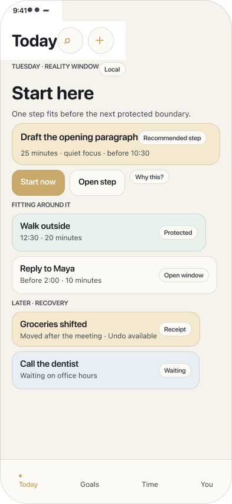 |
| VA-P4-CANDIDATE-002 · `51:100` | [Open](https://www.figma.com/design/Oik7612LSTUHWsNRFoTlTJ?node-id=51-100) | 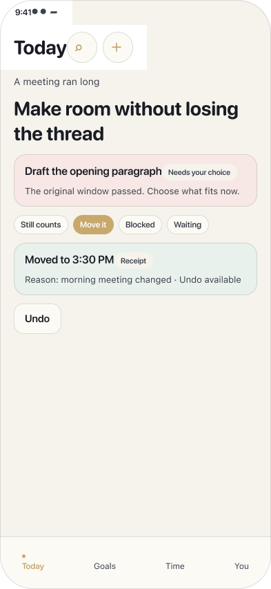 |
| VA-P4-CANDIDATE-003 · `51:195` | [Open](https://www.figma.com/design/Oik7612LSTUHWsNRFoTlTJ?node-id=51-195) | 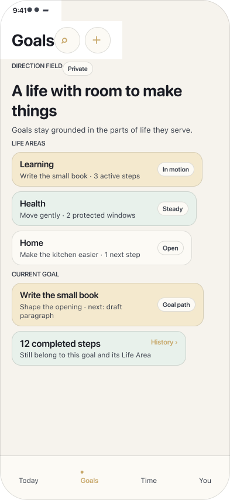 |
| VA-P4-CANDIDATE-004 · `51:292` | [Open](https://www.figma.com/design/Oik7612LSTUHWsNRFoTlTJ?node-id=51-292) | 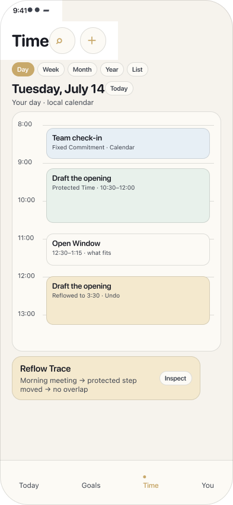 |
| VA-P4-CANDIDATE-005 · `52:57` | [Open](https://www.figma.com/design/Oik7612LSTUHWsNRFoTlTJ?node-id=52-57) | 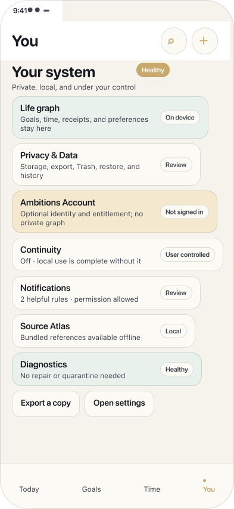 |
| VA-P4-CANDIDATE-006 · `52:157` | [Open](https://www.figma.com/design/Oik7612LSTUHWsNRFoTlTJ?node-id=52-157) | 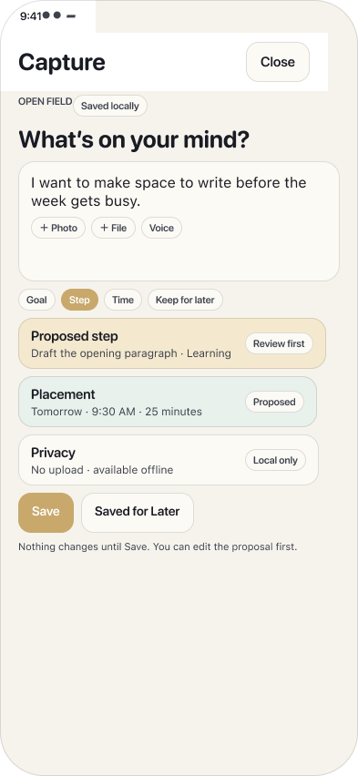 |
| VA-P4-CANDIDATE-007 · `52:232` | [Open](https://www.figma.com/design/Oik7612LSTUHWsNRFoTlTJ?node-id=52-232) | 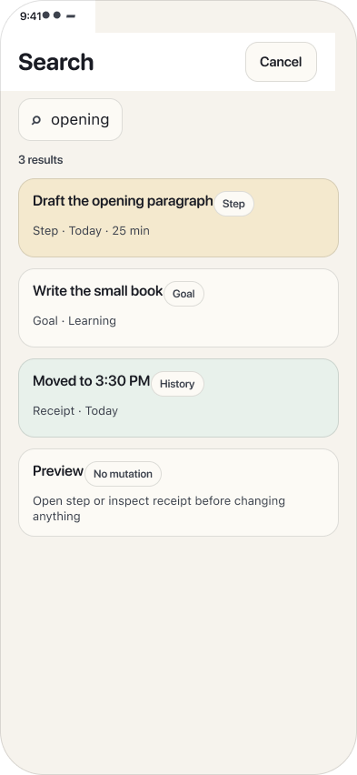 |
| VA-P4-CANDIDATE-008 · `52:314` | [Open](https://www.figma.com/design/Oik7612LSTUHWsNRFoTlTJ?node-id=52-314) | 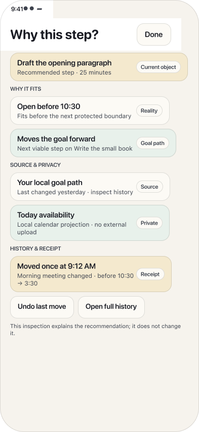 |
| VA-P4-CANDIDATE-009 · `53:69` | [Open](https://www.figma.com/design/Oik7612LSTUHWsNRFoTlTJ?node-id=53-69) | 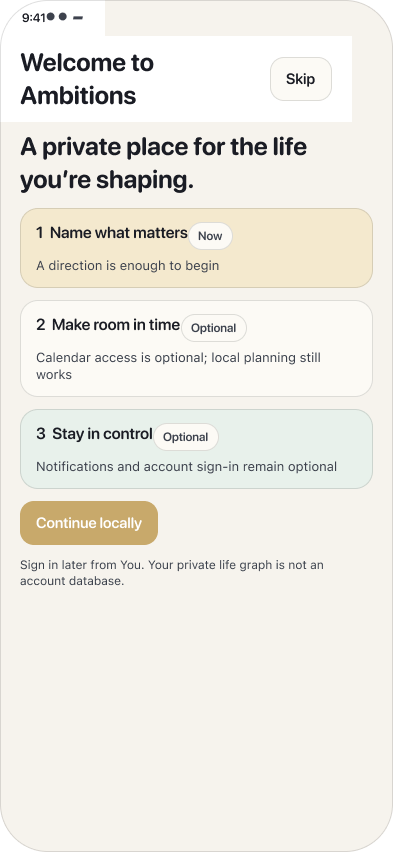 |
| VA-P4-CANDIDATE-010 · `53:145` | [Open](https://www.figma.com/design/Oik7612LSTUHWsNRFoTlTJ?node-id=53-145) | 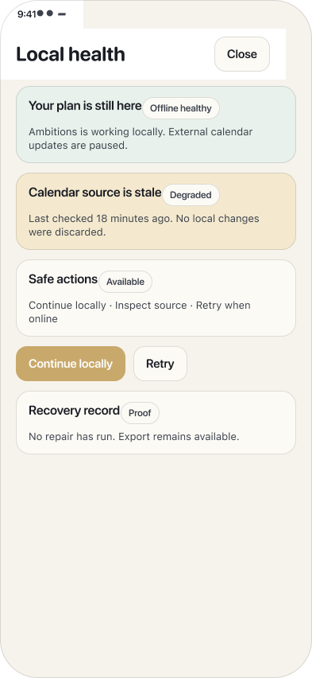 |
| VA-P4-CANDIDATE-011 · `53:228` | [Open](https://www.figma.com/design/Oik7612LSTUHWsNRFoTlTJ?node-id=53-228) | 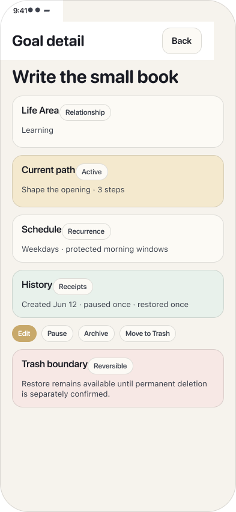 |
| VA-P4-CANDIDATE-012 · `53:322` | [Open](https://www.figma.com/design/Oik7612LSTUHWsNRFoTlTJ?node-id=53-322) | 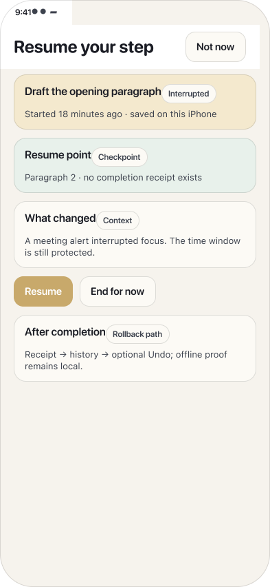 |

### Existing accessibility-class boards

| Authority ID | Figma | Product-only screenshot |
| --- | --- | --- |
| VA-P4-A11Y-CLASS-001 · `54:8` | [Open](https://www.figma.com/design/Oik7612LSTUHWsNRFoTlTJ?node-id=54-8) | 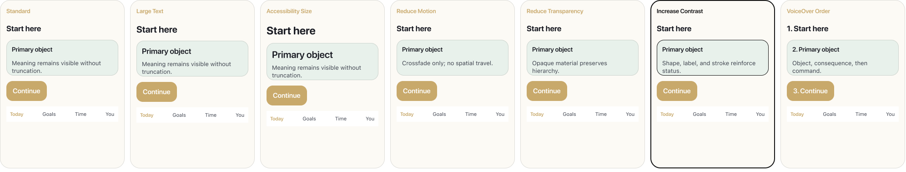 |
| VA-P4-A11Y-CLASS-002 · `54:105` | [Open](https://www.figma.com/design/Oik7612LSTUHWsNRFoTlTJ?node-id=54-105) | 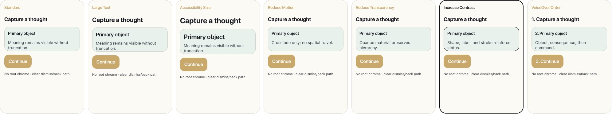 |
| VA-P4-A11Y-CLASS-003 · `54:174` | [Open](https://www.figma.com/design/Oik7612LSTUHWsNRFoTlTJ?node-id=54-174) | 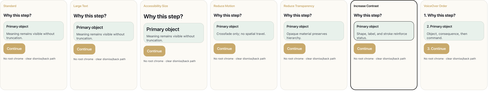 |
| VA-P4-A11Y-CLASS-004 · `54:243` | [Open](https://www.figma.com/design/Oik7612LSTUHWsNRFoTlTJ?node-id=54-243) | 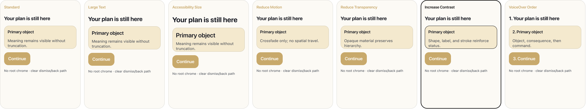 |
| VA-P4-A11Y-CLASS-005 · `54:312` | [Open](https://www.figma.com/design/Oik7612LSTUHWsNRFoTlTJ?node-id=54-312) | 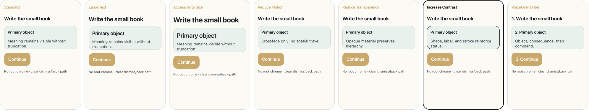 |
| VA-P4-A11Y-CLASS-006 · `54:381` | [Open](https://www.figma.com/design/Oik7612LSTUHWsNRFoTlTJ?node-id=54-381) | 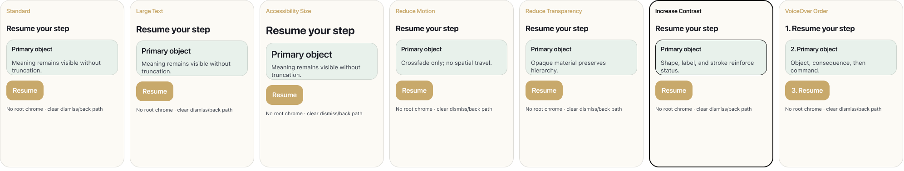 |

## Direction A — Quiet Spatial Stage (recommended)

Figma section: [`69:3`](https://www.figma.com/design/Oik7612LSTUHWsNRFoTlTJ?node-id=69-3)

### Strengths

- Best balance of calm spatial identity, canon clarity, accessibility resilience, and SwiftUI feasibility.
- Unifies Start here, Reality Window, horizontal Goal Path, calendar-grade Time, contextual Trust, local-first setup, and offline health.

### Problems

- Warm surfaces require disciplined contrast tuning.
- Spatial affordances require semantic list counterparts and careful accessibility reflow.

### Consequences and tradeoffs

- Moderate custom layout work without custom rendering.
- Distinctive without forcing a dark default or editorial severity.

### Accessibility and SwiftUI

- Accessibility: Actual accessibility-size Today, high-contrast Trust, opaque offline treatment, keyboard-active Capture, adjacent VoiceOver and Reduce Motion notes.
- SwiftUI feasibility: High: native navigation, sheets, controls, scroll views, calendar grid primitives, and semantic overlays.

### Viewports

| # | Viewport | Canon mapping | Figma | Product-only screenshot |
| --- | --- | --- | --- | --- |
| 01 | Root shell · `71:4` | `UX-SCREEN-APP-SHELL-ROOT` | [Open](https://www.figma.com/design/Oik7612LSTUHWsNRFoTlTJ?node-id=71-4) |  |
| 02 | Today · Start here · `71:50` | `UX-SCREEN-TODAY-START-HERE` | [Open](https://www.figma.com/design/Oik7612LSTUHWsNRFoTlTJ?node-id=71-50) |  |
| 03 | Goals · `71:99` | `UX-SCREEN-GOALS-ROOT` `UX-SCREEN-GOALS-PATH` | [Open](https://www.figma.com/design/Oik7612LSTUHWsNRFoTlTJ?node-id=71-99) |  |
| 04 | Time · `73:2` | `UX-SCREEN-TIME-DAY` | [Open](https://www.figma.com/design/Oik7612LSTUHWsNRFoTlTJ?node-id=73-2) |  |
| 05 | You · `73:59` | `UX-SCREEN-YOU-ROOT` | [Open](https://www.figma.com/design/Oik7612LSTUHWsNRFoTlTJ?node-id=73-59) |  |
| 06 | Capture · `73:109` | `UX-SCREEN-CAPTURE-COMPOSER` | [Open](https://www.figma.com/design/Oik7612LSTUHWsNRFoTlTJ?node-id=73-109) |  |
| 07 | Search · `74:2` | `UX-SCREEN-SEARCH-ROOT` | [Open](https://www.figma.com/design/Oik7612LSTUHWsNRFoTlTJ?node-id=74-2) |  |
| 08 | Contextual Trust · Increase Contrast · `74:33` | `UX-SCREEN-TRUST-DEEP` | [Open](https://www.figma.com/design/Oik7612LSTUHWsNRFoTlTJ?node-id=74-33) |  |
| 09 | Setup · local value before permission · `74:67` | `UX-SCREEN-SETUP-FIRST-USE` `UX-SCREEN-PERMISSIONS-CALENDAR` | [Open](https://www.figma.com/design/Oik7612LSTUHWsNRFoTlTJ?node-id=74-67) |  |
| 10 | Offline healthy · degraded recovery · Reduce Transparency · `75:2` | `UX-SCREEN-OFFLINE-DEGRADED-LOCAL-HEALTH` `UX-SCREEN-OFFLINE-DEGRADED-REPAIR` | [Open](https://www.figma.com/design/Oik7612LSTUHWsNRFoTlTJ?node-id=75-2) |  |
| 11 | Lifecycle · edit, Archive, Trash, restore, History · `75:27` | `UX-SCREEN-GOALS-DETAIL` `UX-SCREEN-YOU-DATA` | [Open](https://www.figma.com/design/Oik7612LSTUHWsNRFoTlTJ?node-id=75-27) |  |
| 12 | Accessibility-size Today reflow · `75:72` | `UX-SCREEN-TODAY-START-HERE` `UX-CROSS-DYNAMIC-TYPE` `UX-CROSS-VOICEOVER` `UX-CROSS-REDUCE-MOTION` `UX-CROSS-REDUCE-TRANSPARENCY` | [Open](https://www.figma.com/design/Oik7612LSTUHWsNRFoTlTJ?node-id=75-72) |  |

## Direction B — Editorial Native

Figma section: [`69:4`](https://www.figma.com/design/Oik7612LSTUHWsNRFoTlTJ?node-id=69-4)

### Strengths

- Strongest typographic scannability and lowest implementation ambiguity.
- Ruled hierarchy maps cleanly to standard SwiftUI controls.

### Problems

- Least ownable at a glance and may drift toward a premium planner.
- Spatial product moat is quieter outside Goals and Time.

### Consequences and tradeoffs

- Lowest visual implementation risk.
- Requires exceptional typography and copy to avoid genericism.

### Accessibility and SwiftUI

- Accessibility: Actual accessibility-size Today, high-contrast Trust, opaque offline treatment, keyboard-active Capture, and adjacent semantic notes.
- SwiftUI feasibility: Very high: native typography, lists, grids, separators, toolbar items, and dialogs.

### Viewports

| # | Viewport | Canon mapping | Figma | Product-only screenshot |
| --- | --- | --- | --- | --- |
| 01 | Root shell · `80:4` | `UX-SCREEN-APP-SHELL-ROOT` | [Open](https://www.figma.com/design/Oik7612LSTUHWsNRFoTlTJ?node-id=80-4) |  |
| 02 | Today · Start here · `80:51` | `UX-SCREEN-TODAY-START-HERE` | [Open](https://www.figma.com/design/Oik7612LSTUHWsNRFoTlTJ?node-id=80-51) |  |
| 03 | Goals · `80:101` | `UX-SCREEN-GOALS-ROOT` `UX-SCREEN-GOALS-PATH` | [Open](https://www.figma.com/design/Oik7612LSTUHWsNRFoTlTJ?node-id=80-101) |  |
| 04 | Time · `80:152` | `UX-SCREEN-TIME-DAY` | [Open](https://www.figma.com/design/Oik7612LSTUHWsNRFoTlTJ?node-id=80-152) |  |
| 05 | You · `81:2` | `UX-SCREEN-YOU-ROOT` | [Open](https://www.figma.com/design/Oik7612LSTUHWsNRFoTlTJ?node-id=81-2) |  |
| 06 | Capture · `81:53` | `UX-SCREEN-CAPTURE-COMPOSER` | [Open](https://www.figma.com/design/Oik7612LSTUHWsNRFoTlTJ?node-id=81-53) |  |
| 07 | Search · `81:131` | `UX-SCREEN-SEARCH-ROOT` | [Open](https://www.figma.com/design/Oik7612LSTUHWsNRFoTlTJ?node-id=81-131) |  |
| 08 | Contextual Trust · Increase Contrast · `81:163` | `UX-SCREEN-TRUST-DEEP` | [Open](https://www.figma.com/design/Oik7612LSTUHWsNRFoTlTJ?node-id=81-163) |  |
| 09 | Setup · local value before permission · `82:2` | `UX-SCREEN-SETUP-FIRST-USE` `UX-SCREEN-PERMISSIONS-CALENDAR` | [Open](https://www.figma.com/design/Oik7612LSTUHWsNRFoTlTJ?node-id=82-2) |  |
| 10 | Offline healthy · degraded recovery · Reduce Transparency · `82:24` | `UX-SCREEN-OFFLINE-DEGRADED-LOCAL-HEALTH` `UX-SCREEN-OFFLINE-DEGRADED-REPAIR` | [Open](https://www.figma.com/design/Oik7612LSTUHWsNRFoTlTJ?node-id=82-24) |  |
| 11 | Lifecycle · edit, Archive, Trash, restore, History · `82:49` | `UX-SCREEN-GOALS-DETAIL` `UX-SCREEN-YOU-DATA` | [Open](https://www.figma.com/design/Oik7612LSTUHWsNRFoTlTJ?node-id=82-49) |  |
| 12 | Accessibility-size Today reflow · `82:95` | `UX-SCREEN-TODAY-START-HERE` `UX-CROSS-DYNAMIC-TYPE` `UX-CROSS-VOICEOVER` `UX-CROSS-REDUCE-MOTION` `UX-CROSS-REDUCE-TRANSPARENCY` | [Open](https://www.figma.com/design/Oik7612LSTUHWsNRFoTlTJ?node-id=82-95) |  |

## Direction C — Atmospheric Temporal Field

Figma section: [`69:5`](https://www.figma.com/design/Oik7612LSTUHWsNRFoTlTJ?node-id=69-5)

### Strengths

- Most ownable expression of time, continuity, and reality-fit action.
- Anchors use a curved Now meridian, spatial living-path lanes, and capacity/protection calendar bands.

### Problems

- Highest motion, material, contrast, and dark-posture calibration risk.
- Could become performative if glow, blur, or path motion exceeds the restrained treatment.

### Consequences and tradeoffs

- Strongest differentiation and emotional continuity.
- Requires owner confidence in dark-first posture and a stricter accessibility bar.

### Accessibility and SwiftUI

- Accessibility: Actual accessibility-size Today, no-glow opaque offline and Trust fallbacks, semantic path/list notes, and immediate Reduce Motion substitution.
- SwiftUI feasibility: Medium-high: standard controls plus SwiftUI Path and restrained ambient blur shapes; no custom renderer.

### Viewports

| # | Viewport | Canon mapping | Figma | Product-only screenshot |
| --- | --- | --- | --- | --- |
| 01 | Root shell · `83:4` | `UX-SCREEN-APP-SHELL-ROOT` | [Open](https://www.figma.com/design/Oik7612LSTUHWsNRFoTlTJ?node-id=83-4) |  |
| 02 | Today · Start here · `83:52` | `UX-SCREEN-TODAY-START-HERE` | [Open](https://www.figma.com/design/Oik7612LSTUHWsNRFoTlTJ?node-id=83-52) |  |
| 03 | Goals · `83:103` | `UX-SCREEN-GOALS-ROOT` `UX-SCREEN-GOALS-PATH` | [Open](https://www.figma.com/design/Oik7612LSTUHWsNRFoTlTJ?node-id=83-103) |  |
| 04 | Time · `83:155` | `UX-SCREEN-TIME-DAY` | [Open](https://www.figma.com/design/Oik7612LSTUHWsNRFoTlTJ?node-id=83-155) |  |
| 05 | You · `84:2` | `UX-SCREEN-YOU-ROOT` | [Open](https://www.figma.com/design/Oik7612LSTUHWsNRFoTlTJ?node-id=84-2) |  |
| 06 | Capture · `84:54` | `UX-SCREEN-CAPTURE-COMPOSER` | [Open](https://www.figma.com/design/Oik7612LSTUHWsNRFoTlTJ?node-id=84-54) |  |
| 07 | Search · `84:133` | `UX-SCREEN-SEARCH-ROOT` | [Open](https://www.figma.com/design/Oik7612LSTUHWsNRFoTlTJ?node-id=84-133) |  |
| 08 | Contextual Trust · Increase Contrast · `84:166` | `UX-SCREEN-TRUST-DEEP` | [Open](https://www.figma.com/design/Oik7612LSTUHWsNRFoTlTJ?node-id=84-166) |  |
| 09 | Setup · local value before permission · `85:2` | `UX-SCREEN-SETUP-FIRST-USE` `UX-SCREEN-PERMISSIONS-CALENDAR` | [Open](https://www.figma.com/design/Oik7612LSTUHWsNRFoTlTJ?node-id=85-2) |  |
| 10 | Offline healthy · degraded recovery · Reduce Transparency · `85:25` | `UX-SCREEN-OFFLINE-DEGRADED-LOCAL-HEALTH` `UX-SCREEN-OFFLINE-DEGRADED-REPAIR` | [Open](https://www.figma.com/design/Oik7612LSTUHWsNRFoTlTJ?node-id=85-25) |  |
| 11 | Lifecycle · edit, Archive, Trash, restore, History · `85:49` | `UX-SCREEN-GOALS-DETAIL` `UX-SCREEN-YOU-DATA` | [Open](https://www.figma.com/design/Oik7612LSTUHWsNRFoTlTJ?node-id=85-49) |  |
| 12 | Accessibility-size Today reflow · `85:96` | `UX-SCREEN-TODAY-START-HERE` `UX-CROSS-DYNAMIC-TYPE` `UX-CROSS-VOICEOVER` `UX-CROSS-REDUCE-MOTION` `UX-CROSS-REDUCE-TRANSPARENCY` | [Open](https://www.figma.com/design/Oik7612LSTUHWsNRFoTlTJ?node-id=85-96) |  |

## Systemic findings

### Language

- Root labels remain exactly Today, Goals, Time, and You.
- Capture, Search, and Trust remain contextual and non-root.
- Locked action and lifecycle terms remain distinct.
- Infrastructure and design terminology was removed from product viewports; accessibility-setting explanations live adjacent to product-only frames.

### Accessibility and Dynamic Type

- Each direction contains one populated Today viewport at an accessibility text size, not an abstract matrix.
- Capture is shown keyboard-active with an explicit native accessory boundary.
- Increase Contrast is embodied in Trust. Reduce Transparency is embodied in offline/recovery. Neither setting appears as invented product UI.
- VoiceOver order, Reduce Motion substitution, semantic Goal Path order, and Time list equivalents are adjacent annotations outside product-only screenshots.
- Active + Move to Trash confirmation is separate from the linked Trash state that offers Restore or a separate permanent-delete review.

### SwiftUI plausibility

- A uses native navigation, sheets, controls, scroll views, calendar geometry, and semantic overlays.
- B stays closest to standard typography, dividers, lists, grids, and confirmation dialogs.
- C adds SwiftUI Path and restrained ambient blur shapes while keeping native controls and opaque/high-contrast fallbacks. It does not require a custom renderer.
- Figma Code Connect requires a Dev or Full seat on an Organization or Enterprise plan; local SwiftUI source and Figma component evidence were used for feasibility review.

## Owner decisions requested

- Select Direction A, B, or C; no direction becomes authority without an explicit owner decision.
- Choose light-first, dark-first, or paired light/dark posture.
- Set motion and material intensity.
- Confirm confidence in the icon-only root dock.
- Confirm confidence in the horizontal Goal Path and its semantic list counterpart.
- Confirm typography scale and density.
- Confirm contextual Trust density.
- Confirm Capture/Search depth and keyboard posture.
- Name unresolved accessibility concerns before authority or implementation work.

## Selection boundary

The package remains `AWAITING_EXPLICIT_OWNER_DIRECTION_SELECTION`. No direction is approved, authoritative, superseding, active, or implementation-ready until the owner makes an explicit direction selection and separately scopes authority or implementation work.

Machine-readable package: [OWNER_REVIEW_PACKAGE.json](OWNER_REVIEW_PACKAGE.json)
