# Owner Review Package — Canon Visual Owner Workshop

Status: `AWAITING_EXPLICIT_OWNER_DIRECTION_SELECTION`

Artifact state: `EXPLORATION`

Recommended direction: **A — Quiet Spatial Stage**
Figma page: [EXPLORATION — Owner Visual Workshop — 2026-07-14](https://www.figma.com/design/Oik7612LSTUHWsNRFoTlTJ?node-id=69-2)

This package is a visual-design decision aid. It does not approve, supersede, or activate a Figma direction. Existing candidate and legacy nodes remain unchanged.

## Frozen inputs and claim ceiling

- Repository frozen base: `dcdd0e0e3e91a19e6988c7c372fea5cb1fca6847`
- Canon source SHA: `ffd462ab52c0eff798071333388a051d9f3e55f3`
- Canon content SHA-256: `0ac3656f1f55c0514ada19da8b36b8a090628e4fa1648a6aaee3f660a3ed27bb`
- Figma file: `Oik7612LSTUHWsNRFoTlTJ`
- Workshop page ID: `69:2`
- Viewport contract: 3 directions × (11 standard 393×852 viewports + 1 populated accessibility-size 393×852 viewport) = 36.
- Claim ceiling: Visual design input only; no source, runtime, rendered-app, accessibility, device, privacy/legal, distribution, approval, or release proof.
- Code Connect limitation: Figma Code Connect requires a Dev or Full seat on an Organization or Enterprise plan; local SwiftUI source and Figma component evidence were used for feasibility review.

## Recommendation

Direction A is recommended because it best balances Ambitions-specific spatial identity, calm native iPhone quality, canon fidelity, accessibility resilience, and SwiftUI plausibility. Direction B is the lower-risk editorial alternative. Direction C is the most differentiated temporal system and carries the highest motion, material, and dark-posture calibration risk.

No recommendation changes the package status. An explicit owner choice is still required.

## Consolidated review repair

- All 36 exploration viewports were recomposed in place while preserving their outer node IDs.
- A now uses object-specific quiet spatial forms across the complete set; B uses edge-to-edge asymmetric editorial rules and typography; C carries one temporal-field grammar through all primary and secondary surfaces.
- The visual Goal Path remains horizontal in every direction. Accessibility uses an ordered semantic-list counterpart; it is not described as a vertical Goal Path.
- Each accessibility-size Today frame uses materially larger type, true vertical reflow, the same information/order, no horizontal scroll, and square/circle/triangle non-color states.
- Every represented interactive control has a named `HitTarget/44` envelope of at least 44×44 pt. Glyphs may be smaller. This is visual design input, not runtime hit-testing or accessibility proof.
- Shared Figma metadata now uses the stable `ambitions.visual_owner_workshop` namespace and keeps `approval_state=EXPLORATION`, mappings, frozen SHAs, composition system, accessibility posture, target count, and the visual-only proof ceiling explicit.

## Current candidate review

### Strengths

- All 18 live R1 candidate viewports are bound to exact Figma node IDs and render SHA-256 values.
- The four-root shell has one dock plus one Search and Capture action; seven drilldowns have one Back affordance and no root chrome.
- The R1 repair is additive and preserves pre-R1 and legacy artifacts as provenance.

### Problems

- R1 remains candidate/shadow and cannot authorize source work while Gate B is pending.
- Figma node and render proof do not prove source implementation, runtime behavior, rendered-app quality, or accessibility.
- The exact R1 candidate still requires independent review before any authority-state decision.

### Current-candidate screen-by-screen assessment

The prose below is the historical pre-R1 workshop assessment. This bounded repair refreshes only the exact current node links and product screenshots; it does not claim a new semantic evaluation.

| Screen class | Node | Strength | Problem |
| --- | --- | --- | --- |
| Root shell and Today overview | `51:10` | Complete four-root shell with contextual Capture, Search, and Trust boundaries. | Text-labeled dock conflicts with icon-only canon; the generic card stack weakens spatial identity and the ±24-hour Reality Window. |
| Today recovery | `51:100` | Preserves agency, closure language, receipts, and Undo without shame. | Reads as a conventional card/list state detached from the Reality Window. |
| Goals | `51:195` | Covers Goal, Life Area, path, recovery, closure, and History boundaries. | Goal Path is not the standard horizontal living route; card density obscures continuity. |
| Time | `51:292` | Uses real hour-grid geometry for Protected, Fixed, open capacity, and reflow. | Boxed controls and compact density understate Day/Week/Month/Year/List breadth. |
| You | `52:57` | Makes local data, optional identity, continuity, privacy, diagnostics, and export inspectable. | Settings-list posture feels generic and exposes too much system organization in the first viewport. |
| Capture | `52:157` | Maintains the global local-first composer and explicit Save boundary without root chrome. | Does not prove keyboard-active composition, focus order, or accessory actions. |
| Search | `52:232` | Typed private results preserve object identity and action preview. | Generic result rows provide limited context depth and weak differentiation from utility search. |
| Contextual Trust | `52:314` | Keeps Trust object-bound and contextual. | Uniform rows make Proof, Source, Privacy, History, Receipts, and Undo feel equally dense. |
| Setup and permission | `53:69` | Establishes local value before optional identity or permission and preserves denial/resume. | Text-heavy cards flatten local value, permission, and account hierarchy. |
| Offline and degraded recovery | `53:145` | Names exact consequences and preserves continue, inspect, retry, export, and repair paths. | Technical card stack does not visually normalize healthy offline use. |
| Lifecycle boundaries | `53:228` | Includes edit, Archive, Trash, restore, recurrence, History, Receipts, privacy, and ownership. | Active, Trash, Restore, and permanent-delete coherence is not shown as separate states. |
| Journey and accessibility proof | `53:322` | Covers checkpoint, interruption, resume, commit, failure, recovery, receipt, rollback, and focus continuity. | Reads as an evidence matrix rather than a populated product viewport or representative accessibility reflow. |

### Existing standard candidate viewports

| Authority ID | Figma | Product-only screenshot |
| --- | --- | --- |
| VA-P4-CANDIDATE-001 · `266:1424` | [Open](https://www.figma.com/design/Oik7612LSTUHWsNRFoTlTJ?node-id=266-1424) | 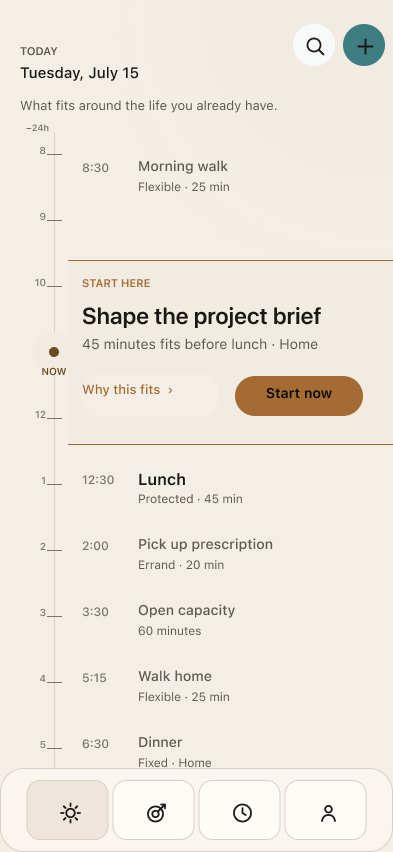 |
| VA-P4-CANDIDATE-002 · `266:1709` | [Open](https://www.figma.com/design/Oik7612LSTUHWsNRFoTlTJ?node-id=266-14240) | 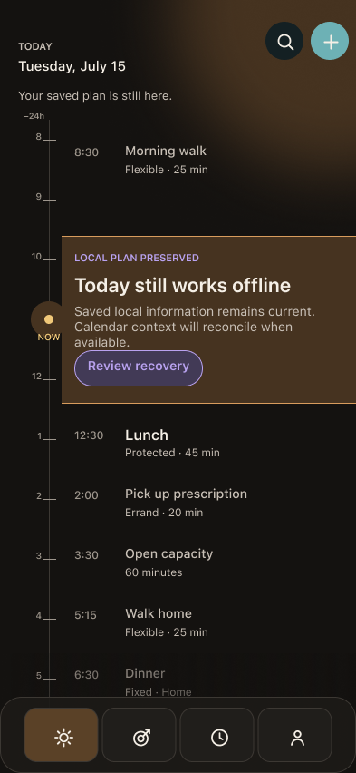 |
| VA-P4-CANDIDATE-003 · `272:1424` | [Open](https://www.figma.com/design/Oik7612LSTUHWsNRFoTlTJ?node-id=272-1424) | 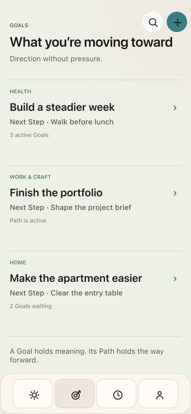 |
| VA-P4-CANDIDATE-004 · `275:1424` | [Open](https://www.figma.com/design/Oik7612LSTUHWsNRFoTlTJ?node-id=275-1424) | 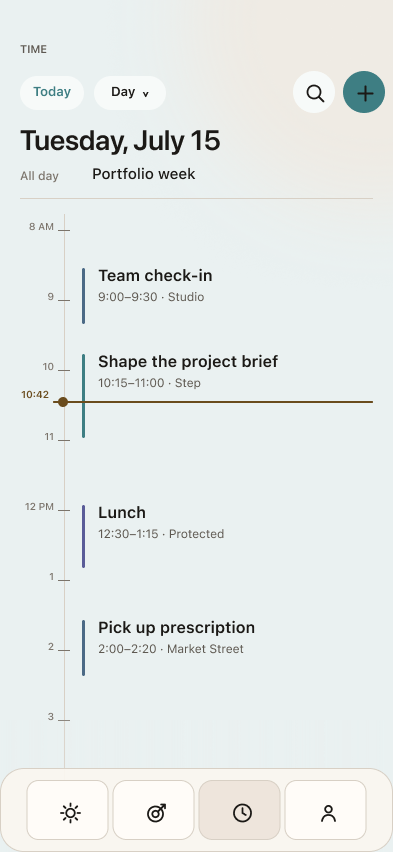 |
| VA-P4-CANDIDATE-005 · `278:1449` | [Open](https://www.figma.com/design/Oik7612LSTUHWsNRFoTlTJ?node-id=278-1449) | 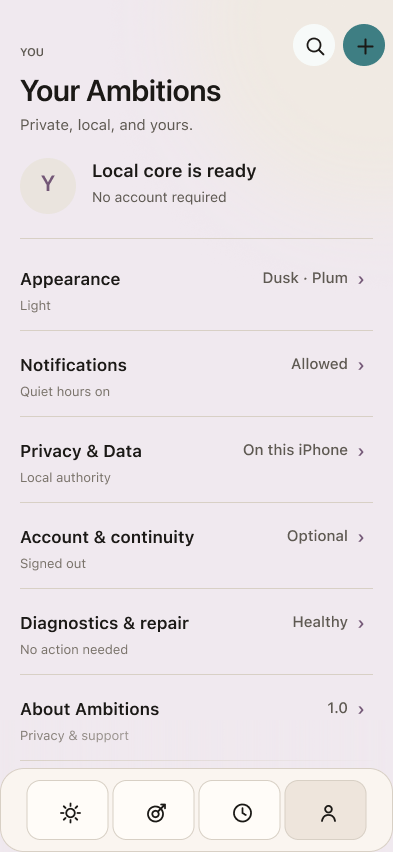 |
| VA-P4-CANDIDATE-006 · `281:1465` | [Open](https://www.figma.com/design/Oik7612LSTUHWsNRFoTlTJ?node-id=281-1465) | 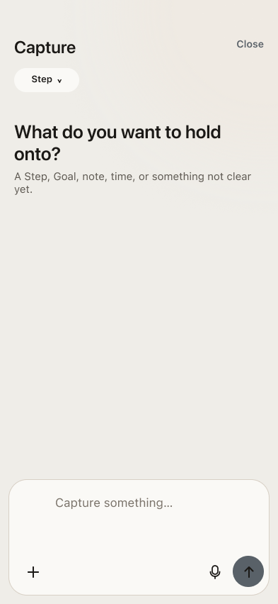 |
| VA-P4-CANDIDATE-007 · `288:41` | [Open](https://www.figma.com/design/Oik7612LSTUHWsNRFoTlTJ?node-id=288-41) | 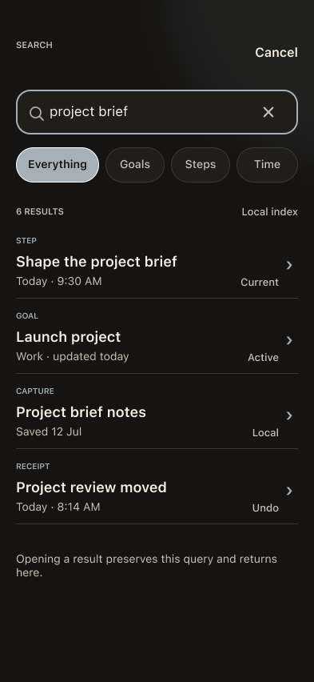 |
| VA-P4-CANDIDATE-008 · `288:156` | [Open](https://www.figma.com/design/Oik7612LSTUHWsNRFoTlTJ?node-id=288-156) | 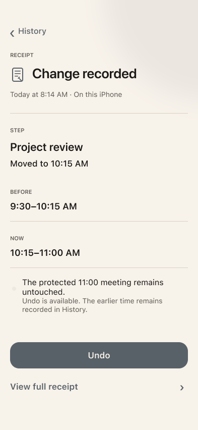 |
| VA-P4-CANDIDATE-009 · `293:23` | [Open](https://www.figma.com/design/Oik7612LSTUHWsNRFoTlTJ?node-id=293-23) | 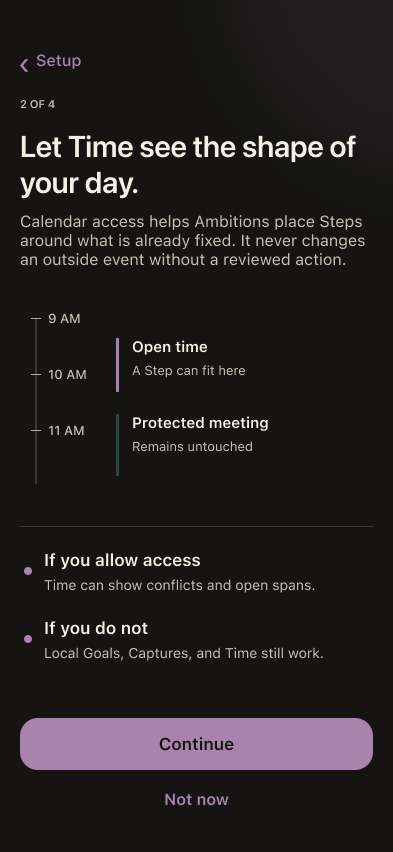 |
| VA-P4-CANDIDATE-010 · `293:141` | [Open](https://www.figma.com/design/Oik7612LSTUHWsNRFoTlTJ?node-id=293-141) | 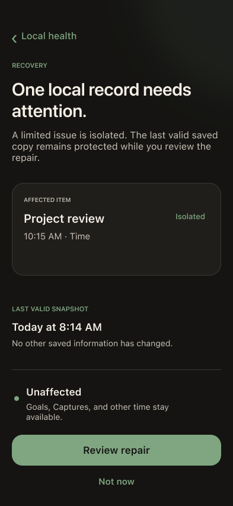 |
| VA-P4-CANDIDATE-011 · `293:164` | [Open](https://www.figma.com/design/Oik7612LSTUHWsNRFoTlTJ?node-id=293-164) | 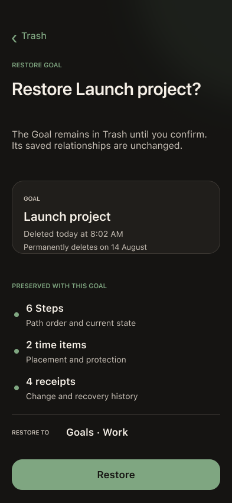 |
| VA-P4-CANDIDATE-012 · `293:83` | [Open](https://www.figma.com/design/Oik7612LSTUHWsNRFoTlTJ?node-id=293-83) | 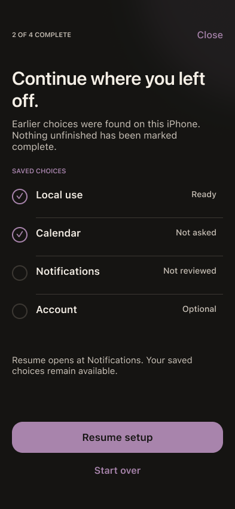 |

### Existing accessibility-class boards

| Authority ID | Figma | Product-only screenshot |
| --- | --- | --- |
| VA-P4-A11Y-CLASS-001 · `270:1430` | [Open](https://www.figma.com/design/Oik7612LSTUHWsNRFoTlTJ?node-id=270-1430) | 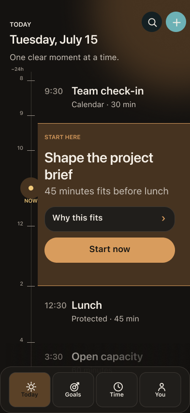 |
| VA-P4-A11Y-CLASS-002 · `296:60` | [Open](https://www.figma.com/design/Oik7612LSTUHWsNRFoTlTJ?node-id=296-60) | 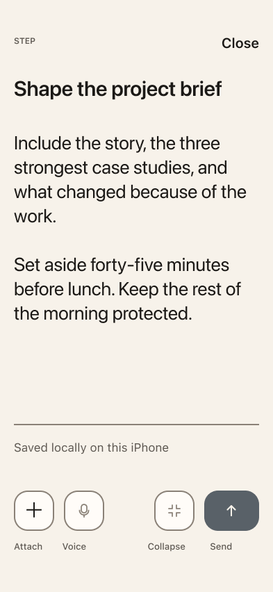 |
| VA-P4-A11Y-CLASS-003 · `296:84` | [Open](https://www.figma.com/design/Oik7612LSTUHWsNRFoTlTJ?node-id=296-84) | 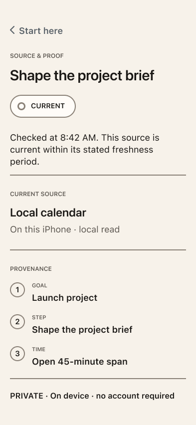 |
| VA-P4-A11Y-CLASS-004 · `327:1603` | [Open](https://www.figma.com/design/Oik7612LSTUHWsNRFoTlTJ?node-id=327-1603) | 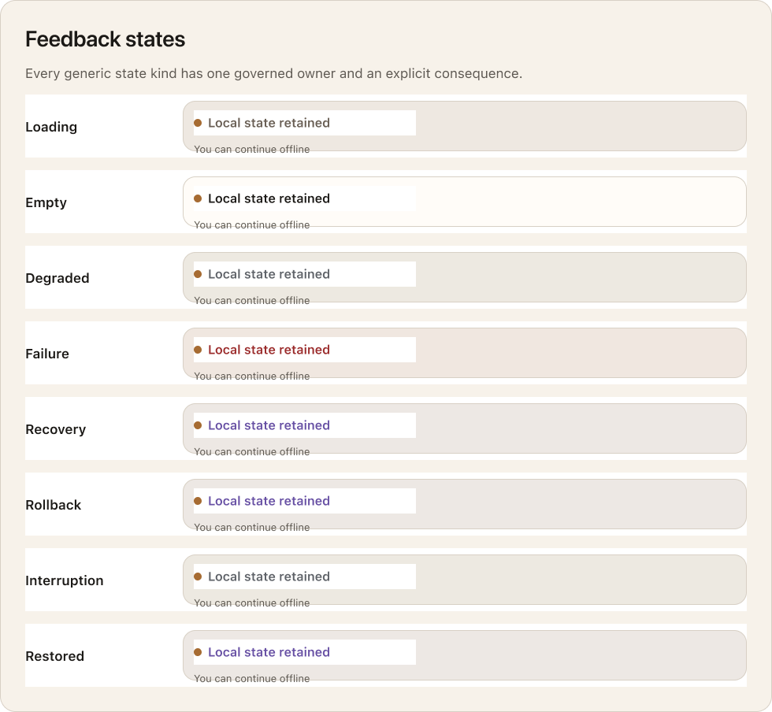 |
| VA-P4-A11Y-CLASS-005 · `329:1635` | [Open](https://www.figma.com/design/Oik7612LSTUHWsNRFoTlTJ?node-id=329-1635) | 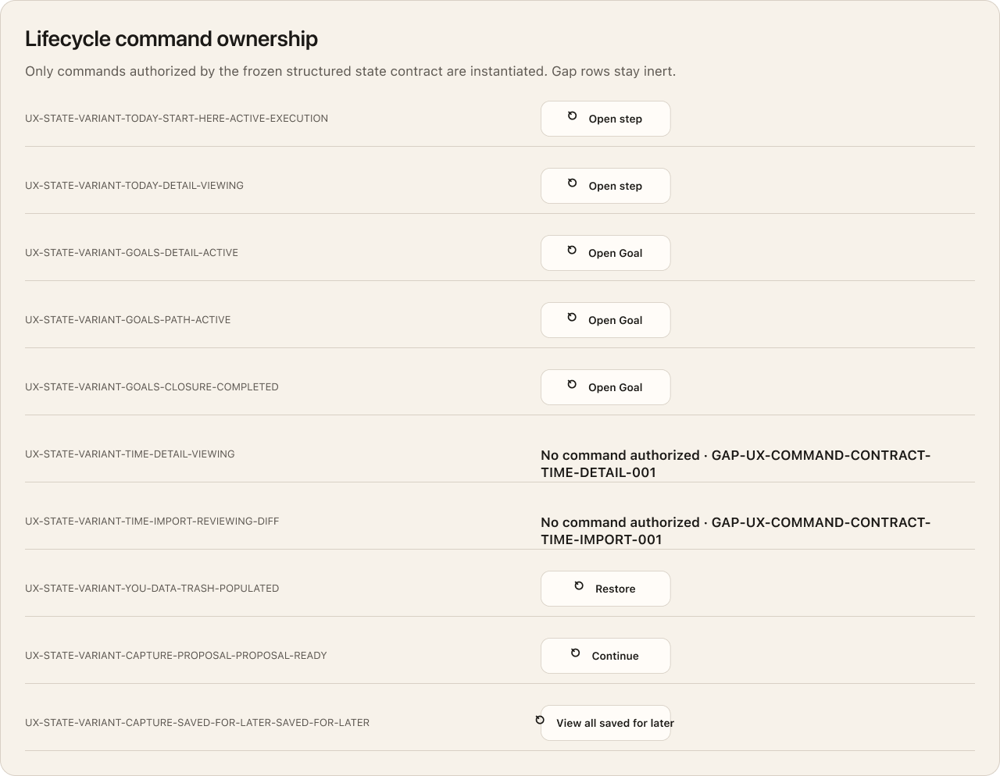 |
| VA-P4-A11Y-CLASS-006 · `327:1648` | [Open](https://www.figma.com/design/Oik7612LSTUHWsNRFoTlTJ?node-id=327-1648) | 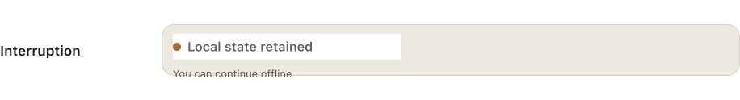 |

## Direction A — Quiet Spatial Stage (recommended)

Figma section: [`69:3`](https://www.figma.com/design/Oik7612LSTUHWsNRFoTlTJ?node-id=69-3)

### Strengths

- One quiet spatial composition system spans all 12 frames through object-specific fields, orbits, living paths, and lifecycle traces without returning to a generic card/list skeleton.
- Balances canon fidelity and native feasibility across Start here, Reality Window, the horizontal Goal Path, calendar-grade Time, contextual Trust, setup, offline continuity, and lifecycle.

### Problems

- Warm spatial fields still require implementation-time contrast verification in the rendered app.
- Spatial relationships require the documented ordered semantic counterpart under accessibility reflow.

### Consequences and tradeoffs

- Moderate custom SwiftUI layout using native shapes and semantic ordering without a custom renderer.
- Most Ambitions-specific light direction; more layout calibration than B and less material/motion risk than C.

### Accessibility and SwiftUI

- Accessibility: materially larger type, full vertical reflow, the same information/order, no horizontal scroll, square/circle/triangle non-color states, and represented controls with named ≥44×44 pt envelopes. Visual design input only.
- SwiftUI feasibility: High: native navigation, sheets, controls, scroll views, calendar grid primitives, and semantic overlays.
- Linked companion node: `78:13`. Direction-level annotation nodes: none.

### Viewports

| # | Viewport | Canon mapping | Figma | Product-only screenshot |
| --- | --- | --- | --- | --- |
| 01 | Root shell · `71:4` | `UX-SCREEN-APP-SHELL-ROOT` | [Open](https://www.figma.com/design/Oik7612LSTUHWsNRFoTlTJ?node-id=71-4) | 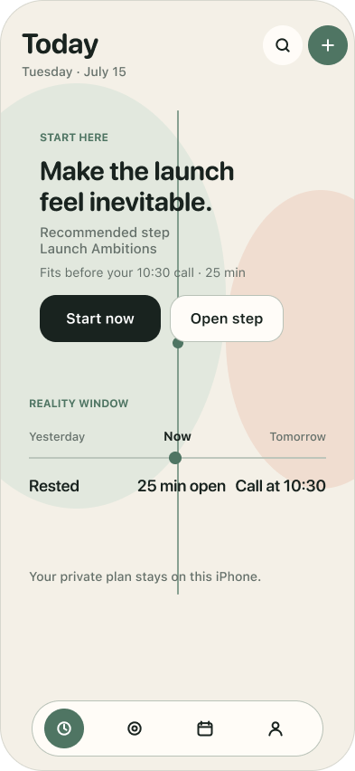 |
| 02 | Today · Start here · `71:50` | `UX-SCREEN-TODAY-START-HERE` | [Open](https://www.figma.com/design/Oik7612LSTUHWsNRFoTlTJ?node-id=71-50) | 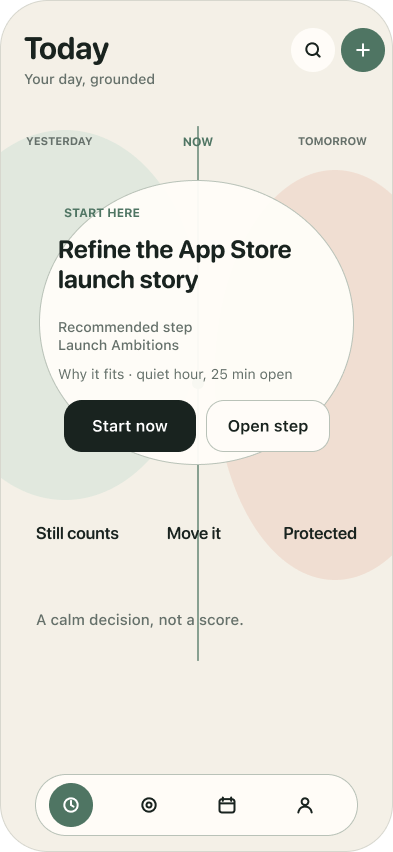 |
| 03 | Goals · `71:99` | `UX-SCREEN-GOALS-ROOT` `UX-SCREEN-GOALS-PATH` | [Open](https://www.figma.com/design/Oik7612LSTUHWsNRFoTlTJ?node-id=71-99) | 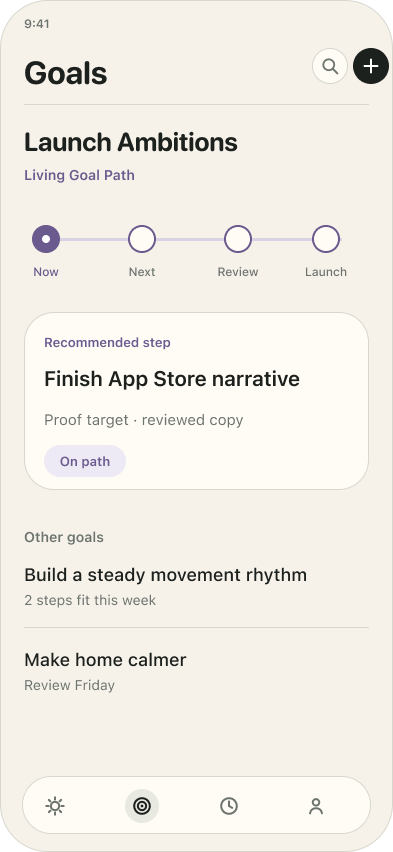 |
| 04 | Time · `73:2` | `UX-SCREEN-TIME-DAY` | [Open](https://www.figma.com/design/Oik7612LSTUHWsNRFoTlTJ?node-id=73-2) | 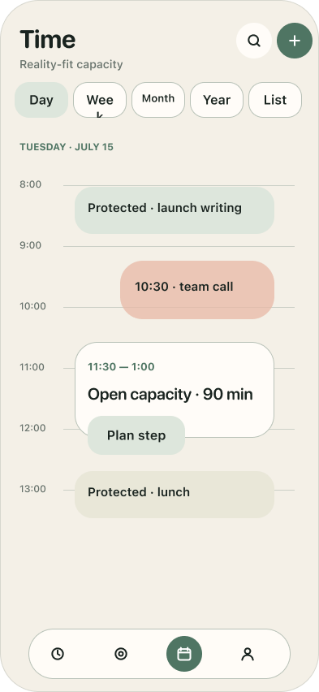 |
| 05 | You · `73:59` | `UX-SCREEN-YOU-ROOT` | [Open](https://www.figma.com/design/Oik7612LSTUHWsNRFoTlTJ?node-id=73-59) | 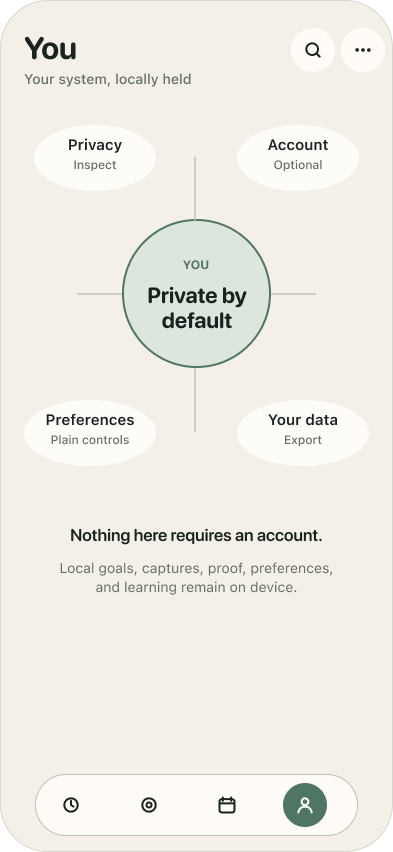 |
| 06 | Capture · `73:109` | `UX-SCREEN-CAPTURE-COMPOSER` | [Open](https://www.figma.com/design/Oik7612LSTUHWsNRFoTlTJ?node-id=73-109) | 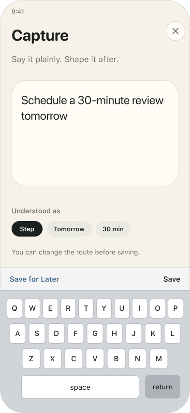 |
| 07 | Search · `74:2` | `UX-SCREEN-SEARCH-ROOT` | [Open](https://www.figma.com/design/Oik7612LSTUHWsNRFoTlTJ?node-id=74-2) | 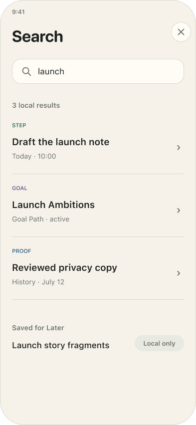 |
| 08 | Contextual Trust · Increase Contrast · `74:33` | `UX-SCREEN-TRUST-DEEP` | [Open](https://www.figma.com/design/Oik7612LSTUHWsNRFoTlTJ?node-id=74-33) | 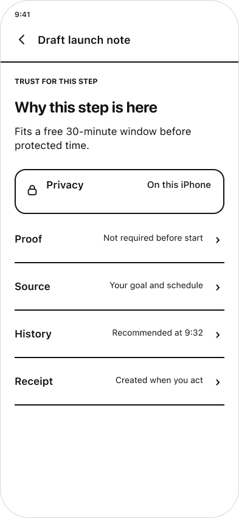 |
| 09 | Setup · local value before permission · `74:67` | `UX-SCREEN-SETUP-FIRST-USE` `UX-SCREEN-PERMISSIONS-CALENDAR` | [Open](https://www.figma.com/design/Oik7612LSTUHWsNRFoTlTJ?node-id=74-67) | 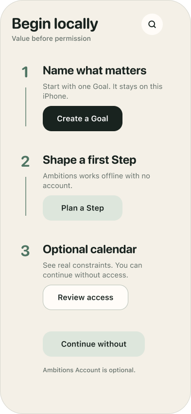 |
| 10 | Offline healthy · degraded recovery · Reduce Transparency · `75:2` | `UX-SCREEN-OFFLINE-DEGRADED-LOCAL-HEALTH` `UX-SCREEN-OFFLINE-DEGRADED-REPAIR` | [Open](https://www.figma.com/design/Oik7612LSTUHWsNRFoTlTJ?node-id=75-2) | 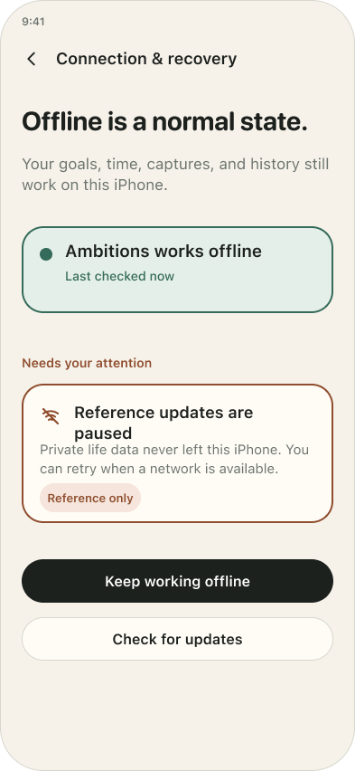 |
| 11 | Lifecycle · edit, Archive, Trash, restore, History · `75:27` | `UX-SCREEN-GOALS-DETAIL` `UX-SCREEN-YOU-DATA` | [Open](https://www.figma.com/design/Oik7612LSTUHWsNRFoTlTJ?node-id=75-27) | 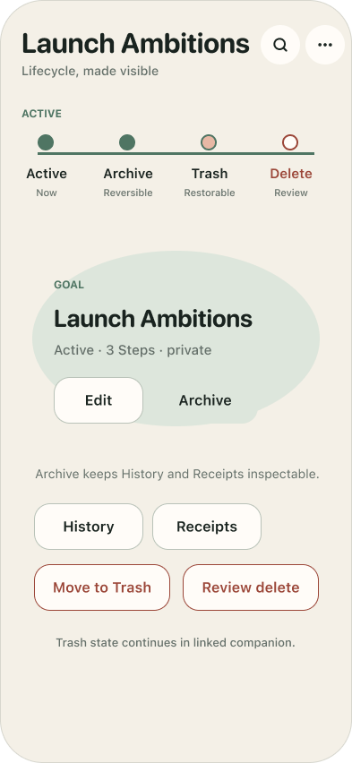 |
| 12 | Accessibility-size Today reflow · `75:72` | `UX-SCREEN-TODAY-START-HERE` `UX-CROSS-DYNAMIC-TYPE` `UX-CROSS-VOICEOVER` `UX-CROSS-REDUCE-MOTION` `UX-CROSS-REDUCE-TRANSPARENCY` | [Open](https://www.figma.com/design/Oik7612LSTUHWsNRFoTlTJ?node-id=75-72) | 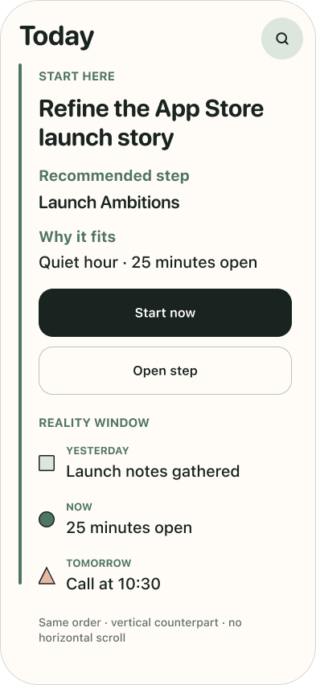 |

## Direction B — Editorial Native

Figma section: [`69:4`](https://www.figma.com/design/Oik7612LSTUHWsNRFoTlTJ?node-id=69-4)

### Strengths

- A materially distinct edge-to-edge editorial system spans all 12 frames through asymmetric gutters, numbered sections, large typography, and rules.
- Strongest typographic scannability and lowest SwiftUI implementation ambiguity while preserving the horizontal Goal Path and native controls.

### Problems

- Least ownable at a glance and still depends on exceptional typography and copy to avoid premium-planner genericism.
- The spatial product moat is intentionally quieter than A and C.

### Consequences and tradeoffs

- Lowest visual implementation risk and most direct mapping to SwiftUI typography, dividers, lists, grids, and dialogs.
- Gives up some spatial emotion in exchange for editorial clarity and density control.

### Accessibility and SwiftUI

- Accessibility: materially larger type, numbered vertical reflow, the same information/order, no horizontal scroll, square/circle/triangle non-color states, and represented controls with named ≥44×44 pt envelopes. Visual design input only.
- SwiftUI feasibility: Very high: native typography, lists, grids, separators, toolbar items, and dialogs.
- Linked companion node: `82:129`. Direction-level annotation nodes: none.

### Viewports

| # | Viewport | Canon mapping | Figma | Product-only screenshot |
| --- | --- | --- | --- | --- |
| 01 | Root shell · `80:4` | `UX-SCREEN-APP-SHELL-ROOT` | [Open](https://www.figma.com/design/Oik7612LSTUHWsNRFoTlTJ?node-id=80-4) | 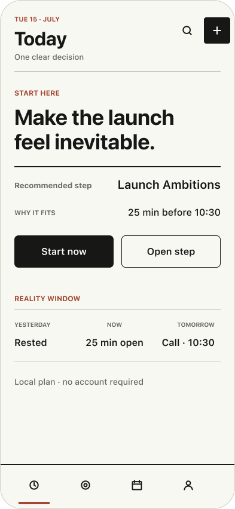 |
| 02 | Today · Start here · `80:51` | `UX-SCREEN-TODAY-START-HERE` | [Open](https://www.figma.com/design/Oik7612LSTUHWsNRFoTlTJ?node-id=80-51) | 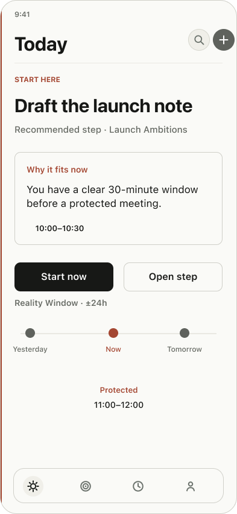 |
| 03 | Goals · `80:101` | `UX-SCREEN-GOALS-ROOT` `UX-SCREEN-GOALS-PATH` | [Open](https://www.figma.com/design/Oik7612LSTUHWsNRFoTlTJ?node-id=80-101) | 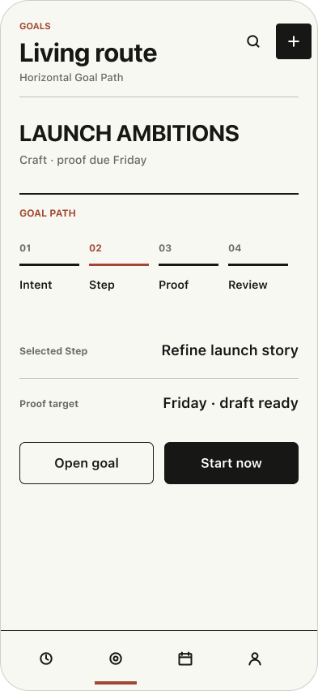 |
| 04 | Time · `80:152` | `UX-SCREEN-TIME-DAY` | [Open](https://www.figma.com/design/Oik7612LSTUHWsNRFoTlTJ?node-id=80-152) | 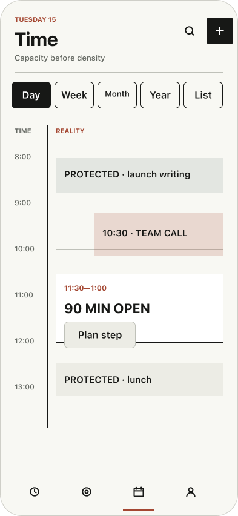 |
| 05 | You · `81:2` | `UX-SCREEN-YOU-ROOT` | [Open](https://www.figma.com/design/Oik7612LSTUHWsNRFoTlTJ?node-id=81-2) | 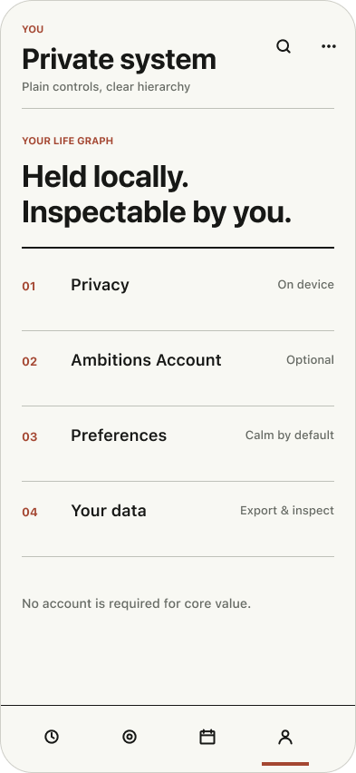 |
| 06 | Capture · `81:53` | `UX-SCREEN-CAPTURE-COMPOSER` | [Open](https://www.figma.com/design/Oik7612LSTUHWsNRFoTlTJ?node-id=81-53) | 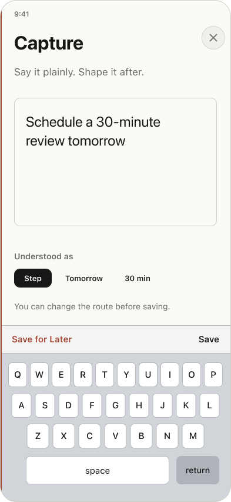 |
| 07 | Search · `81:131` | `UX-SCREEN-SEARCH-ROOT` | [Open](https://www.figma.com/design/Oik7612LSTUHWsNRFoTlTJ?node-id=81-131) | 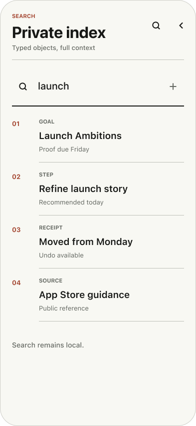 |
| 08 | Contextual Trust · Increase Contrast · `81:163` | `UX-SCREEN-TRUST-DEEP` | [Open](https://www.figma.com/design/Oik7612LSTUHWsNRFoTlTJ?node-id=81-163) | 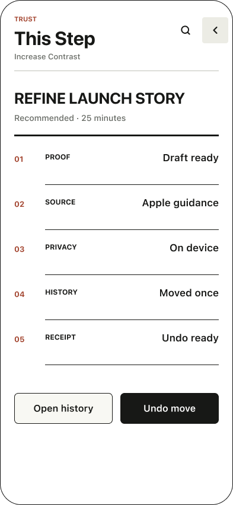 |
| 09 | Setup · local value before permission · `82:2` | `UX-SCREEN-SETUP-FIRST-USE` `UX-SCREEN-PERMISSIONS-CALENDAR` | [Open](https://www.figma.com/design/Oik7612LSTUHWsNRFoTlTJ?node-id=82-2) | 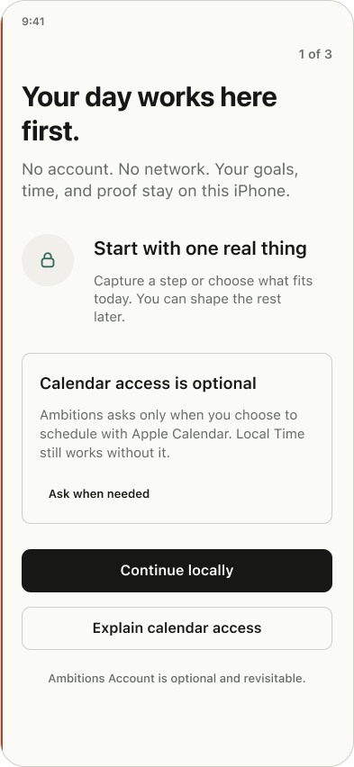 |
| 10 | Offline healthy · degraded recovery · Reduce Transparency · `82:24` | `UX-SCREEN-OFFLINE-DEGRADED-LOCAL-HEALTH` `UX-SCREEN-OFFLINE-DEGRADED-REPAIR` | [Open](https://www.figma.com/design/Oik7612LSTUHWsNRFoTlTJ?node-id=82-24) | 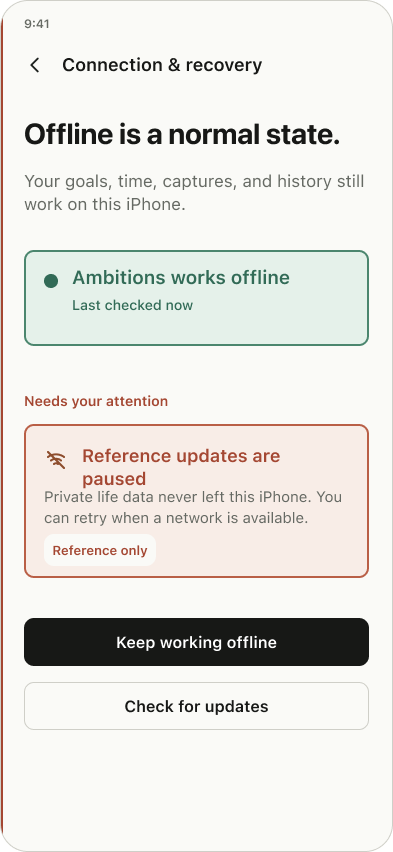 |
| 11 | Lifecycle · edit, Archive, Trash, restore, History · `82:49` | `UX-SCREEN-GOALS-DETAIL` `UX-SCREEN-YOU-DATA` | [Open](https://www.figma.com/design/Oik7612LSTUHWsNRFoTlTJ?node-id=82-49) | 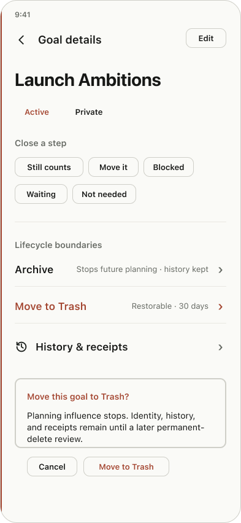 |
| 12 | Accessibility-size Today reflow · `82:95` | `UX-SCREEN-TODAY-START-HERE` `UX-CROSS-DYNAMIC-TYPE` `UX-CROSS-VOICEOVER` `UX-CROSS-REDUCE-MOTION` `UX-CROSS-REDUCE-TRANSPARENCY` | [Open](https://www.figma.com/design/Oik7612LSTUHWsNRFoTlTJ?node-id=82-95) | 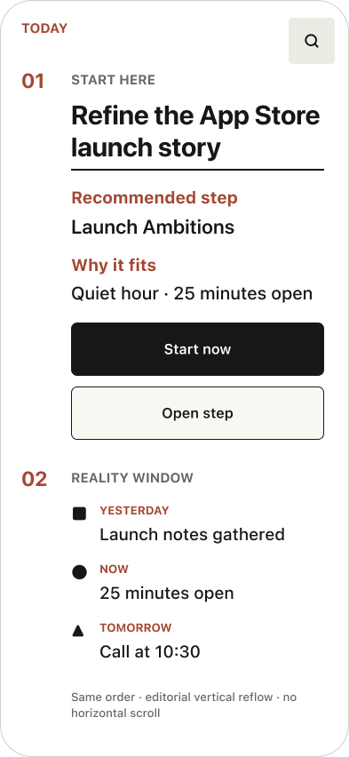 |

## Direction C — Atmospheric Temporal Field

Figma section: [`69:5`](https://www.figma.com/design/Oik7612LSTUHWsNRFoTlTJ?node-id=69-5)

### Strengths

- The temporal-field grammar now spans all 12 frames, including You, setup, recovery, lifecycle, Search, Capture, and contextual Trust rather than only the four anchors.
- Most ownable expression of time, causality, continuity, and reality-fit action; the canonical visual Goal Path remains horizontal.

### Problems

- Highest motion, material, contrast, and dark-posture calibration risk.
- Requires strict restraint so field arcs and transitions remain informative rather than performative.

### Consequences and tradeoffs

- Strongest differentiation and emotional continuity, with more Path, motion, and contrast calibration than A or B.
- Opaque no-glow fallbacks simplify accessibility behavior but intentionally reduce atmospheric depth.

### Accessibility and SwiftUI

- Accessibility: materially larger type, opaque no-glow vertical meridian reflow, the same information/order, no horizontal scroll, square/circle/triangle non-color states, and represented controls with named ≥44×44 pt envelopes. The vertical form is an ordered semantic counterpart, never a vertical Goal Path. Visual design input only.
- SwiftUI feasibility: Medium-high: standard controls plus SwiftUI Path and restrained ambient blur shapes; no custom renderer.
- Linked companion node: `85:129`. Direction-level annotation nodes: `88:2`, `88:3`.

### Viewports

| # | Viewport | Canon mapping | Figma | Product-only screenshot |
| --- | --- | --- | --- | --- |
| 01 | Root shell · `83:4` | `UX-SCREEN-APP-SHELL-ROOT` | [Open](https://www.figma.com/design/Oik7612LSTUHWsNRFoTlTJ?node-id=83-4) | 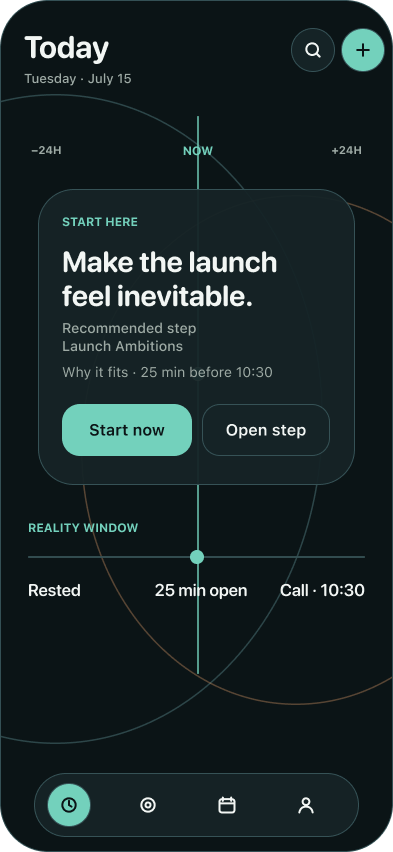 |
| 02 | Today · Start here · `83:52` | `UX-SCREEN-TODAY-START-HERE` | [Open](https://www.figma.com/design/Oik7612LSTUHWsNRFoTlTJ?node-id=83-52) | 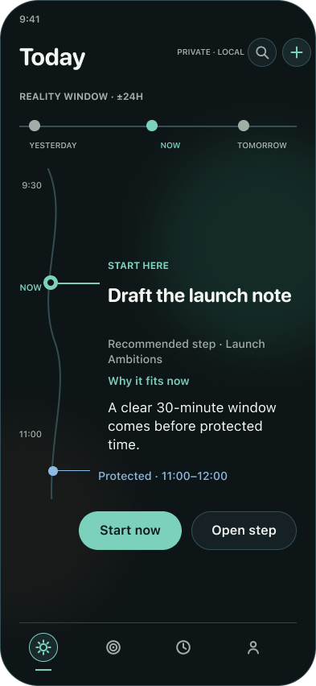 |
| 03 | Goals · `83:103` | `UX-SCREEN-GOALS-ROOT` `UX-SCREEN-GOALS-PATH` | [Open](https://www.figma.com/design/Oik7612LSTUHWsNRFoTlTJ?node-id=83-103) | 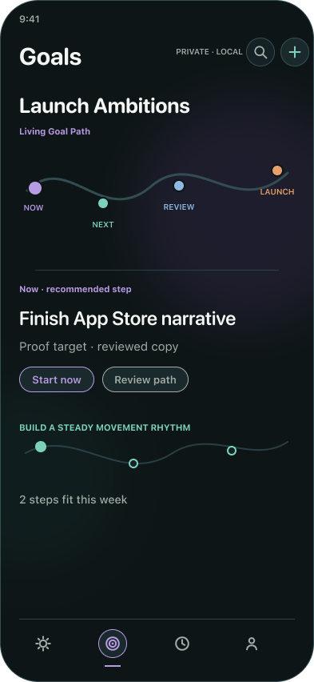 |
| 04 | Time · `83:155` | `UX-SCREEN-TIME-DAY` | [Open](https://www.figma.com/design/Oik7612LSTUHWsNRFoTlTJ?node-id=83-155) | 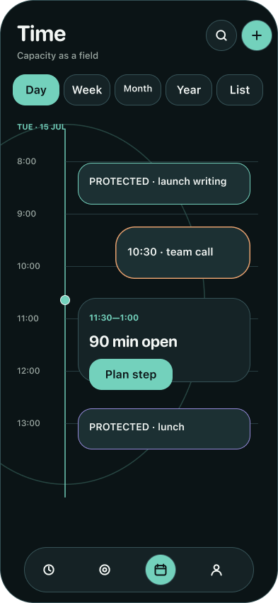 |
| 05 | You · `84:2` | `UX-SCREEN-YOU-ROOT` | [Open](https://www.figma.com/design/Oik7612LSTUHWsNRFoTlTJ?node-id=84-2) | 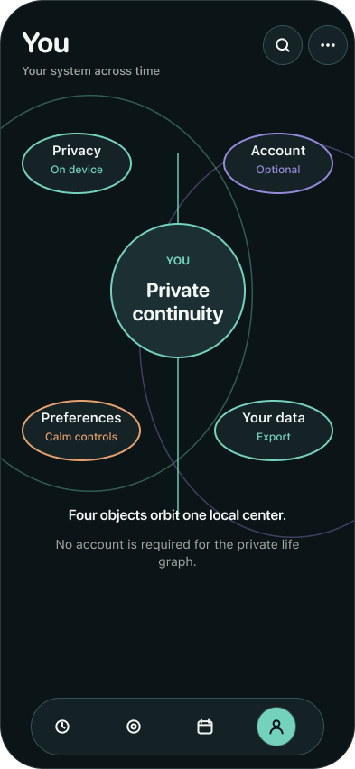 |
| 06 | Capture · `84:54` | `UX-SCREEN-CAPTURE-COMPOSER` | [Open](https://www.figma.com/design/Oik7612LSTUHWsNRFoTlTJ?node-id=84-54) | 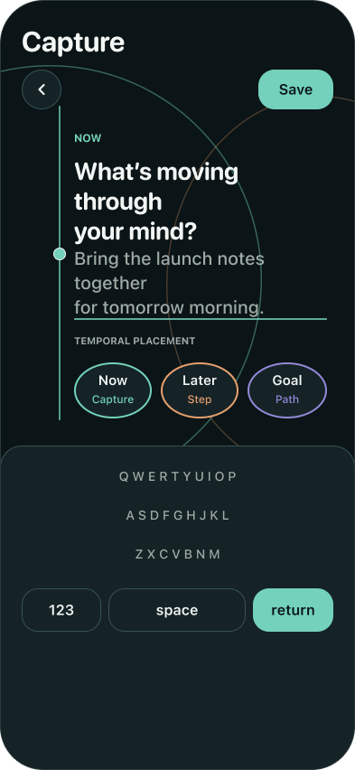 |
| 07 | Search · `84:133` | `UX-SCREEN-SEARCH-ROOT` | [Open](https://www.figma.com/design/Oik7612LSTUHWsNRFoTlTJ?node-id=84-133) | 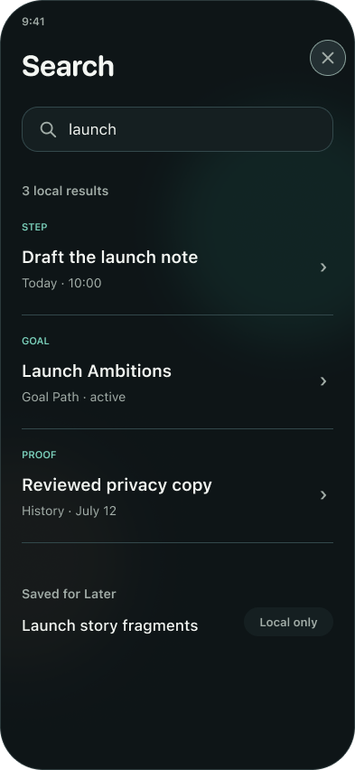 |
| 08 | Contextual Trust · Increase Contrast · `84:166` | `UX-SCREEN-TRUST-DEEP` | [Open](https://www.figma.com/design/Oik7612LSTUHWsNRFoTlTJ?node-id=84-166) | 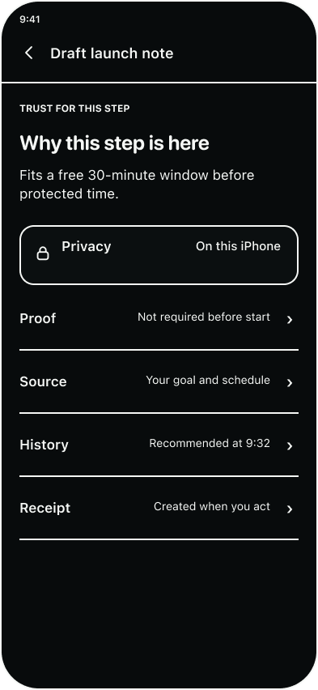 |
| 09 | Setup · local value before permission · `85:2` | `UX-SCREEN-SETUP-FIRST-USE` `UX-SCREEN-PERMISSIONS-CALENDAR` | [Open](https://www.figma.com/design/Oik7612LSTUHWsNRFoTlTJ?node-id=85-2) | 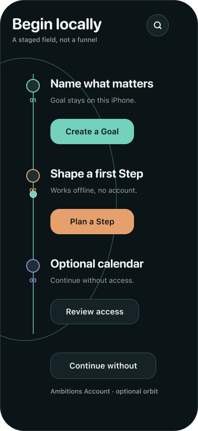 |
| 10 | Offline healthy · degraded recovery · Reduce Transparency · `85:25` | `UX-SCREEN-OFFLINE-DEGRADED-LOCAL-HEALTH` `UX-SCREEN-OFFLINE-DEGRADED-REPAIR` | [Open](https://www.figma.com/design/Oik7612LSTUHWsNRFoTlTJ?node-id=85-25) | 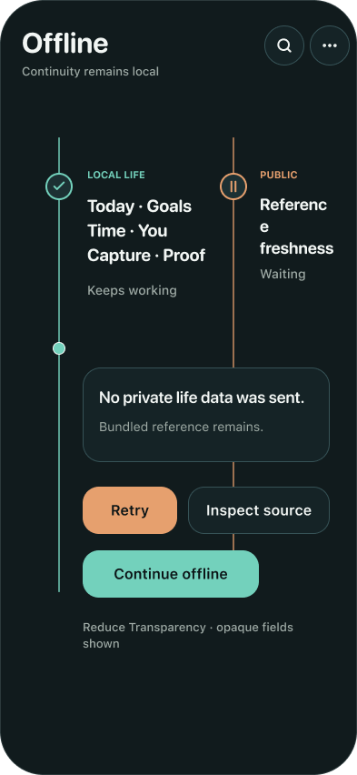 |
| 11 | Lifecycle · edit, Archive, Trash, restore, History · `85:49` | `UX-SCREEN-GOALS-DETAIL` `UX-SCREEN-YOU-DATA` | [Open](https://www.figma.com/design/Oik7612LSTUHWsNRFoTlTJ?node-id=85-49) | 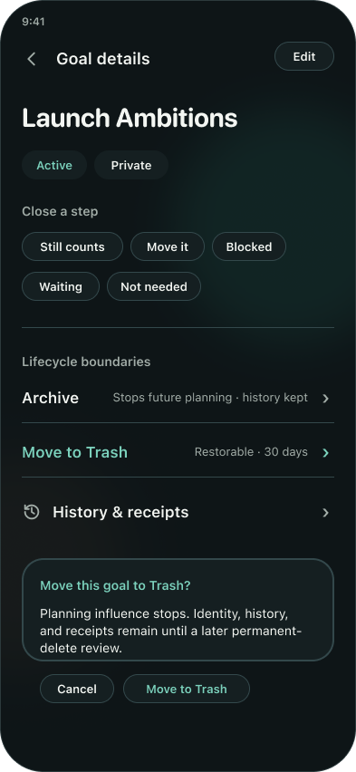 |
| 12 | Accessibility-size Today reflow · `85:96` | `UX-SCREEN-TODAY-START-HERE` `UX-CROSS-DYNAMIC-TYPE` `UX-CROSS-VOICEOVER` `UX-CROSS-REDUCE-MOTION` `UX-CROSS-REDUCE-TRANSPARENCY` | [Open](https://www.figma.com/design/Oik7612LSTUHWsNRFoTlTJ?node-id=85-96) | 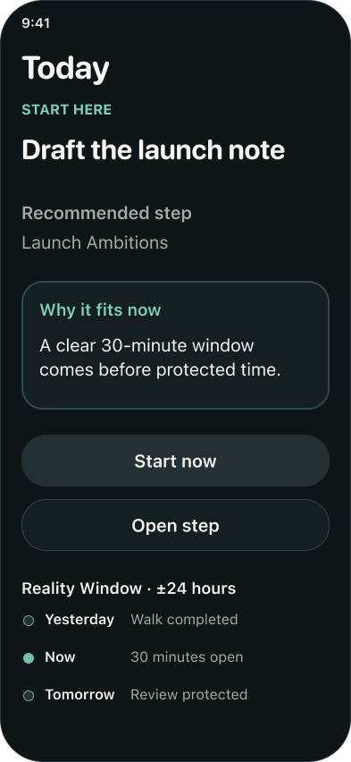 |

## Systemic findings

### Language

- Root labels remain exactly Today, Goals, Time, and You.
- Capture, Search, and Trust remain contextual and non-root.
- Locked action and lifecycle terms remain distinct.
- Infrastructure and design terminology was removed from product viewports; accessibility-setting explanations live adjacent to product-only frames.

### Accessibility and Dynamic Type

- Each direction contains one populated Today viewport with materially larger type and real vertical reflow, not an abstract matrix or a scaled standard viewport.
- Each reflow preserves the same information and order without horizontal scrolling or clipping and adds square/circle/triangle state shapes so color is never the only cue.
- Capture is shown keyboard-active with an explicit native accessory boundary.
- Increase Contrast is embodied in Trust. Reduce Transparency is embodied in offline/recovery. Neither setting appears as invented product UI.
- The visual Goal Path remains horizontal. VoiceOver/Dynamic Type use an ordered semantic-list counterpart; the package does not call that a vertical Goal Path.
- Every represented interaction, including shell Search/Capture/dock controls, Time controls, and lifecycle actions, has a named ≥44×44 pt envelope. Glyphs may be smaller; runtime hit testing remains unproved.
- Active + Move to Trash confirmation is separate from the linked Trash state that offers Restore or a separate permanent-delete review.

### SwiftUI plausibility

- A uses native navigation, sheets, controls, scroll views, calendar geometry, and semantic overlays.
- B stays closest to standard typography, dividers, lists, grids, and confirmation dialogs.
- C adds SwiftUI Path and restrained ambient blur shapes while keeping native controls and opaque/high-contrast fallbacks. It does not require a custom renderer.
- Figma Code Connect requires a Dev or Full seat on an Organization or Enterprise plan; local SwiftUI source and Figma component evidence were used for feasibility review.

## Owner decisions requested

- Select Direction A, B, or C; no direction becomes authority without an explicit owner decision.
- Choose light-first, dark-first, or paired light/dark posture.
- Set motion and material intensity.
- Confirm confidence in the icon-only root dock.
- Confirm confidence in the horizontal Goal Path and its semantic list counterpart.
- Confirm typography scale and density.
- Confirm contextual Trust density.
- Confirm Capture/Search depth and keyboard posture.
- Name unresolved accessibility concerns before authority or implementation work.

## Selection boundary

The package remains `AWAITING_EXPLICIT_OWNER_DIRECTION_SELECTION`. No direction is approved, authoritative, superseding, active, or implementation-ready until the owner makes an explicit direction selection and separately scopes authority or implementation work.

Machine-readable package: [OWNER_REVIEW_PACKAGE.json](OWNER_REVIEW_PACKAGE.json)
