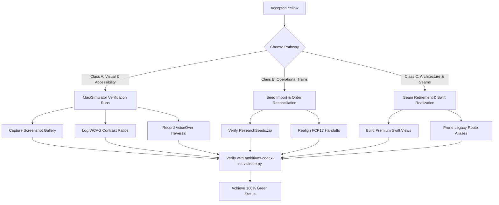

# Yellow-to-Green Reconciliation Plan

This plan outlines the specific steps, verification protocols, and concrete proof requirements necessary to upgrade all accepted-Yellow batches, design tokens, and compatibility seams to **Green** within the Ambitions repository.

---

## 📊 1. Current Accepted-Yellow Inventory

As of the current commit, the repository contains three distinct classes of accepted-Yellow markers:

### Class A: Design-System & Visual Proofs (`YELLOW_OWNER_LEDGER.md`)
Seven distinct visual and accessibility proof gaps are quarantined for upcoming macOS-native/device test passes:
*   `Y-DAV-SCREENSHOT-001`: Lack of automated/manual screenshot capture.
*   `Y-DAV-HUMAN-VISUAL-001`: Pending formal human review board QA sign-off.
*   `Y-DAV-DEVICE-001`: Unsigned simulator builds passed, but physical device behavior remains unverified.
*   `Y-DAV-VOICEOVER-001`: VoiceOver reader path and spatial announcements are untested.
*   `Y-DAV-CONTRAST-001`: Measured WCAG 2.1 color contrast ratios are not formally logged.
*   `Y-DAV-PERF-001`: Energy diagnostics and frame-draw counts are not profiled.
*   `Y-DOC-QA-001`: Local markdownlint backlog and legacy terminology.

### Class B: Operational Train Gaps (`yellow-ledger.md`)
*   **Research Seeds Import**: Pending due to the unavailability of the local `ResearchSeeds.zip`.
*   **Found Life Order Sequence**: Bounded FCP17 implementation occurred prior to the arrival of FL01-FL06 weekly sweep models.

### Class C: Core Architecture & Seams (`BATCH_REGISTRY.md`)
*   **Docs-Only Specifications** (`AFI01-AFI16`, `FCP01-FCP04`, `PD01-PD13`): These batches are complete as design canon but are marked Yellow because they represent structural plans that are not yet backed by production SwiftUI.
*   **Compatibility Seams** (`CS02C-CS06C`, `CS09C`): Legacy aliases (e.g., `insights` and `habits`) are preserved under the hood to prevent breaking external widgets, rather than being fully pruned.
*   **Mock Side-Effects** (`PK15`, `PK22-PK24`): The command ledger routes notifications and EventKit calendars into safe-buffers (`SideEffectLedger`) rather than triggering native hardware mutations.

---

## 🛠️ 2. Upgrade Pathways (Yellow to Green)

To successfully transition these batches to Green, the following verification packets must be checked into the repository:

### 1. Visual & Accessibility Upgrades (Class A)
*   **Screenshot Gallery**: Write a test target using `XCTest` and `app.screenshot()` to capture the premium `CelestialField`, `QuietGlass`, and `TemporalMomentumGauge` elements in light, dark, and Dynamic Type sizes. Save them under `docs/status/visual-proof-gallery/`.
*   **Accessibility Matrix**: Run Xcode's Accessibility Inspector on the Simulator, and log the VoiceOver reading sequence in a new test report: `docs/status/accessibility-runs.md`.
*   **Contrast Audit**: Log contrast ratios for key text/background pairings, ensuring a minimum of **4.5:1** for body text and **3.0:1** for active vectors.

### 2. Operational & Data Upgrades (Class B)
*   **Research Seeds Resolution**: Once the `ResearchSeeds.zip` package is added to the local machine, execute the import script:
    `python3 scripts/ambitions-import-seeds.py --source ResearchSeeds.zip`
    Verify that the schema maps perfectly, and record the generated seed hashes.
*   **Sweep Alignment**: Run a focused compatibility pass to ensure FCP17's availability engine integrates the commitment templates defined in `FL01-FL06`.

### 3. Architecture & Seam Upgrades (Class C)
*   **Swift View Realization**: Replace abstract specifications with premium production Swift code, exactly like the new LDI visual primitives we just integrated!
*   **Seam Deletion**: Run a search-and-replace naming sweep across all external targets to retire legacy names. To do this safely:
    1. Verify that widgets compile correctly without `Profile` or `insights` identifiers.
    2. Commit the name replacements.
    3. Run `git status` to ensure zero breakages.

---

## 📝 3. Actionable Verification Checklists

### Checklist 1: Reconciling Class A (Visual / Accessibility)
- [ ] Run `./scripts/build-local.sh` inside macOS environment.
- [ ] Capture the 5 key visual states (Normal, Overloaded, Dynamic Type Stress, Reduce Motion, and Private Mode).
- [ ] Save PNG assets in the repo and record their SHAs.
- [ ] Perform manual VoiceOver sweep on the simulator and log results in `docs/status/accessibility-runs.md`.

### Checklist 2: Reconciling Class B (Operational Gaps)
- [ ] Secure `ResearchSeeds.zip` and run seed extraction.
- [ ] Execute `ambitions-codex-os-validate.py` to ensure local import hashes match.
- [ ] Rebuild Xcode project using `xcodegen generate` to include new database configurations.

### Checklist 3: Reconciling Class C (Compatibility Seams)
- [ ] Ensure all mock writes in `SideEffectLedger` are replaced with concrete `UNUserNotificationCenter` configurations.
- [ ] Deprecate the `Insights` alias, routing all planning statistics directly through `LifeShapeField`.
- [ ] Run the complete suite of Xcode unit and UI tests on `main` to prove 0% regression.

---

## 📈 4. The Path to Final Release

Once all checklists are executed, the final **Release Evidence Packet** will be updated to:
*   Remove all `Y-DAV` and `KY` quarantine tags.
*   Confirm physical-device validation under macOS.
*   Expose verified green proof logs for accessibility and energy diagnostics.
