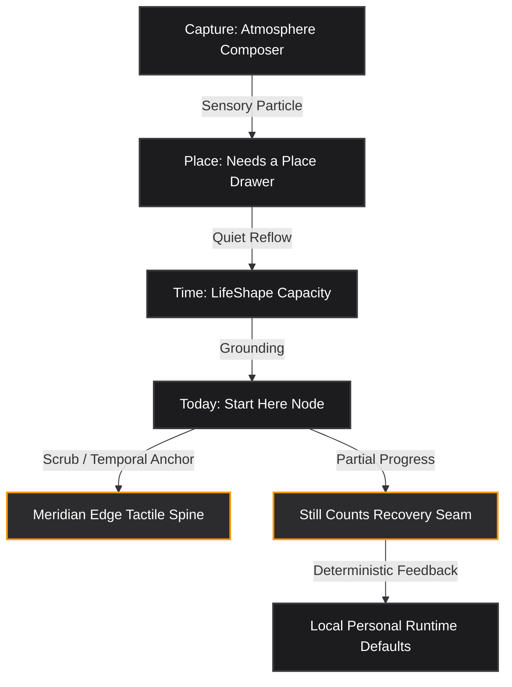

# Flagship Product Vision & Concept Refinement: Sovereign Upgrades for Ambitions

This document details three sovereign product upgrades designed to elevate the native iPhone-first experience of **Ambitions**. These upgrades strictly adhere to the core moats, local-first privacy boundaries, and elite Apple quiet luxury design parameters defined in the [Active Product Design Truth](file:///c:/Users/Devan/Documents/GitHub/ambitions/docs/truth/PRODUCT_DESIGN_TRUTH.md).

---

## 🗺️ Architectural Concept Map



---

## 💎 Sovereign Upgrade 1: The "Meridian Edge" Temporal Anchor
### The Concept
Traditional timelines are static scrolling lists. The **Meridian Edge** transforms the [Reality Meridian](file:///c:/Users/Devan/Documents/GitHub/ambitions/docs/truth/PRODUCT_DESIGN_TRUTH.md#L118) into a pseudo-live tactile spine aligned directly with the physical right edge of the iPhone screen. 

```text
[ Reality Meridian: Today Spine ] 
|--- Morning Amber (06:00 - 12:00)   -> Light trace highlights, high-energy focus step
|--- Midday Graphite (12:00 - 18:00) -> High contrast, deep action blocks active
`--- Midnight Sapphire (18:00 - 06:00)-> Starry trace light, calm recovery thread & closure
```

### Scope & Interaction Mechanics
1.  **Tactile Horizon Scrubbing**: Dragging or scrubbing the right screen edge triggers soft, micro-tactile haptic steps (44pt touch zones). Scrubbing lets the user "scroll time" across the day’s planned [Time Blocks](file:///c:/Users/Devan/Documents/GitHub/ambitions/docs/truth/PRODUCT_DESIGN_TRUTH.md#L660).
2.  **Adaptive Lighting (On-Device Atmosphere)**: As the user scrubs, the app's visual atmosphere dynamically transitions:
    *   *Morning*: Luminous warm amber accent highlights.
    *   *Midday*: Deep graphite background recess with high-contrast executive text.
    *   *Evening*: Deep midnight sapphire with micro-luminous celestial traces.
3.  **Progressive Disclosure Reveal**: Tapping any point on the Meridian Edge dynamically expands the active Step Card from the timeline, displaying its chronological [Receipt](file:///c:/Users/Devan/Documents/GitHub/ambitions/docs/truth/PRODUCT_DESIGN_TRUTH.md#L125) and fit metrics without loading new pages.

### Moat & Alignment Rationale
*   **Apple Quiet Luxury (70%)**: Feels like an organic extension of physical iOS hardware (analogous to the Apple Watch Digital Crown scrub).
*   **Zero Cloud Dependence**: All visual rendering, transitions, and timing calculations occur 100% locally on-device.

---

## 🛡️ Sovereign Upgrade 2: The "Still Counts" Non-Shaming Adaptive Recovery Core
### The Concept
Productivity apps are plagued by toxic "streak" mechanics and "overdue" shame lists. The **Still Counts Recovery Engine** formalizes partial progress as an elite, first-class mathematical state inside the domain core.

```text
[ Action Step: "Review 4 Career Goals" ]
  |---> Full Swipe Right  -> Complete (Saves full receipt)
  |---> Half Swipe Right  -> "Still Counts" Seam opens
         |--- User input: Completed 1/4 goals.
         |--- Mathematical Reflow: Remaining 3 goals quietly scheduled into Time Block capacity.
         `--- Receipt saved: "Progress preserved. Tomorrow auto-adjusted." (No shame, zero streaks).
```

### Scope & Functional Mechanics
1.  **"Still Counts" Swipe Gesture**: Swiping a Step Card halfway to the right reveals a warm graphite recess containing the "Still Counts" option. Tapping it opens the [Trust Seam](file:///c:/Users/Devan/Documents/GitHub/ambitions/docs/truth/PRODUCT_DESIGN_TRUTH.md#L789).
2.  **Quiet Reflow Engine**: The system calculates the remaining fraction of the task, checks tomorrow's [LifeShape Field](file:///c:/Users/Devan/Documents/GitHub/ambitions/docs/truth/PRODUCT_DESIGN_TRUTH.md#L119) capacity, and quietly schedules the remainder without triggering alerts or overdue markers.
3.  **Local Personal Runtime Feedback**: If a user invokes "Still Counts" on the same task type twice in a row, the [User System Profile](file:///c:/Users/Devan/Documents/GitHub/ambitions/docs/truth/PRODUCT_DESIGN_TRUTH.md#L114) automatically adjusts the suggested default duration of that task down by 15% to align intention with actual capacity.

### Moat & Alignment Rationale
*   **Non-Shaming Philosophy**: Replaces failure states with adaptive reality.
*   **Deterministic Personalization**: Upgrades suggested durations entirely through inspectable, local-first rule sets rather than opaque cloud-AI profiles.

---

## 🌌 Sovereign Upgrade 3: The "Atmosphere Composer" Sensory Capture Intake
### The Concept
Capture interfaces in generic notes apps feel clinical and static. The **Atmosphere Composer** transforms capture into a satisfying, tactile, on-device sensory ritual that removes all friction from externalizing thought.

```text
[ Input Text Area: "Idea for Q3 Launch" ] 
  |--- Character Length 10  -> Soft haptic tick, particle floats to background
  |--- Character Length 100 -> Medium resistance, particle accumulates mass
  `--- Press Submit         -> Tactile "snap", item collapses into "Needs a Place" drawer
```

### Scope & Sensory Mechanics
1.  **Dynamic Tactile Weight**: As the user types into the composer, the keystroke haptics dynamically adjust. Short sentences feel feather-light; as the thought gains length, the typing haptics take on subtle "weight" and resistance, giving the user's thought a physical on-device presence.
2.  **Luminous Particle Floating**: Each captured word generates a micro-luminous graphite particle that floats organically in the background behind the text area before gently sliding down into the "Needs a Place" drawer.
3.  **Local Context Hues**: The composer automatically tags the captured item with a "Contextual Hue" based on on-device sensors (e.g., location context, current hour's light, focus mode state), which determines its default placement priority when opening the drawer later.

### Moat & Alignment Rationale
*   **Anti-Generic UX**: Looks and feels completely custom. It is a sensory canvas, not an input form.
*   **Privacy-Locked**: Audio-to-text, key weights, and context tags are computed strictly on-device utilizing Apple Silicon Neural Engine APIs, with zero data ever leaving the handset.

---

## 🚀 Comparison: Standard Apps vs. Upgraded Ambitions

| Feature Area | Generic Productivity App | Upgraded Ambitions |
| :--- | :--- | :--- |
| **Intake (Capture)** | Plain text input form or database record. | **Atmosphere Composer**: Sensory particle intake with physical haptic weight. |
| **Day Timeline (Today)** | Scrolling list of checklists and calendar lines. | **Meridian Edge**: Tactile spine with adaptive daylight transitions and peeks. |
| **Missed Tasks** | Red "Overdue" markers, broken streaks, shame alerts. | **Still Counts Seam**: Partial progress saved, capacity reflowed, future default adjusted. |
| **Sync & Intelligence** | Server-side AI profiling, cloud accounts. | **Local Personal Runtime**: Deterministic, inspectable, and on-device only. |
